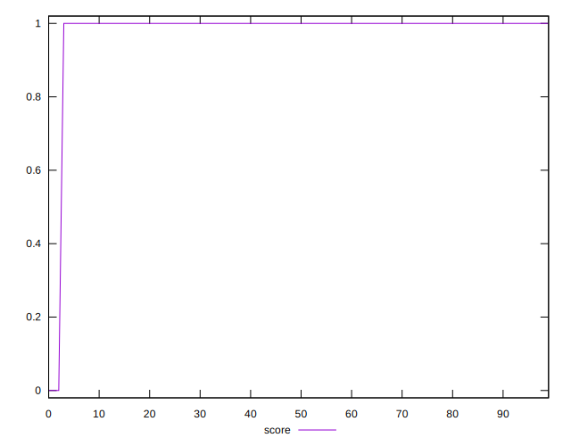
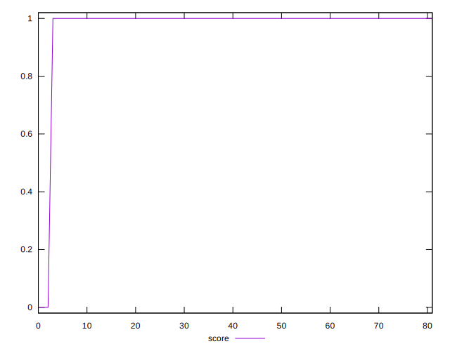
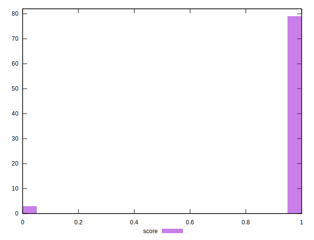

# //third-party-summary/samples/agenda

[→ Parent](../..)


## Raw


```yaml
p90range: 0

```


## Score


```yaml
p90min: 1
p90max: 1
p90range: 0
p90mean: 1
median: 1
p90stdev: 0
mad: 0
stdevBySn: 0
lfitCenter: 0.9823894929751642
lfitStdev: 0.043365614361967536
mfitCenter: 0.9823894929751642
mfitStdev: 0.05435073760791603
mfitConfidence: 0.006002034897335722
p90skewness: .nan
p90eccentricity: .nan
p90discretization: 76
outlandishness: 0.9281677572873289

```

