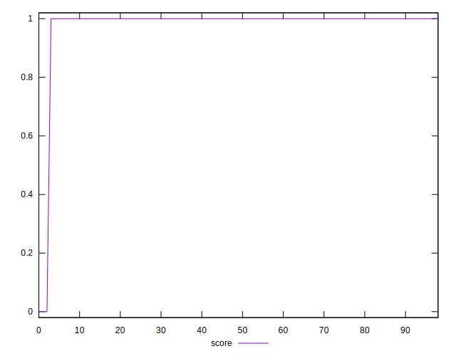
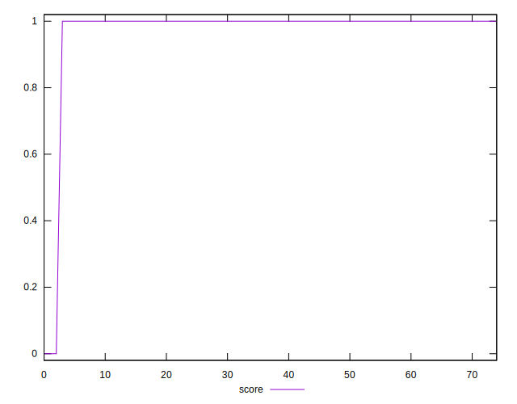
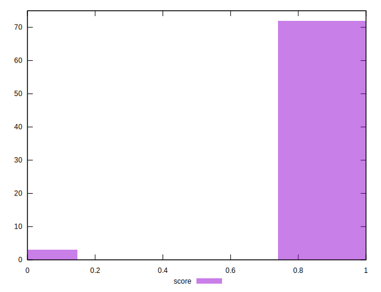

# //third-party-summary/samples/card

[→ Parent](../..)


## Raw


```yaml
p90range: 0

```


## Score


```yaml
p90min: 0
p90max: 1
p90range: 1
p90mean: 0.9859154929577465
median: 1
p90stdev: 0.11783944035691205
mad: 0
stdevBySn: 0
lfitCenter: 0.9806765522478363
lfitStdev: 0.04750073649534715
mfitCenter: 0.9806765522478363
mfitStdev: 0.05953334464242189
mfitConfidence: 0.006874318511012208
p90skewness: -8.247077404407271
p90eccentricity: 1.000000000000005
p90discretization: 35.5
outlandishness: 0.9481195102040815

```

