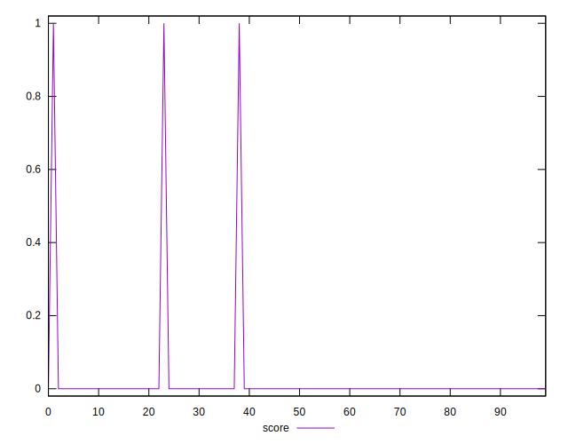
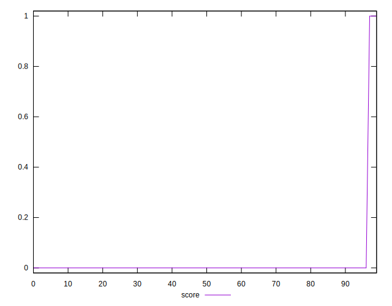
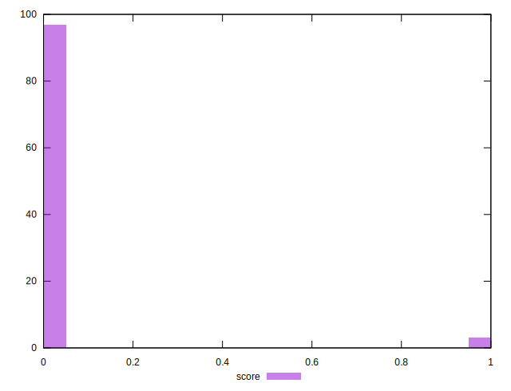

# //third-party-summary/samples/music

[→ Parent](../..)


## Raw


```yaml
p90range: 0

```


## Score


```yaml
p90min: 0
p90max: 0
p90range: 0
p90mean: 0
median: 0
p90stdev: 0
mad: 0
stdevBySn: 0
lfitCenter: 0.014336679461373921
lfitStdev: 0.0354215128148256
mfitCenter: 0.014336679461373921
mfitStdev: 0.044394282820594495
mfitConfidence: 0.004439428282059449
p90skewness: .nan
p90eccentricity: .nan
p90discretization: 94
outlandishness: .inf

```

