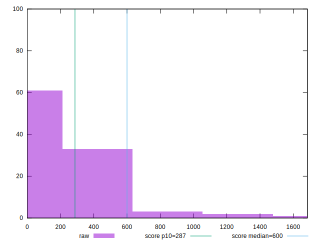
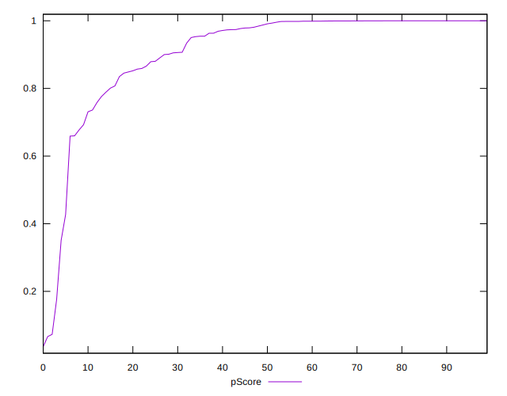
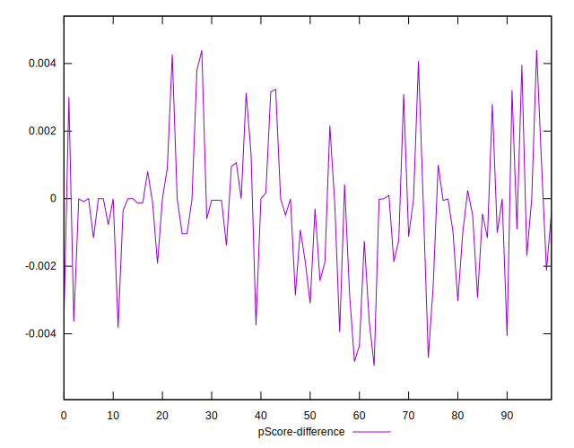

# //total-blocking-time/samples/agenda

[→ Parent](../..)


## Raw


```yaml
p90min: 6.5
p90max: 1024.0420000000004
p90range: 1017.5420000000004
p90mean: 199.15666382978722
median: 159.37099999999992
p90stdev: 171.47348224273998
mad: 105.62099999999992
stdevBySn: 150.1626512000002
lfitCenter: 199.46442889409178
lfitStdev: 150.80264995090295
mfitCenter: 199.46442889409178
mfitStdev: 189.00309331829024
mfitConfidence: 18.900309331829025
p90skewness: 1.8038922267891695
p90eccentricity: 0.9999999999999997
p90discretization: 1
outlandishness: 1.3592990379068486

```


## Score


```yaml
p90min: 0.18
p90max: 1
p90range: 0.8200000000000001
p90mean: 0.9211702127659577
median: 0.99
p90stdev: 0.14184840861854706
mad: 0.010000000000000009
stdevBySn: 0.011926000000000011
lfitCenter: 0.9327758647653682
lfitStdev: 0.10666380632346723
mfitCenter: 0.9327758647653682
mfitStdev: 0.1336832565396017
mfitConfidence: 0.01336832565396017
p90skewness: -2.8957577476085983
p90eccentricity: 1.000000000000001
p90discretization: 3.357142857142857
outlandishness: 0.9496917784018016

```


## Raw Estimate


## Score Estimate


## P Score


```yaml
p90min: 0.17644198779948006
p90max: 0.9999999999999981
p90range: 0.823558012200518
p90mean: 0.920803097480892
median: 0.989292274342604
p90stdev: 0.14232616867636252
mad: 0.010707725657164824
stdevBySn: 0.013798384250517296
lfitCenter: 0.9325233219801197
lfitStdev: 0.10738868424810111
mfitCenter: 0.9325233219801197
mfitStdev: 0.13459175629128745
mfitConfidence: 0.013459175629128744
p90skewness: -2.8914039708795043
p90eccentricity: 1.0000000000000002
p90discretization: 1.010752688172043
outlandishness: 0.9496284353118117

```


## Score Difference


```yaml
p90min: 0
p90max: 1.1102230246251565e-16
p90range: 1.1102230246251565e-16
p90mean: 2.9527208101732887e-18
median: 0
p90stdev: 1.6920919490504977e-17
mad: 0
stdevBySn: 0
lfitCenter: 3.0207243392451914e-18
lfitStdev: 7.34568759733014e-18
mfitCenter: 3.0207243392451914e-18
mfitStdev: 9.206454123300918e-18
mfitConfidence: 9.206454123300919e-19
p90skewness: 5.856608956366593
p90eccentricity: 0.9999999999999976
p90discretization: 31.333333333333332
outlandishness: 4.276624

```


## P Score Difference


```yaml
p90min: -0.004355213277142944
p90max: 0.004070430593110963
p90range: 0.008425643870253907
p90mean: -0.0003973291898000288
median: -0.00009961931831109494
p90stdev: 0.001860325262110125
mad: 0.0009776513603833026
stdevBySn: 0.0013857008860934906
lfitCenter: -0.0003675221664054664
lfitStdev: 0.0013137550268619133
mfitCenter: -0.0003675221664054664
mfitStdev: 0.001646547749792167
mfitConfidence: 0.0001646547749792167
p90skewness: 0.20536581560142944
p90eccentricity: 1.0000000000000002
p90discretization: 1.032967032967033
outlandishness: 0.952058272702944

```

