# //total-blocking-time/samples/astro

[→ Parent](../..)


## Raw


```yaml
p90min: 982
p90max: 2450.6820000000016
p90range: 1468.6820000000016
p90mean: 1671.2659893617024
median: 1666.9182499999977
p90stdev: 368.34859969122874
mad: 253.4465000000008
stdevBySn: 404.8130134249998
lfitCenter: 1670.2962527394334
lfitStdev: 304.27791764182
mfitCenter: 1670.2962527394334
mfitStdev: 381.3558162371509
mfitConfidence: 38.13558162371509
p90skewness: 0.07160428165746228
p90eccentricity: 1
p90discretization: 1
outlandishness: 1.0025427545999837

```

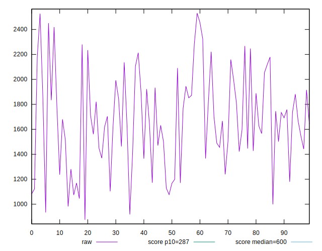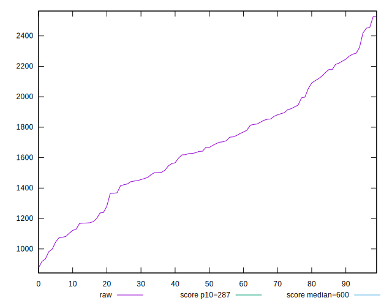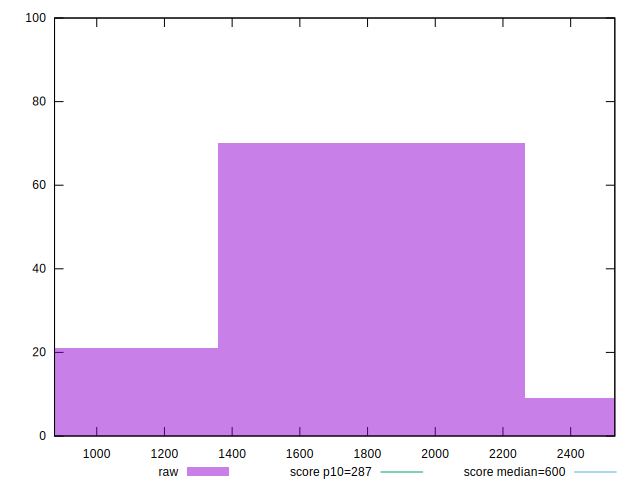
## Score


```yaml
p90min: 0.01
p90max: 0.2
p90range: 0.19
p90mean: 0.053723404255319115
median: 0.04
p90stdev: 0.04559264690979054
mad: 0.02
stdevBySn: 0.035778000000000004
lfitCenter: 0.050303956934278304
lfitStdev: 0.03635503715405509
mfitCenter: 0.050303956934278304
mfitStdev: 0.04556428207365623
mfitConfidence: 0.004556428207365623
p90skewness: 1.3512163307704026
p90eccentricity: 1.0000000000000002
p90discretization: 5.222222222222222
outlandishness: 1.161529056367022

```

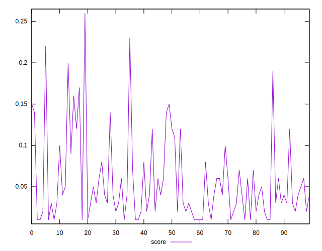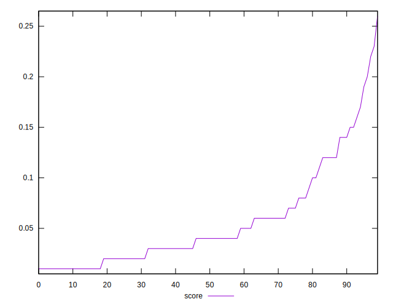
## Raw Estimate

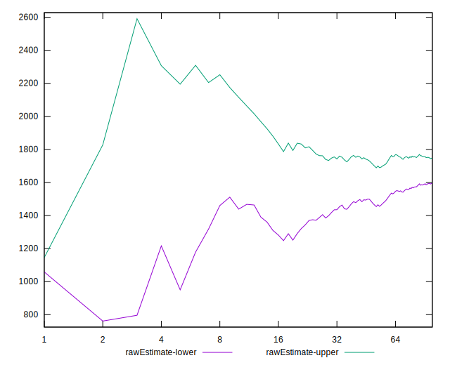
## Score Estimate

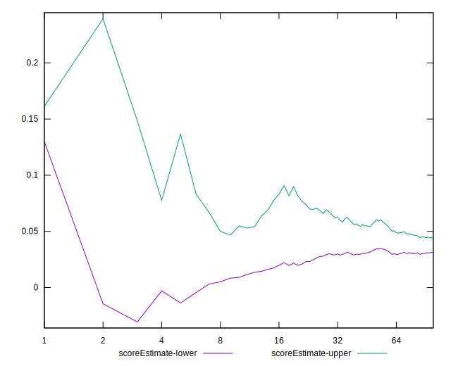
## P Score


```yaml
p90min: 0.007233626437936569
p90max: 0.19595523020036348
p90range: 0.18872160376242691
p90mean: 0.05392311754387349
median: 0.03789038427801156
p90stdev: 0.04546744152127039
mad: 0.02309702024705579
stdevBySn: 0.03181129322419915
lfitCenter: 0.05033497028575965
lfitStdev: 0.03616368188729858
mfitCenter: 0.05033497028575965
mfitStdev: 0.04532445381233919
mfitConfidence: 0.004532445381233919
p90skewness: 1.3460519091249876
p90eccentricity: 0.9999999999999999
p90discretization: 1
outlandishness: 1.1549913998088663

```

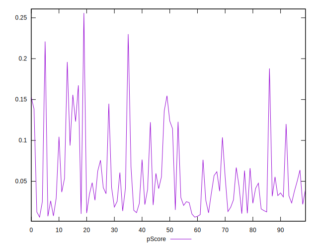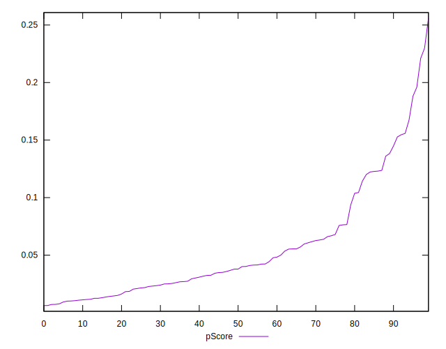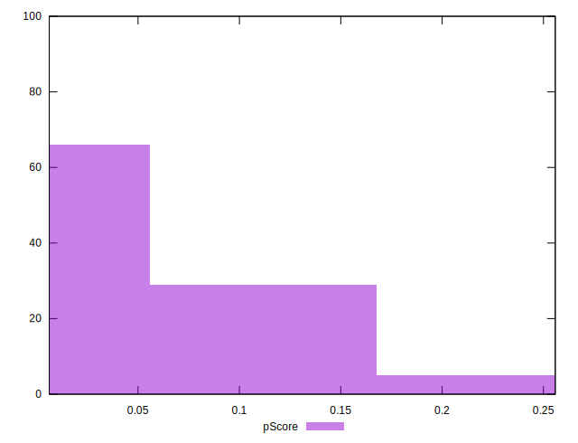
## Score Difference


```yaml
p90min: 0
p90max: 0
p90range: 0
p90mean: 0
median: 0
p90stdev: 0
mad: 0
stdevBySn: 0
lfitCenter: 0
lfitStdev: 0
mfitCenter: 0
mfitStdev: 0
mfitConfidence: 0
p90skewness: .nan
p90eccentricity: .nan
p90discretization: 94
outlandishness: .nan

```


## P Score Difference


```yaml
p90min: -0.004747339206394585
p90max: 0.004663815454207493
p90range: 0.009411154660602078
p90mean: 0.000056450488813473534
median: 0.00030659885827675516
p90stdev: 0.0028911410926262563
mad: 0.0027316481544568073
stdevBySn: 0.0034002888010590264
lfitCenter: 0.00011689141367243653
lfitStdev: 0.002626743766916583
mfitCenter: 0.00011689141367243653
mfitStdev: 0.003292135101494611
mfitConfidence: 0.0003292135101494611
p90skewness: -0.11728651613180202
p90eccentricity: 1.0000000000000007
p90discretization: 1
outlandishness: 0.8309465164384413

```

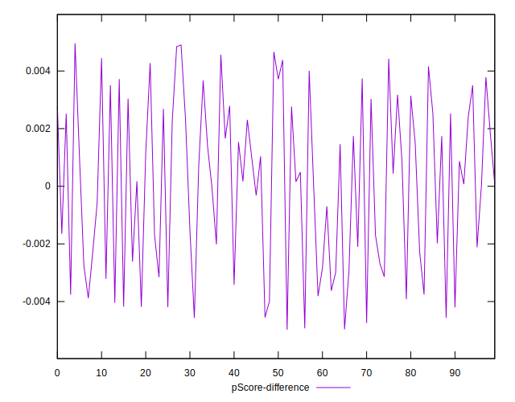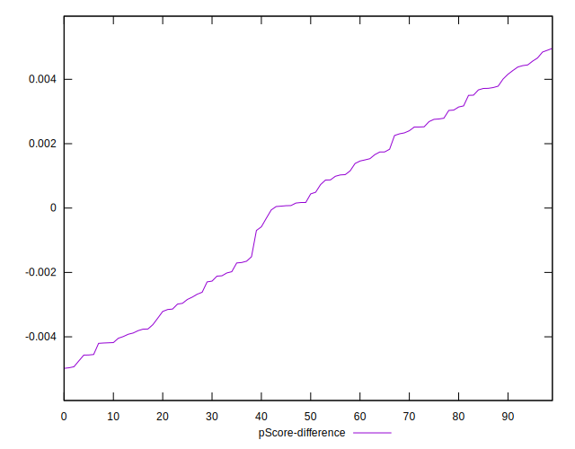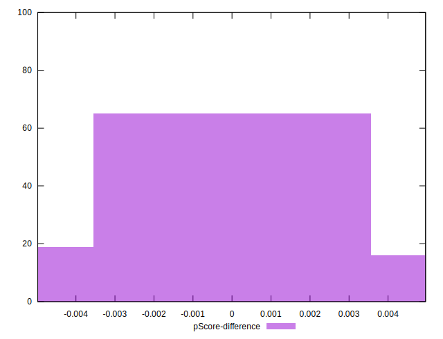