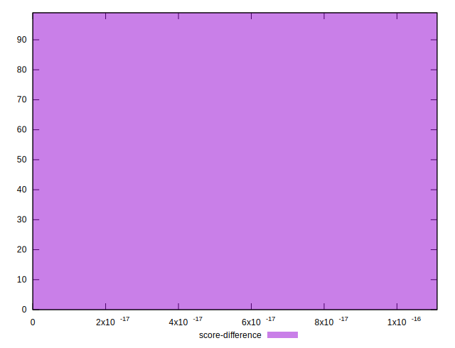

# //total-blocking-time/samples/card

[→ Parent](../..)


## Raw


```yaml
p90min: 1
p90max: 638.5140000000002
p90range: 637.5140000000002
p90mean: 207.10752903225813
median: 193
p90stdev: 146.67261811843863
mad: 113.99999999999989
stdevBySn: 167.3909507999998
lfitCenter: 214.29261047938658
lfitStdev: 135.13133048835263
mfitCenter: 214.29261047938658
mfitStdev: 169.3620070657247
mfitConfidence: 17.02152215692512
p90skewness: 0.8037848384383856
p90eccentricity: 1.0000000000000002
p90discretization: 1.021978021978022
outlandishness: 1.2958319491497137

```


## Score


```yaml
p90min: 0.46
p90max: 1
p90range: 0.54
p90mean: 0.9213978494623654
median: 0.98
p90stdev: 0.12112014294754303
mad: 0.020000000000000018
stdevBySn: 0.023852000000000022
lfitCenter: 0.9286506578788053
lfitStdev: 0.09915023457194513
mfitCenter: 0.9286506578788053
mfitStdev: 0.12426639083220903
mfitConfidence: 0.012489242195215074
p90skewness: -2.2382728620747723
p90eccentricity: 0.9999999999999993
p90discretization: 3.4444444444444446
outlandishness: 0.9504555409765062

```


## Raw Estimate


## Score Estimate


## P Score


```yaml
p90min: 0.4569515105186117
p90max: 1
p90range: 0.5430484894813883
p90mean: 0.9212018157090162
median: 0.9756441379504828
p90stdev: 0.12088692925911279
mad: 0.024355861753355024
stdevBySn: 0.02904680108025425
lfitCenter: 0.9284481184144541
lfitStdev: 0.09881143107979395
mfitCenter: 0.9284481184144541
mfitStdev: 0.12384176362529682
mfitConfidence: 0.012446565555181607
p90skewness: -2.2525039969707015
p90eccentricity: 1.0000000000000002
p90discretization: 1.0333333333333334
outlandishness: 0.9504983388501168

```


## Score Difference


```yaml
p90min: 0
p90max: 1.1102230246251565e-16
p90range: 1.1102230246251565e-16
p90mean: 1.0744093786695063e-17
median: 0
p90stdev: 3.282374870082325e-17
mad: 0
stdevBySn: 0
lfitCenter: 7.30397039441984e-18
lfitStdev: 1.71038639399e-17
mfitCenter: 7.30397039441984e-18
mfitStdev: 2.1436514500167794e-17
mfitConfidence: 2.154450770002106e-18
p90skewness: 2.727723627949906
p90eccentricity: 1.0000000000000002
p90discretization: 46.5
outlandishness: 1.5688195082134477

```


## P Score Difference


```yaml
p90min: -0.004663770789847477
p90max: 0.003955475198501812
p90range: 0.008619245988349289
p90mean: -0.00016758956085349068
median: -1.1275766431673162e-7
p90stdev: 0.002155202988050187
mad: 0.0017470451704286738
stdevBySn: 0.0022176969374597074
lfitCenter: -0.00011889586640507447
lfitStdev: 0.001598353671733076
mfitCenter: -0.00011889586640507447
mfitStdev: 0.002003239255228947
mfitConfidence: 0.0002013331204516792
p90skewness: -0.2062529717252292
p90eccentricity: 1
p90discretization: 1.0689655172413792
outlandishness: 1.0398492869336593

```

