# //total-blocking-time/samples/music

[→ Parent](../..)


## Raw


```yaml
p90min: 477.7570000000014
p90max: 2308.999999999999
p90range: 1831.2429999999977
p90mean: 1428.4134941489365
median: 1468.8497499999996
p90stdev: 393.50453257494246
mad: 274.4602499999995
stdevBySn: 438.27941175250055
lfitCenter: 1438.0689201974021
lfitStdev: 339.75273712422404
mfitCenter: 1438.0689201974021
mfitStdev: 425.81690905790185
mfitConfidence: 42.58169090579018
p90skewness: -0.22962898568190282
p90eccentricity: 0.9999999999999992
p90discretization: 1
outlandishness: 0.9993014746801926

```

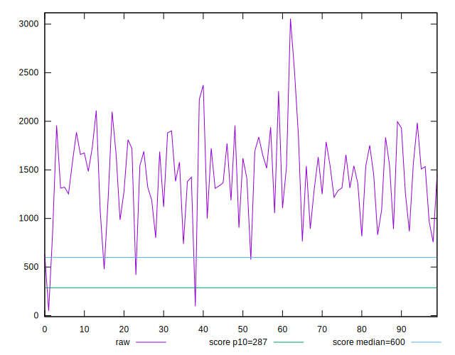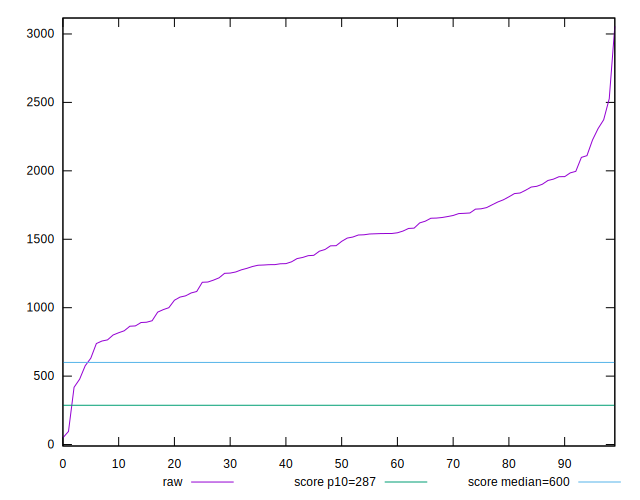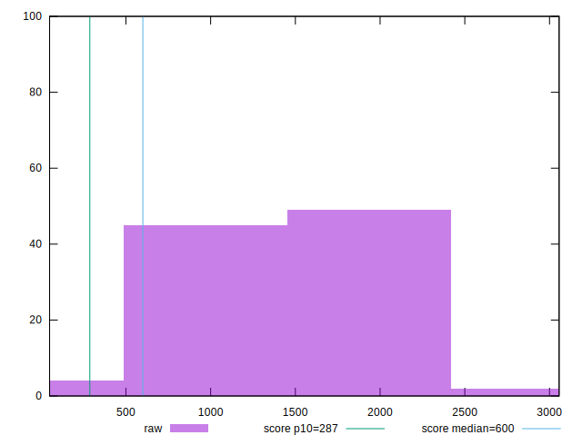
## Score


```yaml
p90min: 0.01
p90max: 0.65
p90range: 0.64
p90mean: 0.10617021276595741
median: 0.06
p90stdev: 0.1173928337275876
mad: 0.03
stdevBySn: 0.05963
lfitCenter: 0.09983132829818735
lfitStdev: 0.09097044128162865
mfitCenter: 0.09983132829818735
mfitStdev: 0.11401454025082106
mfitConfidence: 0.011401454025082105
p90skewness: 2.280184160625892
p90eccentricity: 1.0000000000000007
p90discretization: 3.357142857142857
outlandishness: 1.4376442508263025

```

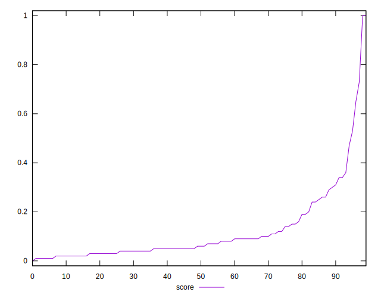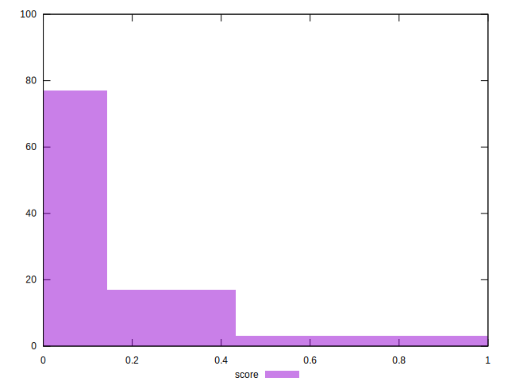
## Raw Estimate

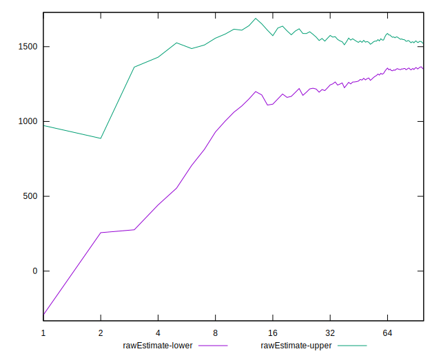
## Score Estimate

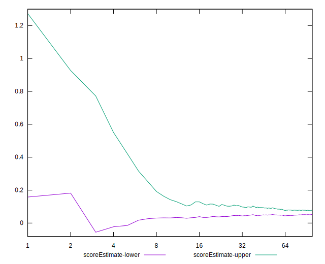
## P Score


```yaml
p90min: 0.009591437490096666
p90max: 0.6539191248080709
p90range: 0.6443276873179742
p90mean: 0.10626371575517154
median: 0.05991288011729601
p90stdev: 0.1172081189205435
mad: 0.034453536850933164
stdevBySn: 0.05183774047041589
lfitCenter: 0.09991303647370181
lfitStdev: 0.09114495602668497
mfitCenter: 0.09991303647370181
mfitStdev: 0.11423326204819025
mfitConfidence: 0.011423326204819024
p90skewness: 2.290066822665549
p90eccentricity: 0.9999999999999996
p90discretization: 1
outlandishness: 1.4372394754022637

```

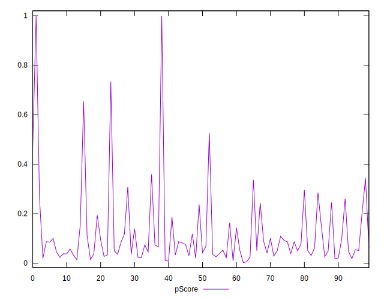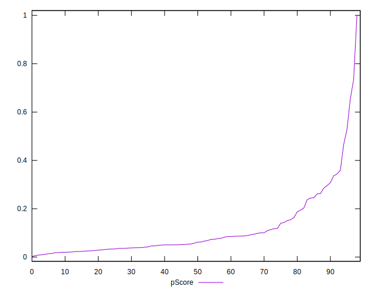
## Score Difference


```yaml
p90min: 0
p90max: 0
p90range: 0
p90mean: 0
median: 0
p90stdev: 0
mad: 0
stdevBySn: 0
lfitCenter: 2.583267684513104e-19
lfitStdev: 6.445158398659724e-19
mfitCenter: 2.583267684513104e-19
mfitStdev: 8.077808146406197e-19
mfitConfidence: 8.077808146406197e-20
p90skewness: .nan
p90eccentricity: .nan
p90discretization: 94
outlandishness: .inf

```


## P Score Difference


```yaml
p90min: -0.004345327676313349
p90max: 0.004733890688404203
p90range: 0.009079218364717551
p90mean: 0.00009518605251872089
median: -0.000052507418465363304
p90stdev: 0.002702274354810781
mad: 0.0023636922714073243
stdevBySn: 0.003067723632758864
lfitCenter: 0.00007278054352970631
lfitStdev: 0.002409190512442423
mfitCenter: 0.00007278054352970631
mfitStdev: 0.003019472531768785
mfitConfidence: 0.0003019472531768785
p90skewness: 0.04492277003097018
p90eccentricity: 1
p90discretization: 1
outlandishness: 0.9788435740369256

```

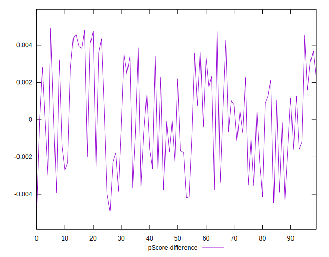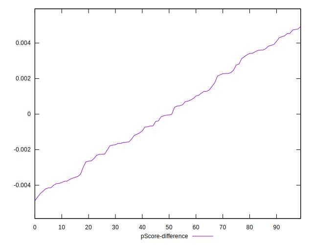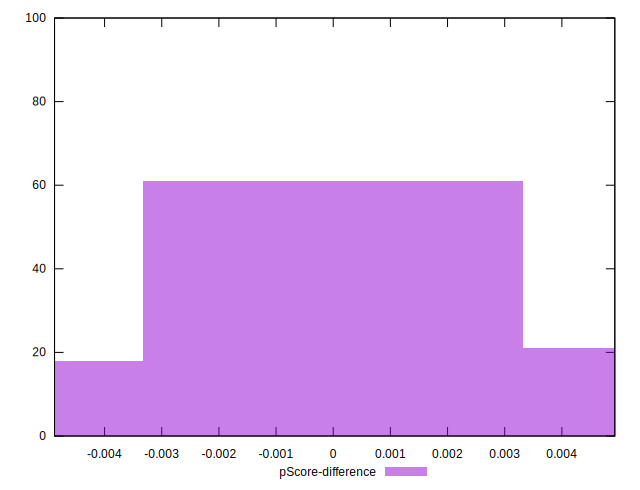