# //unminified-javascript/samples/agenda

[→ Parent](../..)


## Raw


```yaml
p90min: 0
p90max: 150
p90range: 150
p90mean: 46.91489361702128
median: 0
p90stdev: 69.12872044921797
mad: 0
stdevBySn: 0
lfitCenter: 36.957015893191546
lfitStdev: 69.60535561339475
mfitCenter: 36.957015893191546
mfitStdev: 87.23737631092241
mfitConfidence: 8.723737631092241
p90skewness: 0.8102697886193695
p90eccentricity: 1.0000000000000002
p90discretization: 31.333333333333332
outlandishness: 1.1403915220509973

```

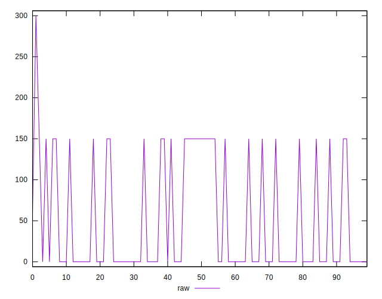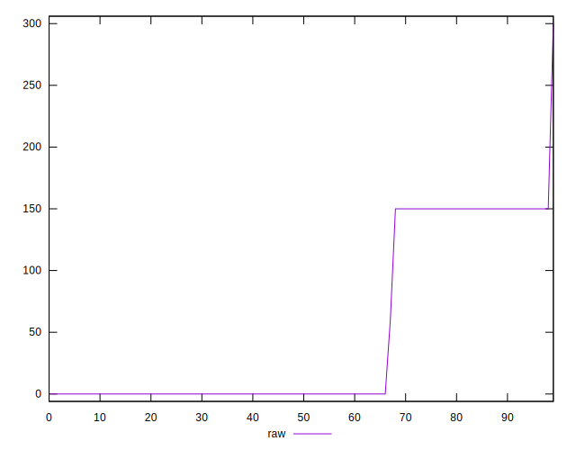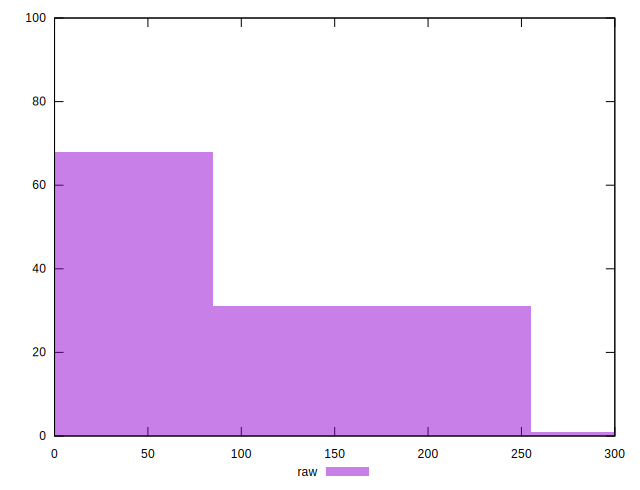
## Score


```yaml
p90min: 0.88
p90max: 1
p90range: 0.12
p90mean: 0.9624468085106386
median: 1
p90stdev: 0.05530738418270699
mad: 0
stdevBySn: 0
lfitCenter: 0.9703648510065207
lfitStdev: 0.05581525008157082
mfitCenter: 0.9703648510065207
mfitStdev: 0.06995404207542358
mfitConfidence: 0.006995404207542358
p90skewness: -0.8089717302591938
p90eccentricity: 0.9999999999999974
p90discretization: 31.333333333333332
outlandishness: 0.9945073971551407

```

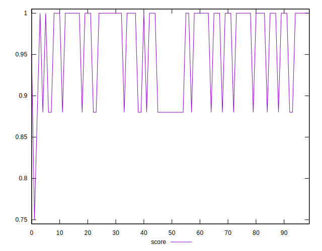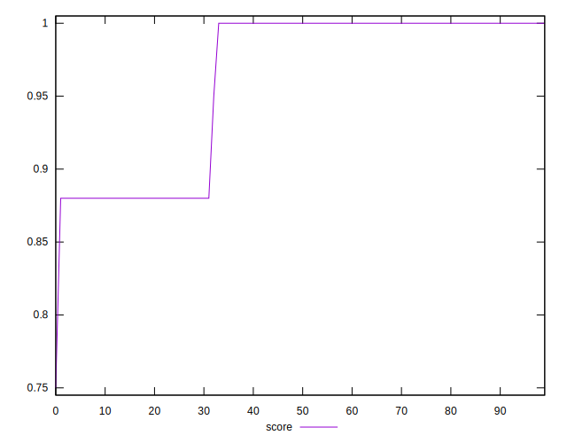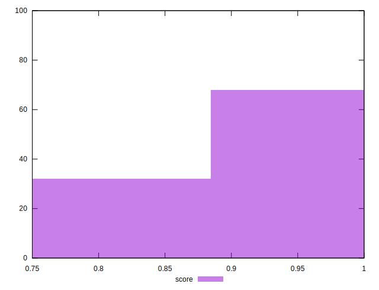
## Raw Estimate

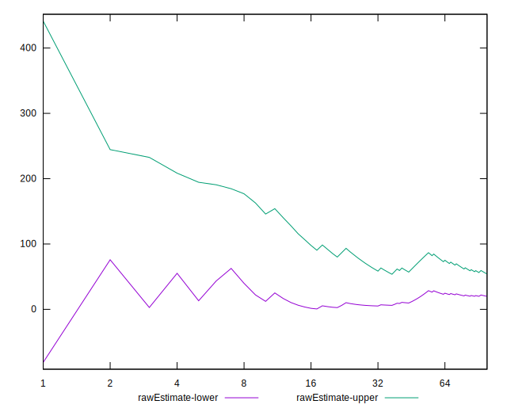
## Score Estimate

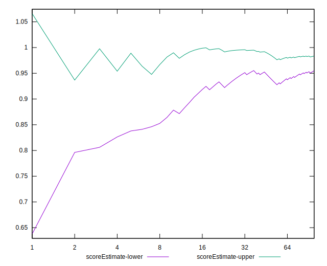
## P Score


```yaml
p90min: 0.875
p90max: 1
p90range: 0.125
p90mean: 0.9609042553191489
median: 1
p90stdev: 0.05760726704101497
mad: 0
stdevBySn: 0
lfitCenter: 0.9692024867556739
lfitStdev: 0.05800446301116222
mfitCenter: 0.9692024867556739
mfitStdev: 0.07269781359243525
mfitConfidence: 0.007269781359243525
p90skewness: -0.8102697886193686
p90eccentricity: 0.9999999999999989
p90discretization: 31.333333333333332
outlandishness: 0.9944831351313173

```

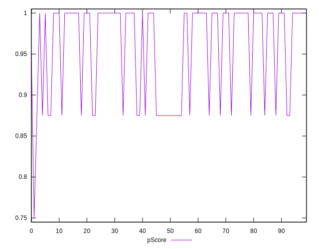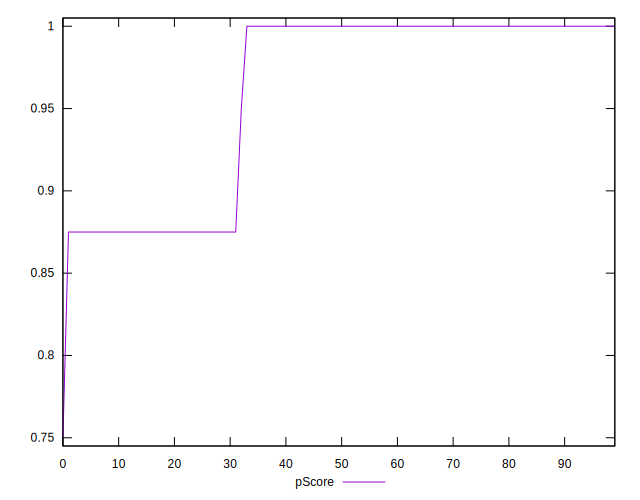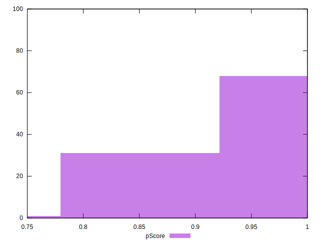
## Score Difference


```yaml
p90min: 0
p90max: 0
p90range: 0
p90mean: 0
median: 0
p90stdev: 0
mad: 0
stdevBySn: 0
lfitCenter: 5.166535369026208e-19
lfitStdev: 1.2890316797319448e-18
mfitCenter: 5.166535369026208e-19
mfitStdev: 1.6155616292812394e-18
mfitConfidence: 1.6155616292812395e-19
p90skewness: .nan
p90eccentricity: .nan
p90discretization: 94
outlandishness: .inf

```

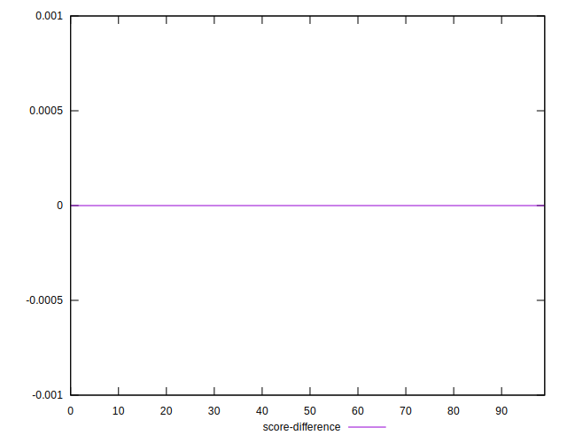
## P Score Difference


```yaml
p90min: -0.0050000000000000044
p90max: 0
p90range: 0.0050000000000000044
p90mean: -0.001489361702127661
median: 0
p90stdev: 0.0022866154532132643
mad: 0
stdevBySn: 0
lfitCenter: -0.0011297532542798438
lfitStdev: 0.0021920082553512866
mfitCenter: -0.0011297532542798438
mfitStdev: 0.0027472749383084774
mfitConfidence: 0.00027472749383084774
p90skewness: -0.8839599998785513
p90eccentricity: 1.0000000000000002
p90discretization: 47
outlandishness: 1.0830862244897959

```

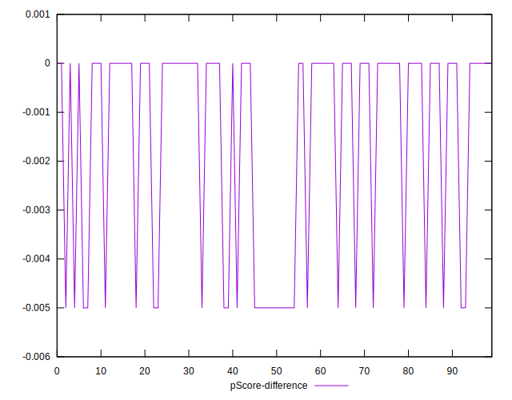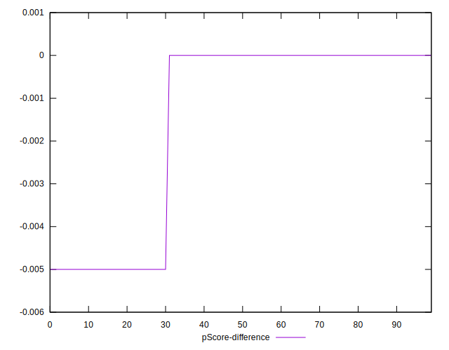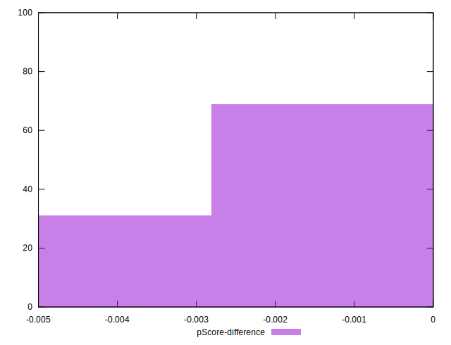