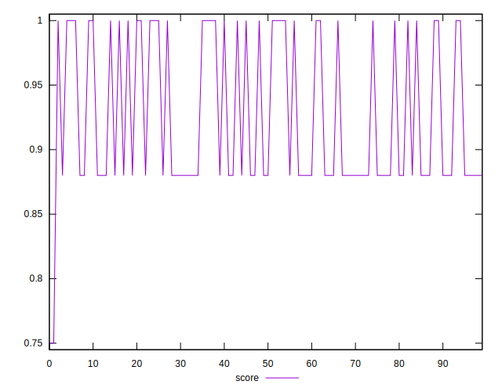

# //unminified-javascript/samples/astro

[→ Parent](../..)


## Raw


```yaml
p90min: 0
p90max: 150
p90range: 150
p90mean: 92.55319148936171
median: 150
p90stdev: 72.91697654550548
mad: 0
stdevBySn: 0
lfitCenter: 102.68774873346834
lfitStdev: 83.61538939631785
mfitCenter: 102.68774873346834
mfitStdev: 104.79634973299628
mfitConfidence: 10.479634973299628
p90skewness: -0.48145692048565153
p90eccentricity: 1.0000000000000004
p90discretization: 47
outlandishness: 1.042511414982164

```


## Score


```yaml
p90min: 0.88
p90max: 1
p90range: 0.12
p90mean: 0.9259574468085102
median: 0.88
p90stdev: 0.05833358123640439
mad: 0
stdevBySn: 0
lfitCenter: 0.9177554901565769
lfitStdev: 0.06696910586789236
mfitCenter: 0.9177554901565769
mfitStdev: 0.08393332723206519
mfitConfidence: 0.008393332723206519
p90skewness: 0.48145692048566074
p90eccentricity: 0.9999999999999992
p90discretization: 47
outlandishness: 0.9962076464379117

```


## Raw Estimate


## Score Estimate


## P Score


```yaml
p90min: 0.875
p90max: 1
p90range: 0.125
p90mean: 0.9228723404255319
median: 0.875
p90stdev: 0.06076414712125462
mad: 0
stdevBySn: 0
lfitCenter: 0.9144268760554435
lfitStdev: 0.0696794911635984
mfitCenter: 0.9144268760554435
mfitStdev: 0.0873302914441638
mfitConfidence: 0.00873302914441638
p90skewness: 0.48145692048564936
p90eccentricity: 0.9999999999999991
p90discretization: 47
outlandishness: 0.9964872401564667

```


## Score Difference


```yaml
p90min: 0
p90max: 0
p90range: 0
p90mean: 0
median: 0
p90stdev: 0
mad: 0
stdevBySn: 0
lfitCenter: 0
lfitStdev: 0
mfitCenter: 0
mfitStdev: 0
mfitConfidence: 0
p90skewness: .nan
p90eccentricity: .nan
p90discretization: 94
outlandishness: .nan

```


## P Score Difference


```yaml
p90min: -0.0050000000000000044
p90max: 0
p90range: 0.0050000000000000044
p90mean: -0.002978723404255322
median: -0.0050000000000000044
p90stdev: 0.002453736722270385
mad: 0
stdevBySn: 0
lfitCenter: -0.0032341849996638324
lfitStdev: 0.0028630569746924935
mfitCenter: -0.0032341849996638324
mfitStdev: 0.003588309785932558
mfitConfidence: 0.00035883097859325583
p90skewness: 0.39019948628585427
p90eccentricity: 1.0000000000000004
p90discretization: 47
outlandishness: 0.9808072704081632

```

