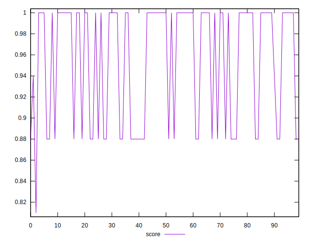

# //unminified-javascript/samples/card

[→ Parent](../..)


## Raw


```yaml
p90min: 0
p90max: 150
p90range: 150
p90mean: 53.97849462365591
median: 0
p90stdev: 71.57430585027636
mad: 0
stdevBySn: 0
lfitCenter: 44.75757985308417
lfitStdev: 78.21017854711316
mfitCenter: 44.75757985308417
mfitStdev: 98.0219225537002
mfitConfidence: 9.851573889087852
p90skewness: 0.5847725838028766
p90eccentricity: 0.9999999999999989
p90discretization: 31
outlandishness: 1.0786338364562231

```


## Score


```yaml
p90min: 0.88
p90max: 1
p90range: 0.12
p90mean: 0.956774193548387
median: 1
p90stdev: 0.05727055747399264
mad: 0
stdevBySn: 0
lfitCenter: 0.964113201727726
lfitStdev: 0.06270921952374874
mfitCenter: 0.964113201727726
mfitStdev: 0.07859435144822045
mfitConfidence: 0.007899029527123418
p90skewness: -0.5823309397463297
p90eccentricity: 0.9999999999999979
p90discretization: 31
outlandishness: 0.9964001206486874

```


## Raw Estimate


## Score Estimate


## P Score


```yaml
p90min: 0.875
p90max: 1
p90range: 0.125
p90mean: 0.9550179211469534
median: 1
p90stdev: 0.05964525487523025
mad: 0
stdevBySn: 0
lfitCenter: 0.9627020167890963
lfitStdev: 0.06517514878926109
mfitCenter: 0.9627020167890963
mfitStdev: 0.08168493546141699
mfitConfidence: 0.008209644907573227
p90skewness: -0.5847725838028758
p90eccentricity: 1
p90discretization: 31
outlandishness: 0.9963696666783513

```


## Score Difference


```yaml
p90min: 0
p90max: 0
p90range: 0
p90mean: 0
median: 0
p90stdev: 0
mad: 0
stdevBySn: 0
lfitCenter: 5.21847134031707e-19
lfitStdev: 1.3019283231074932e-18
mfitCenter: 5.21847134031707e-19
mfitStdev: 1.631725174763995e-18
mfitConfidence: 1.6399455047482617e-19
p90skewness: .nan
p90eccentricity: .nan
p90discretization: 93
outlandishness: .inf

```


## P Score Difference


```yaml
p90min: -0.0050000000000000044
p90max: 0
p90range: 0.0050000000000000044
p90mean: -0.0017383512544802886
median: 0
p90stdev: 0.0023685763724095744
mad: 0
stdevBySn: 0
lfitCenter: -0.0013983404853254704
lfitStdev: 0.0025091543186962144
mfitCenter: -0.0013983404853254704
mfitStdev: 0.0031447585834925972
mfitConfidence: 0.00031606012962710544
p90skewness: -0.6434501370966553
p90eccentricity: 1.0000000000000027
p90discretization: 31
outlandishness: 1.0340240441497452

```

