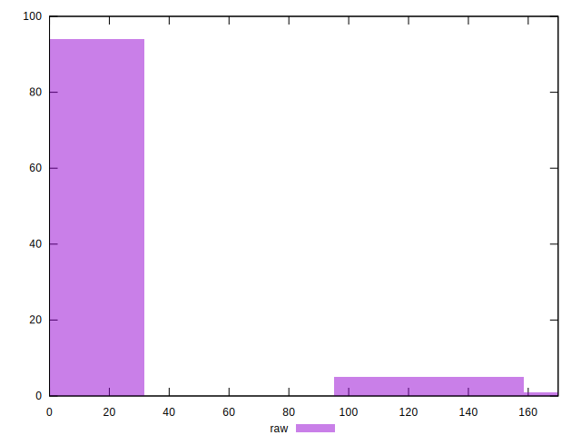

# //unminified-javascript/samples/music

[→ Parent](../..)


## Raw


```yaml
p90min: 0
p90max: 150
p90range: 150
p90mean: 4.680851063829787
median: 0
p90stdev: 25.793868958949048
mad: 0
stdevBySn: 0
lfitCenter: 4.5199046194268915
lfitStdev: 10.991339683890411
mfitCenter: 4.5199046194268915
mfitStdev: 13.77560142771833
mfitConfidence: 1.377560142771833
p90skewness: 5.334954149794606
p90eccentricity: 1.000000000000004
p90discretization: 31.333333333333332
outlandishness: 3.7794894628099165

```


## Score


```yaml
p90min: 0.88
p90max: 1
p90range: 0.12
p90mean: 0.9961702127659574
median: 1
p90stdev: 0.02109282337258507
mad: 0
stdevBySn: 0
lfitCenter: 0.996322927414151
lfitStdev: 0.008941771394838278
mfitCenter: 0.996322927414151
mfitStdev: 0.011206848513070961
mfitConfidence: 0.001120684851307096
p90skewness: -5.3260022874854664
p90eccentricity: 1.0000000000000027
p90discretization: 47
outlandishness: 0.9928449676394332

```


## Raw Estimate


## Score Estimate


## P Score


```yaml
p90min: 0.875
p90max: 1
p90range: 0.125
p90mean: 0.9960992907801418
median: 1
p90stdev: 0.021494890799124203
mad: 0
stdevBySn: 0
lfitCenter: 0.9962334128171444
lfitStdev: 0.009159449736575186
mfitCenter: 0.9962334128171444
mfitStdev: 0.011479667856431746
mfitConfidence: 0.0011479667856431745
p90skewness: -5.334954149794618
p90eccentricity: 1.0000000000000064
p90discretization: 31.333333333333332
outlandishness: 0.9926195777196603

```


## Score Difference


```yaml
p90min: 0
p90max: 0
p90range: 0
p90mean: 0
median: 0
p90stdev: 0
mad: 0
stdevBySn: 0
lfitCenter: 0
lfitStdev: 0
mfitCenter: 0
mfitStdev: 0
mfitConfidence: 0
p90skewness: .nan
p90eccentricity: .nan
p90discretization: 94
outlandishness: .nan

```


## P Score Difference


```yaml
p90min: -0.0050000000000000044
p90max: 0
p90range: 0.0050000000000000044
p90mean: -0.00007092198581560212
median: 0
p90stdev: 0.0005389604309776813
mad: 0
stdevBySn: 0
lfitCenter: -0.00008998696448258153
lfitStdev: 0.0002589091372997902
mfitCenter: -0.00008998696448258153
mfitStdev: 0.00032449448238450705
mfitConfidence: 0.000032449448238450704
p90skewness: -8.41152790283636
p90eccentricity: 1.0000000000000029
p90discretization: 31.333333333333332
outlandishness: 6.682225000000119

```

