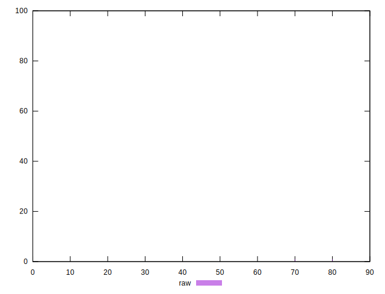

# //unused-css-rules/samples/agenda

[→ Parent](../..)


## Raw


```yaml
p90min: 0
p90max: 0
p90range: 0
p90mean: 0
median: 0
p90stdev: 0
mad: 0
stdevBySn: 0
lfitCenter: 1.1444144324704955
lfitStdev: 2.8274950691643803
mfitCenter: 1.1444144324704955
mfitStdev: 3.5437395469394475
mfitConfidence: 0.3543739546939447
p90skewness: .nan
p90eccentricity: .nan
p90discretization: 94
outlandishness: .inf

```


## Score


```yaml
p90min: 1
p90max: 1
p90range: 0
p90mean: 1
median: 1
p90stdev: 0
mad: 0
stdevBySn: 0
lfitCenter: 0.9990454883756688
lfitStdev: 0.00235830380558076
mfitCenter: 0.9990454883756688
mfitStdev: 0.002955695502593458
mfitConfidence: 0.0002955695502593458
p90skewness: .nan
p90eccentricity: .nan
p90discretization: 94
outlandishness: 0.996004

```


## Raw Estimate


## Score Estimate


## P Score


```yaml
p90min: 1
p90max: 1
p90range: 0
p90mean: 1
median: 1
p90stdev: 0
mad: 0
stdevBySn: 0
lfitCenter: 0.9990463213062747
lfitStdev: 0.002356245890970194
mfitCenter: 0.9990463213062747
mfitStdev: 0.0029531162891160523
mfitConfidence: 0.0002953116289116052
p90skewness: .nan
p90eccentricity: .nan
p90discretization: 94
outlandishness: 0.996004

```


## Score Difference


```yaml
p90min: 0
p90max: 0
p90range: 0
p90mean: 0
median: 0
p90stdev: 0
mad: 0
stdevBySn: 0
lfitCenter: 5.166535369026208e-19
lfitStdev: 1.2890316797319448e-18
mfitCenter: 5.166535369026208e-19
mfitStdev: 1.6155616292812394e-18
mfitConfidence: 1.6155616292812395e-19
p90skewness: .nan
p90eccentricity: .nan
p90discretization: 94
outlandishness: .inf

```


## P Score Difference


```yaml
p90min: 0
p90max: 0
p90range: 0
p90mean: 0
median: 0
p90stdev: 0
mad: 0
stdevBySn: 0
lfitCenter: 2.064715996439084e-7
lfitStdev: 0.000058836910219301
mfitCenter: 2.064715996439084e-7
mfitStdev: 0.00007374113144801423
mfitConfidence: 0.000007374113144801422
p90skewness: .nan
p90eccentricity: .nan
p90discretization: 94
outlandishness: .nan

```

