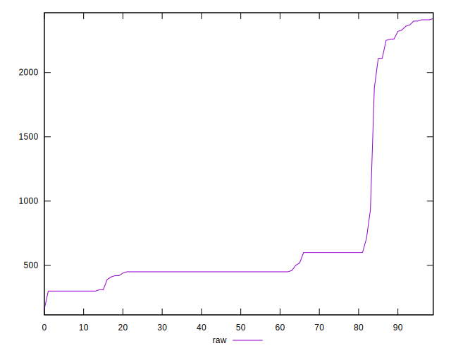

# //unused-css-rules/samples/astro

[→ Parent](../..)


## Raw


```yaml
p90min: 300
p90max: 2410
p90range: 2110
p90mean: 713.6170212765958
median: 450
p90stdev: 632.3509849924441
mad: 105
stdevBySn: 146.0935
lfitCenter: 632.5661621516995
lfitStdev: 386.03750565643315
mfitCenter: 632.5661621516995
mfitStdev: 483.8262638600666
mfitConfidence: 48.38262638600666
p90skewness: 2.0213553880999497
p90eccentricity: 1.0000000000000009
p90discretization: 4.086956521739131
outlandishness: 1.106924824371544

```


## Score


```yaml
p90min: 0.3
p90max: 0.75
p90range: 0.45
p90mean: 0.6136170212765962
median: 0.67
p90stdev: 0.12867451155159715
mad: 0.05499999999999999
stdevBySn: 0.07751899999999998
lfitCenter: 0.6287424905287432
lfitStdev: 0.09480100865442528
mfitCenter: 0.6287424905287432
mfitStdev: 0.11881544449791745
mfitConfidence: 0.011881544449791745
p90skewness: -1.447254710699221
p90eccentricity: 0.9999999999999994
p90discretization: 5.529411764705882
outlandishness: 0.9866261537782708

```


## Raw Estimate


## Score Estimate


## P Score


```yaml
p90min: 0.30470588235294116
p90max: 0.75
p90range: 0.44529411764705884
p90mean: 0.6128723404255316
median: 0.6666666666666666
p90stdev: 0.12798732440182164
mad: 0.05833333333333335
stdevBySn: 0.0811630555555556
lfitCenter: 0.6275083672065872
lfitStdev: 0.09251546383451792
mfitCenter: 0.6275083672065872
mfitStdev: 0.11595093886077695
mfitConfidence: 0.011595093886077695
p90skewness: -1.4534196176275267
p90eccentricity: 1.0000000000000002
p90discretization: 4.086956521739131
outlandishness: 0.9870662684112556

```


## Score Difference


```yaml
p90min: 0
p90max: 0
p90range: 0
p90mean: 0
median: 0
p90stdev: 0
mad: 0
stdevBySn: 0
lfitCenter: 1.0470608452365924e-18
lfitStdev: 2.5998395675404994e-18
mfitCenter: 1.0470608452365924e-18
mfitStdev: 3.2584156880294808e-18
mfitConfidence: 3.258415688029481e-19
p90skewness: .nan
p90eccentricity: .nan
p90discretization: 94
outlandishness: .inf

```


## P Score Difference


```yaml
p90min: -0.0033333333333334103
p90max: 0.004444444444444473
p90range: 0.007777777777777883
p90mean: -0.0006549853984147077
median: -0.0011111111111111183
p90stdev: 0.002841829904218906
mad: 0.002222222222222292
stdevBySn: 0.003585594771241791
lfitCenter: -0.0008770583935448189
lfitStdev: 0.0028654062529313933
mfitCenter: -0.0008770583935448189
mfitStdev: 0.0035912541695648217
mfitConfidence: 0.00035912541695648216
p90skewness: 0.432975923894024
p90eccentricity: 1.0000000000000016
p90discretization: 4.7
outlandishness: 0.8501544727980851

```

