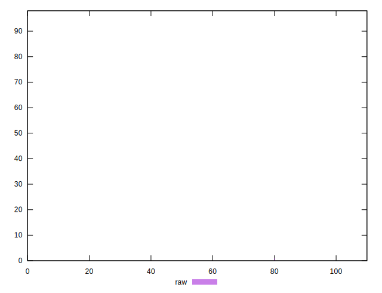

# //unused-css-rules/samples/card

[→ Parent](../..)


## Raw


```yaml
p90min: 0
p90max: 0
p90range: 0
p90mean: 0
median: 0
p90stdev: 0
mad: 0
stdevBySn: 0
lfitCenter: 0.9126564770487587
lfitStdev: 2.2656662705431114
mfitCenter: 0.9126564770487587
mfitStdev: 2.8395915701678844
mfitConfidence: 0.2868420650094096
p90skewness: .nan
p90eccentricity: .nan
p90discretization: 92
outlandishness: .inf

```


## Score


```yaml
p90min: 1
p90max: 1
p90range: 0
p90mean: 1
median: 1
p90stdev: 0
mad: 0
stdevBySn: 0
lfitCenter: 0.9992311075009789
lfitStdev: 0.0019087727359795967
mfitCenter: 0.9992311075009789
mfitStdev: 0.002392291857332841
mfitConfidence: 0.00024165797069963037
p90skewness: .nan
p90eccentricity: .nan
p90discretization: 92
outlandishness: 0.9967373594335693

```


## Raw Estimate


## Score Estimate


## P Score


```yaml
p90min: 1
p90max: 1
p90range: 0
p90mean: 1
median: 1
p90stdev: 0
mad: 0
stdevBySn: 0
lfitCenter: 0.9992394529357927
lfitStdev: 0.0018880552254525354
mfitCenter: 0.9992394529357927
mfitStdev: 0.0023663263084731647
mfitConfidence: 0.0002390350541745007
p90skewness: .nan
p90eccentricity: .nan
p90discretization: 92
outlandishness: 0.9967713177958258

```


## Score Difference


```yaml
p90min: 0
p90max: 0
p90range: 0
p90mean: 0
median: 0
p90stdev: 0
mad: 0
stdevBySn: 0
lfitCenter: 0
lfitStdev: 0
mfitCenter: 0
mfitStdev: 0
mfitConfidence: 0
p90skewness: .nan
p90eccentricity: .nan
p90discretization: 92
outlandishness: .nan

```


## P Score Difference


```yaml
p90min: 0
p90max: 0
p90range: 0
p90mean: 0
median: 0
p90stdev: 0
mad: 0
stdevBySn: 0
lfitCenter: 0.00000791517823905438
lfitStdev: 0.000039586594958487936
mfitCenter: 0.00000791517823905438
mfitStdev: 0.000049614439159579595
mfitConfidence: 0.000005011815196358018
p90skewness: .nan
p90eccentricity: .nan
p90discretization: 92
outlandishness: .inf

```

