# //unused-javascript/samples/agenda

[→ Parent](../..)


## Raw


```yaml
p90min: 0
p90max: 2420
p90range: 2420
p90mean: 1815.1063829787233
median: 2250
p90stdev: 813.9001777373932
mad: 120
stdevBySn: 161.001
lfitCenter: 1944.4906016359637
lfitStdev: 574.7573292971675
mfitCenter: 1944.4906016359637
mfitStdev: 720.3514870586887
mfitConfidence: 72.03514870586886
p90skewness: -1.6677443262790184
p90eccentricity: 1.0000000000000004
p90discretization: 4.086956521739131
outlandishness: 0.9740493743208885

```

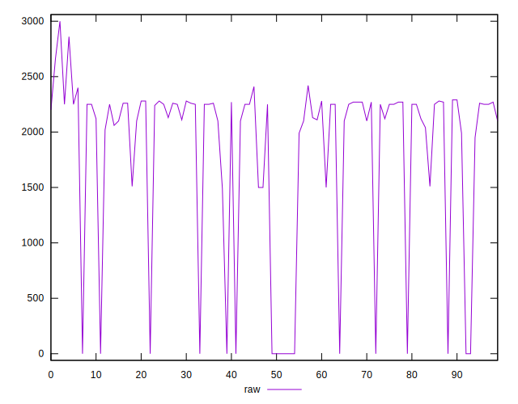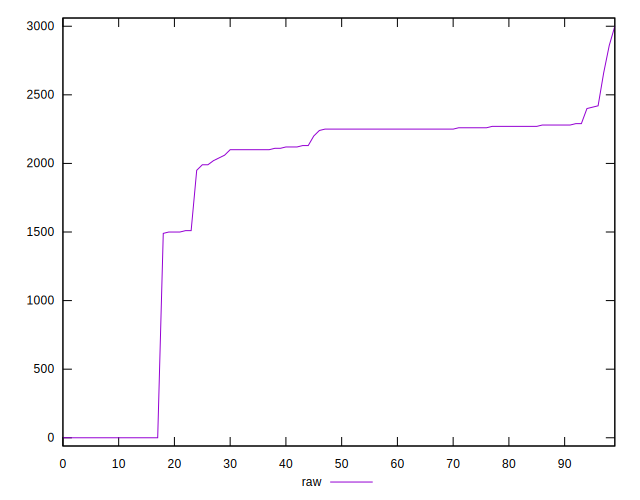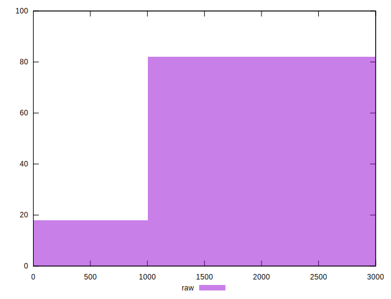
## Score


```yaml
p90min: 0.3
p90max: 1
p90range: 0.7
p90mean: 0.43904255319148955
median: 0.32
p90stdev: 0.245504557087904
mad: 0.015000000000000013
stdevBySn: 0.02087050000000002
lfitCenter: 0.40183005135606303
lfitStdev: 0.16093375986258307
mfitCenter: 0.40183005135606303
mfitStdev: 0.20170055661007286
mfitConfidence: 0.020170055661007286
p90skewness: 1.8255608308827622
p90eccentricity: 1.0000000000000016
p90discretization: 10.444444444444445
outlandishness: 1.052406527545676

```

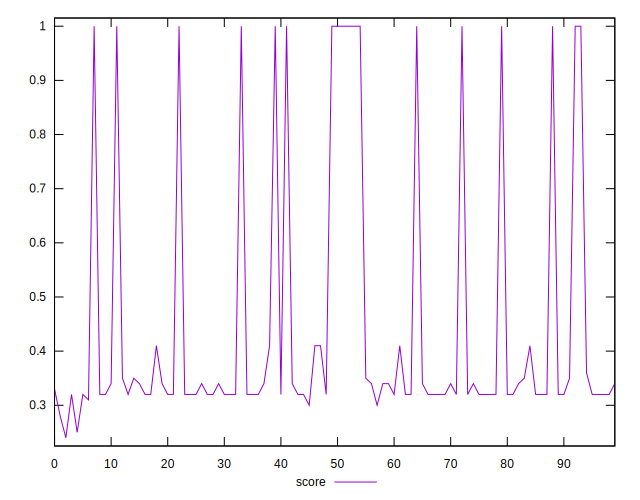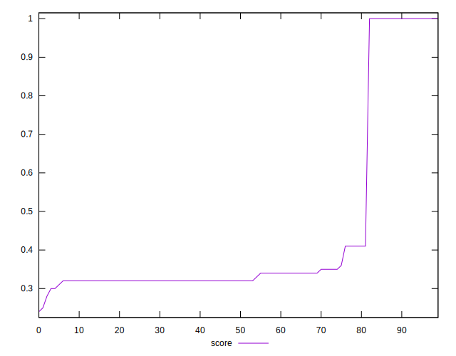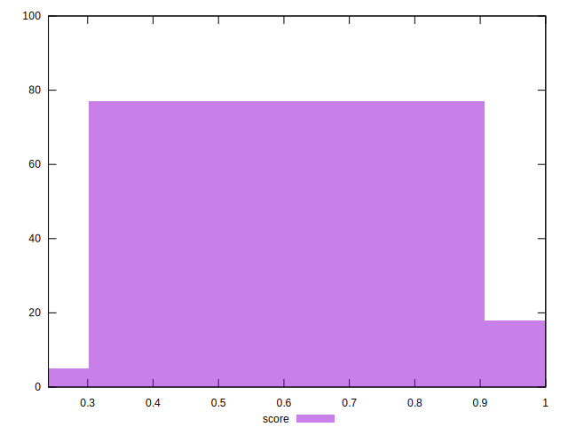
## Raw Estimate

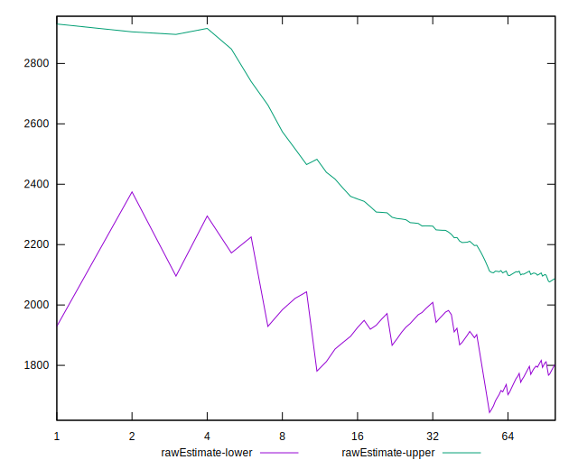
## Score Estimate

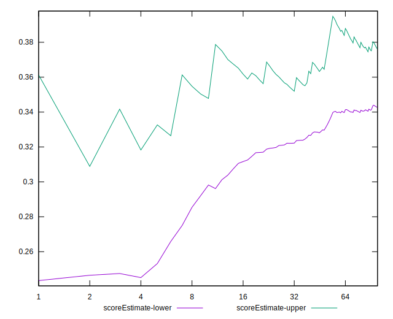
## P Score


```yaml
p90min: 0.3035294117647059
p90max: 1
p90range: 0.6964705882352942
p90mean: 0.44040050062578207
median: 0.32352941176470584
p90stdev: 0.24488678407610376
mad: 0.014117647058823568
stdevBySn: 0.018941294117647046
lfitCenter: 0.40338921440639325
lfitStdev: 0.16051350706039752
mfitCenter: 0.40338921440639325
mfitStdev: 0.20117384783131725
mfitConfidence: 0.020117384783131725
p90skewness: 1.8263492184897792
p90eccentricity: 0.9999999999999996
p90discretization: 4.086956521739131
outlandishness: 1.0515072187717731

```

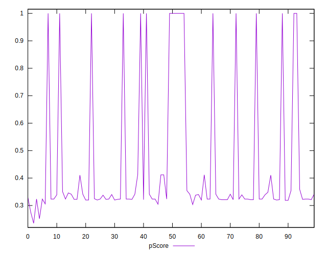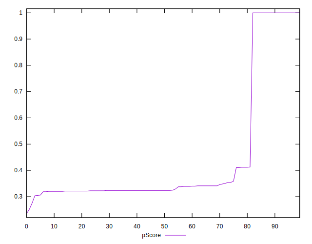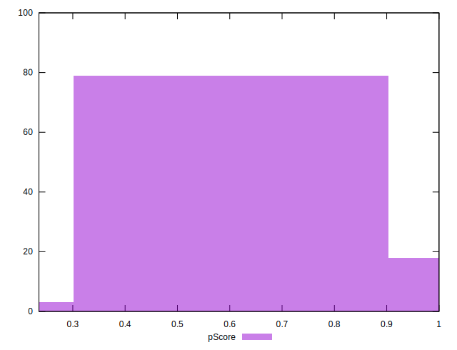
## Score Difference


```yaml
p90min: 0
p90max: 5.551115123125783e-17
p90range: 5.551115123125783e-17
p90mean: 4.724353296277262e-18
median: 0
p90stdev: 1.5489828153710845e-17
mad: 0
stdevBySn: 0
lfitCenter: 3.2613928185421445e-18
lfitStdev: 7.694795773604994e-18
mfitCenter: 3.2613928185421445e-18
mfitStdev: 9.6439963365189e-18
mfitConfidence: 9.6439963365189e-19
p90skewness: 2.9737221214857827
p90eccentricity: 0.9999999999999971
p90discretization: 47
outlandishness: 1.67055625

```

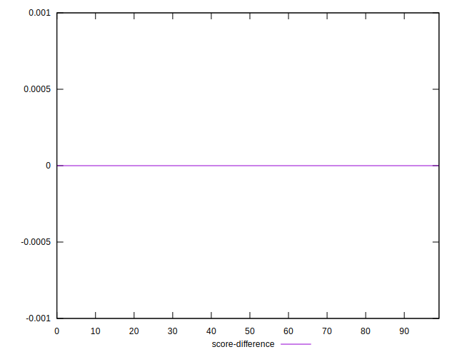
## P Score Difference


```yaml
p90min: -0.004117647058823504
p90max: 0.004117647058823559
p90range: 0.008235294117647063
p90mean: 0.001276595744680838
median: 0.0011764705882352788
p90stdev: 0.0017681199721248156
mad: 0.0011764705882353343
stdevBySn: 0.00140305882352946
lfitCenter: 0.0012166003887293308
lfitStdev: 0.0015471608799768573
mfitCenter: 0.0012166003887293308
mfitStdev: 0.0019390786055276685
mfitConfidence: 0.00019390786055276685
p90skewness: -0.21080592579756638
p90eccentricity: 1.0000000000000002
p90discretization: 5.875
outlandishness: 0.8836000000000002

```

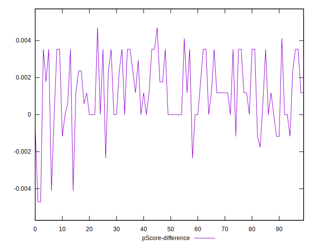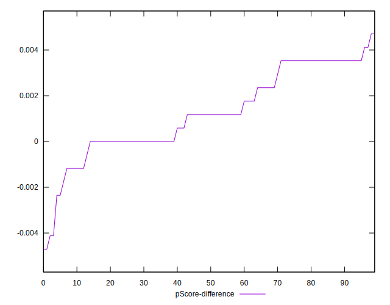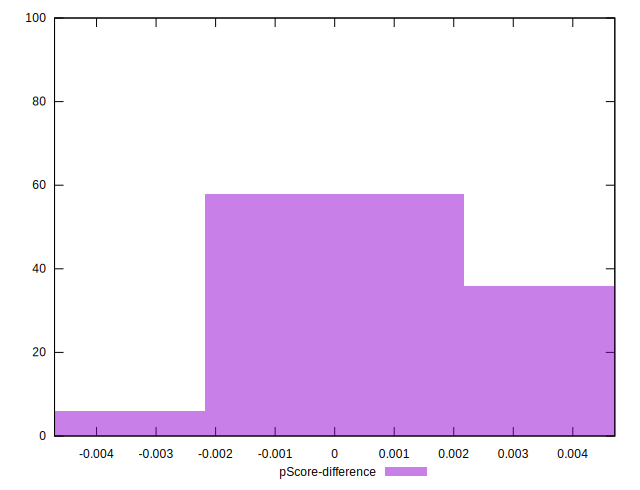