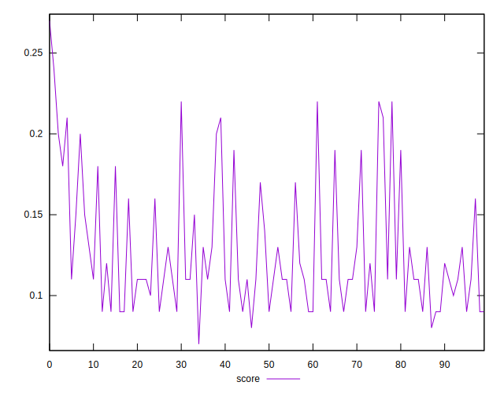

# //unused-javascript/samples/astro

[→ Parent](../..)


## Raw


```yaml
p90min: 3120
p90max: 4240
p90range: 1120
p90mean: 3908.936170212766
median: 4050
p90stdev: 322.55122662625035
mad: 150
stdevBySn: 190.81600000000003
lfitCenter: 3943.5201837850313
lfitStdev: 263.06961042947614
mfitCenter: 3943.5201837850313
mfitStdev: 329.7088621811107
mfitConfidence: 32.97088621811107
p90skewness: -1.1342990488876912
p90eccentricity: 0.9999999999999999
p90discretization: 2.5405405405405403
outlandishness: 0.9920667439539311

```


## Score


```yaml
p90min: 0.09
p90max: 0.22
p90range: 0.13
p90mean: 0.12670212765957445
median: 0.11
p90stdev: 0.038437246394177116
mad: 0.020000000000000004
stdevBySn: 0.023852000000000005
lfitCenter: 0.12289150822343682
lfitStdev: 0.0315254626413613
mfitCenter: 0.12289150822343682
mfitStdev: 0.039511308053587726
mfitConfidence: 0.0039511308053587725
p90skewness: 1.0806094181283414
p90eccentricity: 1.0000000000000002
p90discretization: 6.714285714285714
outlandishness: 1.0317851620148595

```


## Raw Estimate


## Score Estimate


## P Score


```yaml
p90min: 0.08941176470588236
p90max: 0.2211764705882353
p90range: 0.13176470588235295
p90mean: 0.12836045056320394
median: 0.11176470588235293
p90stdev: 0.03794720313250003
mad: 0.017647058823529405
stdevBySn: 0.022448941176470564
lfitCenter: 0.12429174308411411
lfitStdev: 0.030949365932879617
mfitCenter: 0.12429174308411411
mfitStdev: 0.03878927790366017
mfitConfidence: 0.0038789277903660173
p90skewness: 1.1342990488877032
p90eccentricity: 0.9999999999999999
p90discretization: 2.5405405405405403
outlandishness: 1.0286817016514513

```


## Score Difference


```yaml
p90min: 0
p90max: 0
p90range: 0
p90mean: 0
median: 0
p90stdev: 0
mad: 0
stdevBySn: 0
lfitCenter: 0
lfitStdev: 0
mfitCenter: 0
mfitStdev: 0
mfitConfidence: 0
p90skewness: .nan
p90eccentricity: .nan
p90discretization: 94
outlandishness: .nan

```


## P Score Difference


```yaml
p90min: -0.003529411764705878
p90max: 0.004705882352941143
p90range: 0.008235294117647021
p90mean: 0.0015581977471839739
median: 0.0017647058823529321
p90stdev: 0.001950403690270573
mad: 0.0017647058823529321
stdevBySn: 0.0021045882352941237
lfitCenter: 0.0015495181133426679
lfitStdev: 0.0016308281658811146
mfitCenter: 0.0015495181133426679
mfitStdev: 0.002043939997887808
mfitConfidence: 0.00020439399978878077
p90skewness: -0.2493956546086835
p90eccentricity: 1.0000000000000007
p90discretization: 3.6153846153846154
outlandishness: 0.9122167771487547

```

