# //unused-javascript/samples/card

[→ Parent](../..)


## Raw


```yaml
p90min: 0
p90max: 2550
p90range: 2550
p90mean: 1692.9032258064517
median: 2160
p90stdev: 927.5630931155165
mad: 100
stdevBySn: 190.81600000000003
lfitCenter: 1838.604561350528
lfitStdev: 754.8964175749601
mfitCenter: 1838.604561350528
mfitStdev: 946.1223533075513
mfitConfidence: 95.08887429361258
p90skewness: -1.22330523969538
p90eccentricity: 1.0000000000000004
p90discretization: 4.428571428571429
outlandishness: 0.9806737119813225

```

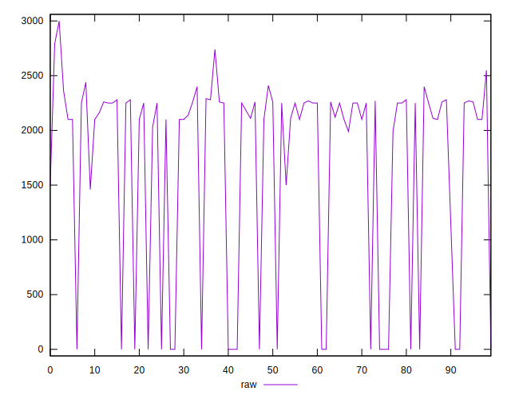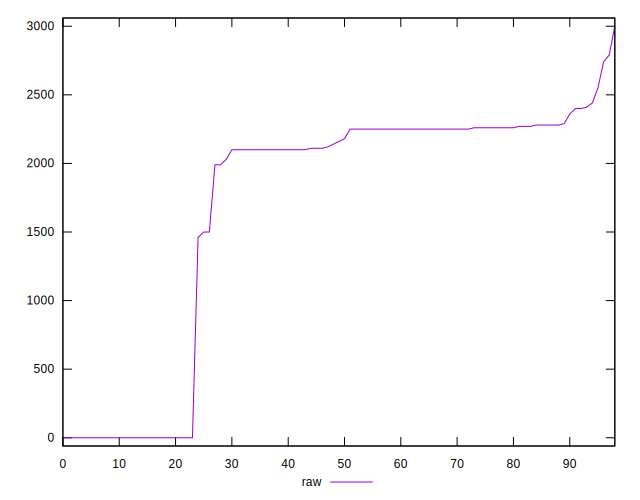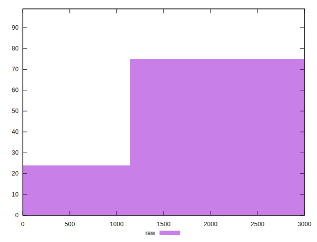
## Score


```yaml
p90min: 0.29
p90max: 1
p90range: 0.71
p90mean: 0.48075268817204325
median: 0.33
p90stdev: 0.2810473367664715
mad: 0.010000000000000009
stdevBySn: 0.023852000000000022
lfitCenter: 0.43563101816205574
lfitStdev: 0.2239613257328426
mfitCenter: 0.43563101816205574
mfitStdev: 0.2806938960353395
mfitConfidence: 0.0282107980027954
p90skewness: 1.2965636225913344
p90eccentricity: 1.0000000000000002
p90discretization: 9.3
outlandishness: 1.0375556280341527

```

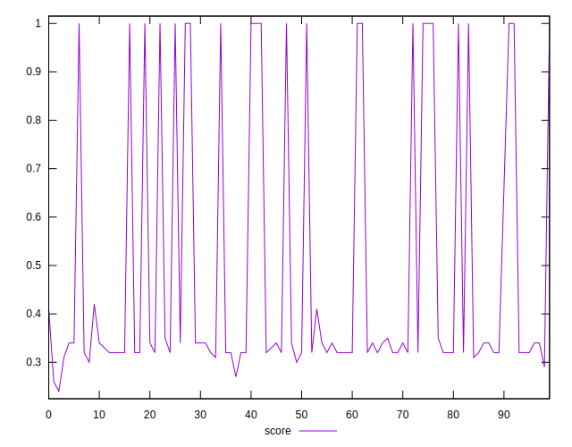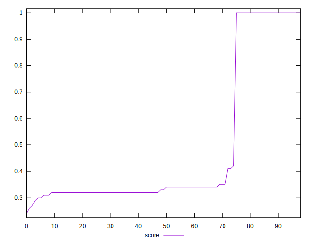
## Raw Estimate

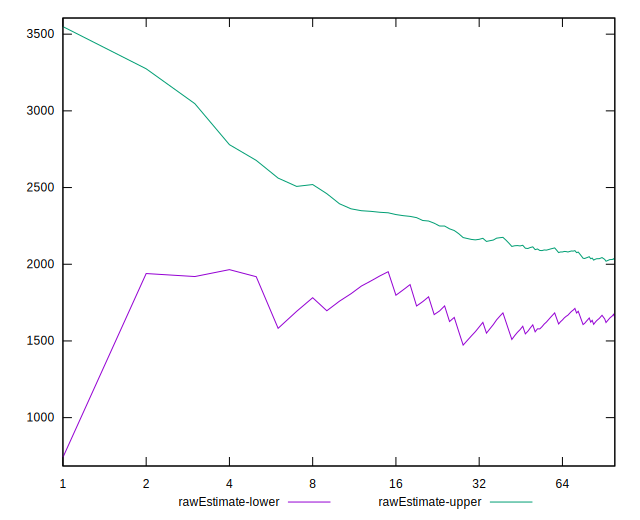
## Score Estimate

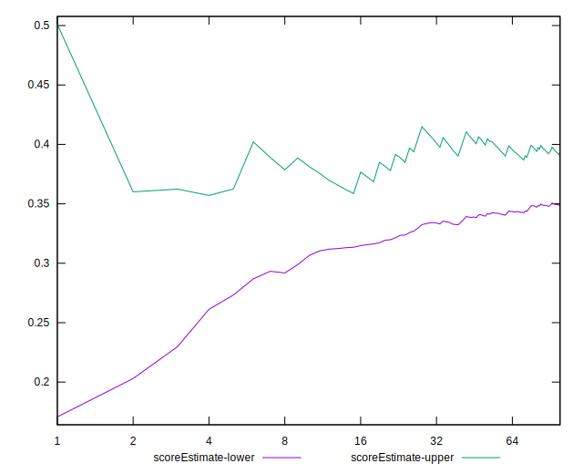
## P Score


```yaml
p90min: 0.28823529411764703
p90max: 1
p90range: 0.711764705882353
p90mean: 0.4820493358633775
median: 0.3341176470588235
p90stdev: 0.28033030035936857
mad: 0.0117647058823529
stdevBySn: 0.022448941176470564
lfitCenter: 0.4371170883083368
lfitStdev: 0.22337160118949673
mfitCenter: 0.4371170883083368
mfitStdev: 0.27995478592729844
mfitConfidence: 0.028136514641973243
p90skewness: 1.296886572479445
p90eccentricity: 0.9999999999999996
p90discretization: 4.428571428571429
outlandishness: 1.0367450639447768

```

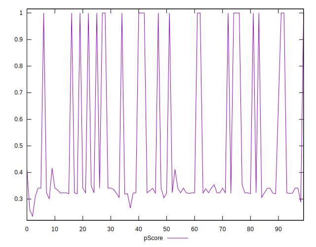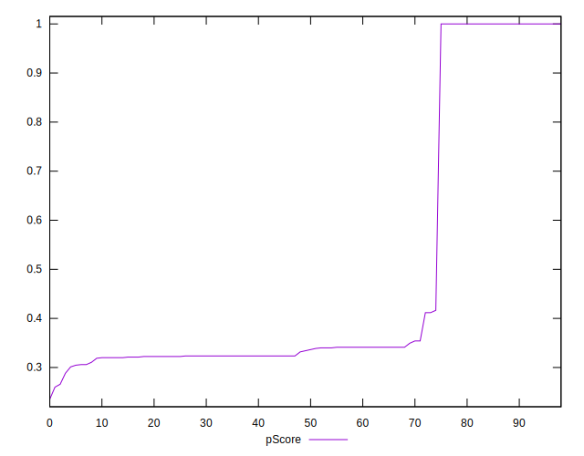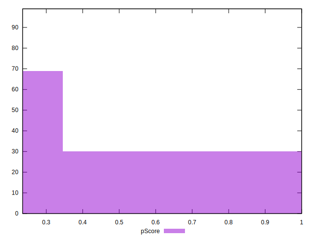
## Score Difference


```yaml
p90min: 0
p90max: 5.551115123125783e-17
p90range: 5.551115123125783e-17
p90mean: 1.1937881985216738e-18
median: 0
p90stdev: 8.052541646169713e-18
mad: 0
stdevBySn: 0
lfitCenter: 1.3772619907040874e-18
lfitStdev: 3.3666308024413447e-18
mfitCenter: 1.3772619907040874e-18
mfitStdev: 4.21944598406735e-18
mfitConfidence: 4.240702773431306e-19
p90skewness: 6.597118918283824
p90eccentricity: 1.0000000000000044
p90discretization: 46.5
outlandishness: 5.5153810835629

```

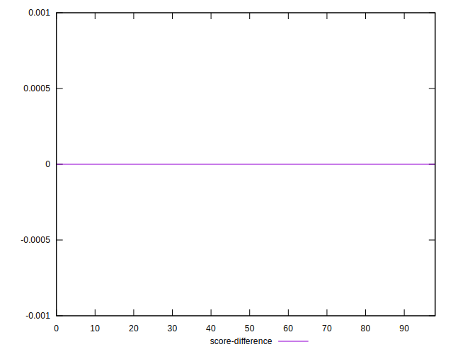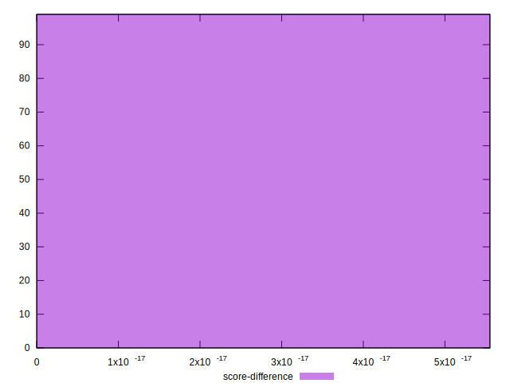
## P Score Difference


```yaml
p90min: -0.004117647058823504
p90max: 0.004117647058823504
p90range: 0.008235294117647007
p90mean: 0.001201771030993028
median: 0.0011764705882352788
p90stdev: 0.0017465095567768649
mad: 0.0011764705882352788
stdevBySn: 0.00140305882352946
lfitCenter: 0.0011175448270181571
lfitStdev: 0.0014827175273319953
mfitCenter: 0.0011175448270181571
mfitStdev: 0.0018583108405205828
mfitConfidence: 0.00018676726672293167
p90skewness: -0.3302181040707766
p90eccentricity: 1.0000000000000004
p90discretization: 6.2
outlandishness: 0.8824609733700652

```

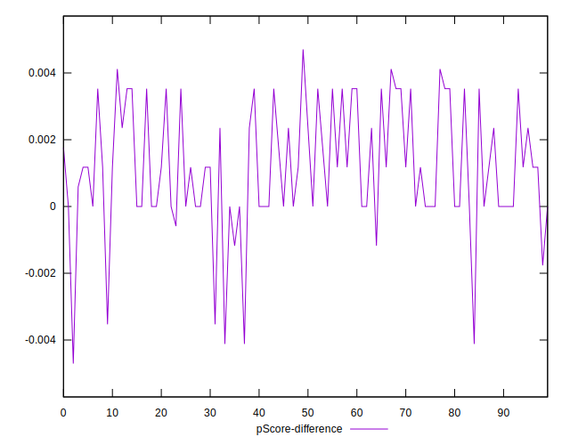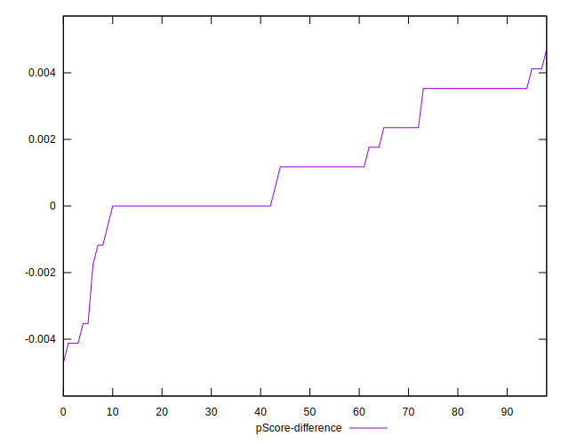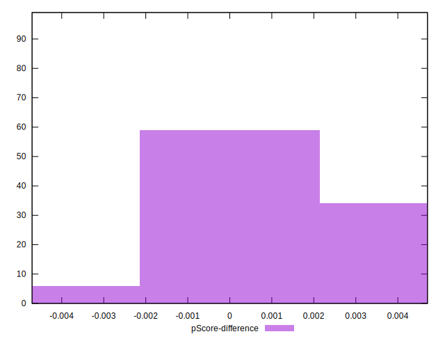