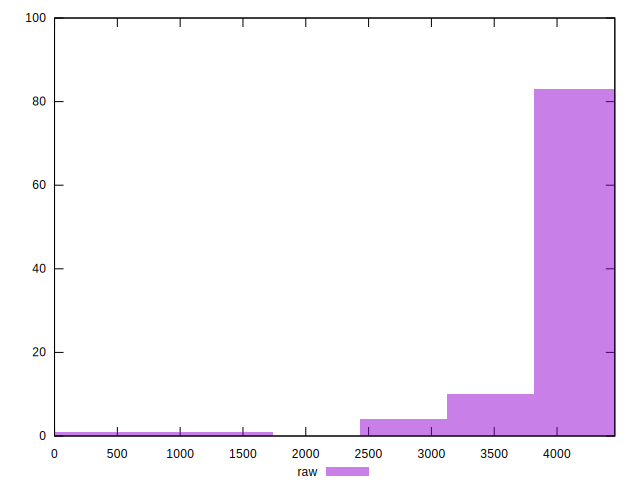

# //unused-javascript/samples/music

[→ Parent](../..)


## Raw


```yaml
p90min: 2850
p90max: 4350
p90range: 1500
p90mean: 3884.7872340425533
median: 3910
p90stdev: 282.09221641235445
mad: 140
stdevBySn: 178.89000000000001
lfitCenter: 3866.583555055521
lfitStdev: 224.8976262382261
mfitCenter: 3866.583555055521
mfitStdev: 281.8673746966931
mfitConfidence: 28.18673746966931
p90skewness: -1.7481734799239892
p90eccentricity: 0.9999999999999987
p90discretization: 2.8484848484848486
outlandishness: 0.9598493874825753

```


## Score


```yaml
p90min: 0.08
p90max: 0.25
p90range: 0.16999999999999998
p90mean: 0.13159574468085117
median: 0.13
p90stdev: 0.03371669172740995
mad: 0.01999999999999999
stdevBySn: 0.023852000000000005
lfitCenter: 0.13568443391053325
lfitStdev: 0.031051267569005614
mfitCenter: 0.13568443391053325
mfitStdev: 0.03891699266496097
mfitConfidence: 0.003891699266496097
p90skewness: 1.672237735278787
p90eccentricity: 1.0000000000000009
p90discretization: 6.266666666666667
outlandishness: 1.2124199638079194

```


## Raw Estimate


## Score Estimate


## P Score


```yaml
p90min: 0.07647058823529412
p90max: 0.2529411764705882
p90range: 0.1764705882352941
p90mean: 0.13120150187734658
median: 0.12823529411764706
p90stdev: 0.03318731957792404
mad: 0.016470588235294126
stdevBySn: 0.02104588235294117
lfitCenter: 0.1352592999621645
lfitStdev: 0.03067473922911585
mfitCenter: 0.1352592999621645
mfitStdev: 0.03844508437300234
mfitConfidence: 0.003844508437300234
p90skewness: 1.7481734799239956
p90eccentricity: 0.9999999999999997
p90discretization: 2.8484848484848486
outlandishness: 1.2144742228981797

```


## Score Difference


```yaml
p90min: 0
p90max: 0
p90range: 0
p90mean: 0
median: 0
p90stdev: 0
mad: 0
stdevBySn: 0
lfitCenter: 2.583267684513104e-19
lfitStdev: 6.445158398659724e-19
mfitCenter: 2.583267684513104e-19
mfitStdev: 8.077808146406197e-19
mfitConfidence: 8.077808146406197e-20
p90skewness: .nan
p90eccentricity: .nan
p90discretization: 94
outlandishness: .inf

```


## P Score Difference


```yaml
p90min: -0.004117647058823559
p90max: 0.003529411764705892
p90range: 0.007647058823529451
p90mean: -0.0003254067584480718
median: -0.0005882352941176672
p90stdev: 0.0018153294200124546
mad: 0.0011764705882352788
stdevBySn: 0.0014030588235294434
lfitCenter: -0.00036495793355128164
lfitStdev: 0.0013813715836194585
mfitCenter: -0.00036495793355128164
mfitStdev: 0.0017312925363782681
mfitConfidence: 0.0001731292536378268
p90skewness: 0.08166535913972325
p90eccentricity: 1.0000000000000002
p90discretization: 3.4814814814814814
outlandishness: 0.9179113905325467

```

