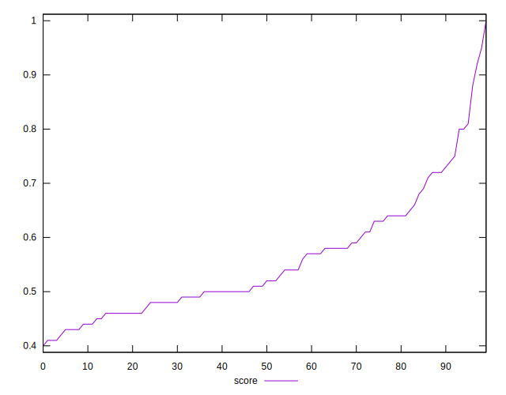

# //uses-http2/samples/agenda

[→ Parent](../..)


## Raw


```yaml
p90min: 150
p90max: 1510
p90range: 1360
p90mean: 748.2978723404256
median: 725
p90stdev: 297.75271154015644
mad: 205
stdevBySn: 310.076
lfitCenter: 738.185447308614
lfitStdev: 235.51123678209518
mfitCenter: 738.185447308614
mfitStdev: 295.1695628526703
mfitConfidence: 29.51695628526703
p90skewness: 0.4457895232581429
p90eccentricity: 1.0000000000000002
p90discretization: 1.5161290322580645
outlandishness: 1.0077716520003697

```


## Score


```yaml
p90min: 0.41
p90max: 0.88
p90range: 0.47000000000000003
p90mean: 0.5525531914893619
median: 0.515
p90stdev: 0.10199015565983083
mad: 0.06499999999999995
stdevBySn: 0.09540799999999997
lfitCenter: 0.5467467554941104
lfitStdev: 0.08895302664456488
mfitCenter: 0.5467467554941104
mfitStdev: 0.11148608596281757
mfitConfidence: 0.011148608596281757
p90skewness: 1.0034728532893384
p90eccentricity: 1
p90discretization: 2.764705882352941
outlandishness: 1.0282366072549873

```


## Raw Estimate


## Score Estimate


## P Score


```yaml
p90min: 0.41058823529411764
p90max: 0.875
p90range: 0.46441176470588236
p90mean: 0.5528688638575997
median: 0.5138888888888888
p90stdev: 0.1016949278586605
mad: 0.061830065359477104
stdevBySn: 0.09414134967320259
lfitCenter: 0.5468480132907063
lfitStdev: 0.0889645872617904
mfitCenter: 0.5468480132907063
mfitStdev: 0.111500575047837
mfitConfidence: 0.0111500575047837
p90skewness: 0.999850659797697
p90eccentricity: 0.9999999999999994
p90discretization: 1.5161290322580645
outlandishness: 1.0280717838548843

```


## Score Difference


```yaml
p90min: 0
p90max: 1.1102230246251565e-16
p90range: 1.1102230246251565e-16
p90mean: 5.9054416203465774e-18
median: 0
p90stdev: 2.212768265923376e-17
mad: 0
stdevBySn: 0
lfitCenter: 4.580625976147215e-18
lfitStdev: 1.0877396843401316e-17
mfitCenter: 4.580625976147215e-18
mfitStdev: 1.3632795254743764e-17
mfitConfidence: 1.3632795254743764e-18
p90skewness: 3.8832217811649707
p90eccentricity: 1.0000000000000027
p90discretization: 31.333333333333332
outlandishness: 2.262016

```


## P Score Difference


```yaml
p90min: -0.004444444444444362
p90max: 0.004705882352941171
p90range: 0.009150326797385533
p90mean: 0.0002902934223334749
median: 0
p90stdev: 0.0026614361889225817
mad: 0.0023529411764705577
stdevBySn: 0.0028061176470588534
lfitCenter: 0.00022894527892736415
lfitStdev: 0.002463736296867528
mfitCenter: 0.00022894527892736415
mfitStdev: 0.0030878355345885225
mfitConfidence: 0.00030878355345885224
p90skewness: 0.10467856806013778
p90eccentricity: 0.9999999999999999
p90discretization: 2.8484848484848486
outlandishness: 0.8984769484743037

```

