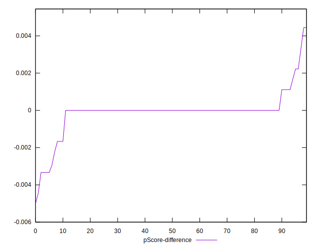

# //uses-http2/samples/astro

[→ Parent](../..)


## Raw


```yaml
p90min: 0
p90max: 540
p90range: 540
p90mean: 61.59574468085106
median: 0
p90stdev: 139.85024811127747
mad: 0
stdevBySn: 0
lfitCenter: 45.920877117164764
lfitStdev: 100.1052140053857
mfitCenter: 45.920877117164764
mfitStdev: 125.46328005819001
mfitConfidence: 12.546328005819001
p90skewness: 2.108479690450222
p90eccentricity: 0.9999999999999978
p90discretization: 5.222222222222222
outlandishness: 1.7207639590622863

```


## Score


```yaml
p90min: 0.62
p90max: 1
p90range: 0.38
p90mean: 0.9524468085106383
median: 1
p90stdev: 0.10619819057452796
mad: 0
stdevBySn: 0
lfitCenter: 0.966095990845501
lfitStdev: 0.07390904323086314
mfitCenter: 0.966095990845501
mfitStdev: 0.09263124884991275
mfitConfidence: 0.009263124884991276
p90skewness: -1.996970487423024
p90eccentricity: 1.000000000000002
p90discretization: 5.529411764705882
outlandishness: 0.9767302888338941

```


## Raw Estimate


## Score Estimate


## P Score


```yaml
p90min: 0.6166666666666667
p90max: 1
p90range: 0.3833333333333333
p90mean: 0.9523345153664303
median: 1
p90stdev: 0.10636687640810281
mad: 0
stdevBySn: 0
lfitCenter: 0.9660241616533115
lfitStdev: 0.07406562727514471
mfitCenter: 0.9660241616533115
mfitStdev: 0.09282749784648635
mfitConfidence: 0.009282749784648634
p90skewness: -1.9947887399173085
p90eccentricity: 0.9999999999999999
p90discretization: 5.222222222222222
outlandishness: 0.976749684605063

```


## Score Difference


```yaml
p90min: 0
p90max: 0
p90range: 0
p90mean: 0
median: 0
p90stdev: 0
mad: 0
stdevBySn: 0
lfitCenter: 1.319376004352692e-18
lfitStdev: 3.259771146566013e-18
mfitCenter: 1.319376004352692e-18
mfitStdev: 4.085517266515362e-18
mfitConfidence: 4.0855172665153624e-19
p90skewness: .nan
p90eccentricity: .nan
p90discretization: 94
outlandishness: .inf

```


## P Score Difference


```yaml
p90min: -0.0033333333333334103
p90max: 0.0022222222222222365
p90range: 0.005555555555555647
p90mean: -0.00010221109720483973
median: 0
p90stdev: 0.0008743752888856892
mad: 0
stdevBySn: 0
lfitCenter: -0.000055704048517948015
lfitStdev: 0.0004200406354255567
mfitCenter: -0.000055704048517948015
mfitStdev: 0.0005264428671555654
mfitConfidence: 0.000052644286715556536
p90skewness: -1.7062206775576625
p90eccentricity: 0.9999999999999997
p90discretization: 8.545454545454545
outlandishness: 0.9887393632283008

```

