# //uses-http2/samples/card

[→ Parent](../..)


## Raw


```yaml
p90min: 170
p90max: 1450
p90range: 1280
p90mean: 807.5268817204301
median: 760
p90stdev: 317.86132065705357
mad: 190
stdevBySn: 357.78000000000003
lfitCenter: 791.1730426120258
lfitStdev: 258.1002572512672
mfitCenter: 791.1730426120258
mfitStdev: 323.4807015832806
mfitConfidence: 32.51103375977775
p90skewness: 0.37420624981460204
p90eccentricity: 0.9999999999999999
p90discretization: 1.690909090909091
outlandishness: 1.0006214902298245

```

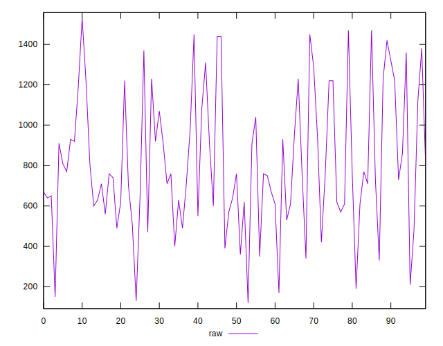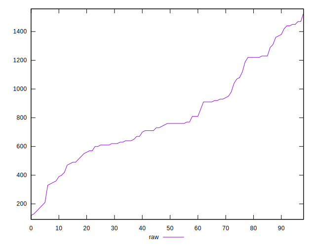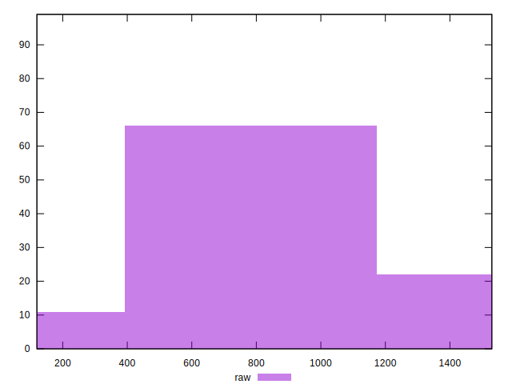
## Score


```yaml
p90min: 0.42
p90max: 0.86
p90range: 0.44
p90mean: 0.5361290322580643
median: 0.5
p90stdev: 0.09768318614814284
mad: 0.06000000000000005
stdevBySn: 0.08348200000000001
lfitCenter: 0.5304895879891899
lfitStdev: 0.07969491132111296
mfitCenter: 0.5304895879891899
mfitStdev: 0.09988275913136227
mfitConfidence: 0.010038595001944645
p90skewness: 1.2540249047961618
p90eccentricity: 0.9999999999999999
p90discretization: 3
outlandishness: 1.026673979855567

```

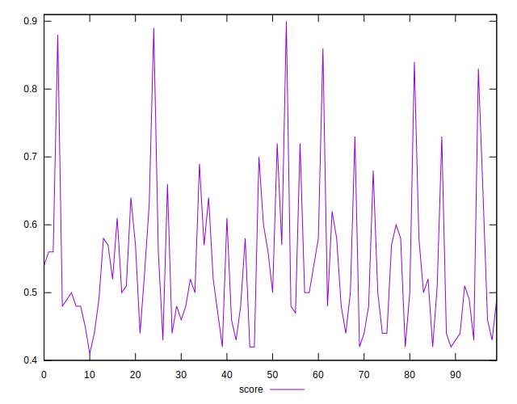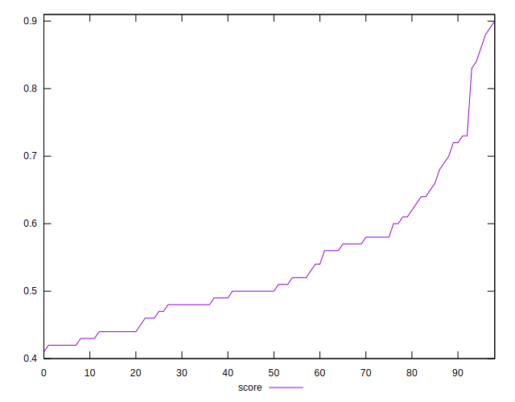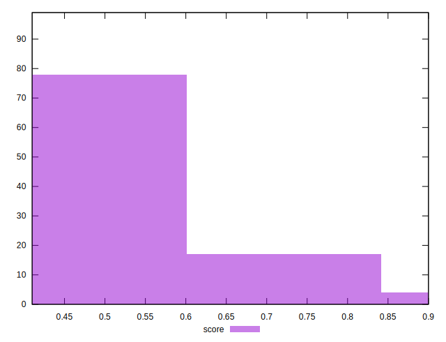
## Raw Estimate

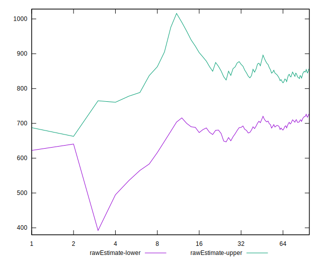
## Score Estimate

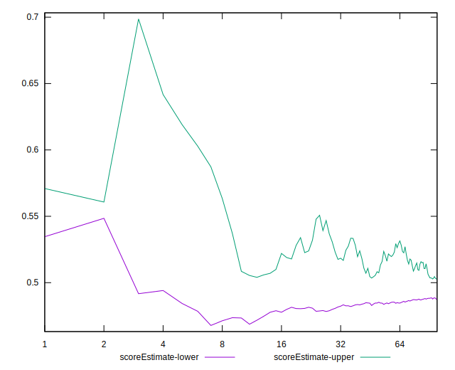
## P Score


```yaml
p90min: 0.4176470588235294
p90max: 0.8583333333333334
p90range: 0.44068627450980397
p90mean: 0.5364076885234381
median: 0.4988235294117647
p90stdev: 0.0976131465166271
mad: 0.062287581699346395
stdevBySn: 0.07919487581699343
lfitCenter: 0.5306301900204028
lfitStdev: 0.07989629350849292
mfitCenter: 0.5306301900204028
mfitStdev: 0.10013515427406305
mfitConfidence: 0.010063961668224848
p90skewness: 1.2445495037899093
p90eccentricity: 0.9999999999999997
p90discretization: 1.690909090909091
outlandishness: 1.026042622768808

```

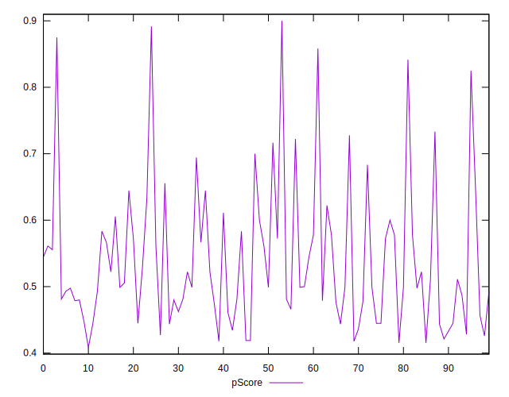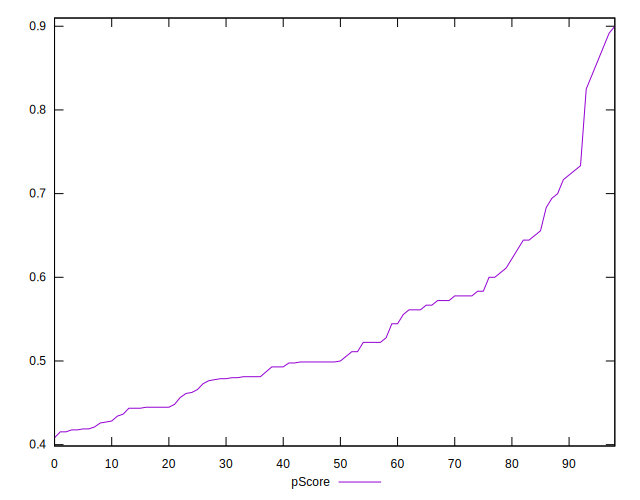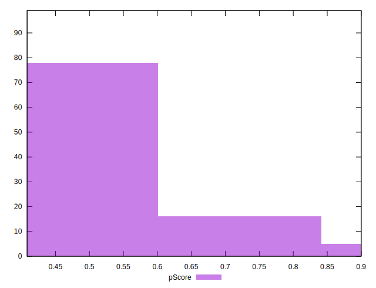
## Score Difference


```yaml
p90min: 0
p90max: 1.1102230246251565e-16
p90range: 1.1102230246251565e-16
p90mean: 7.759623290390878e-18
median: 0
p90stdev: 2.649295480864374e-17
mad: 0
stdevBySn: 0
lfitCenter: 5.597116416091117e-18
lfitStdev: 1.319608830519018e-17
mfitCenter: 5.597116416091117e-18
mfitStdev: 1.653884404680068e-17
mfitConfidence: 1.6622163687709382e-18
p90skewness: 3.34958016866237
p90eccentricity: 0.9999999999999989
p90discretization: 31
outlandishness: 1.8850201857194866

```

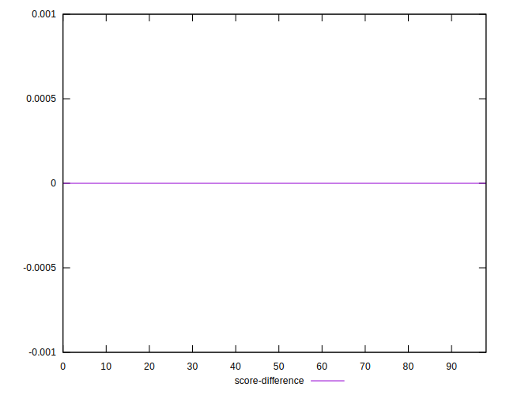
## P Score Difference


```yaml
p90min: -0.004705882352941171
p90max: 0.004705882352941171
p90range: 0.009411764705882342
p90mean: 0.0001289619790568616
median: 0
p90stdev: 0.002673987362742023
mad: 0.0022222222222222365
stdevBySn: 0.0029620130718954014
lfitCenter: 0.0001279530140320217
lfitStdev: 0.0024454762003096155
mfitCenter: 0.0001279530140320217
mfitStdev: 0.003064949897400716
mfitConfidence: 0.00030803905487625623
p90skewness: -0.0232102244412213
p90eccentricity: 1.0000000000000002
p90discretization: 3.1
outlandishness: 0.798020840732705

```

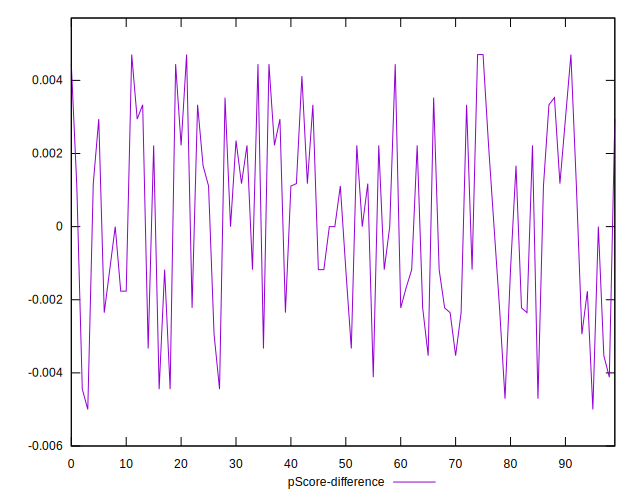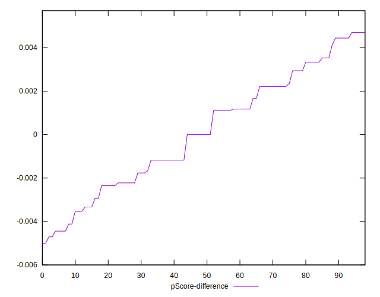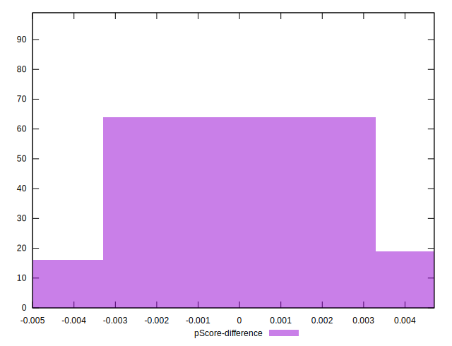