# //uses-http2/samples/music

[→ Parent](../..)


## Raw


```yaml
p90min: 0
p90max: 720
p90range: 720
p90mean: 240.95744680851064
median: 225
p90stdev: 191.9223532540897
mad: 170
stdevBySn: 244.48300000000003
lfitCenter: 243.37977749953419
lfitStdev: 180.44832683258747
mfitCenter: 243.37977749953419
mfitStdev: 226.15843930178002
mfitConfidence: 22.615843930178002
p90skewness: 0.3608584109662203
p90eccentricity: 0.9999999999999999
p90discretization: 2.088888888888889
outlandishness: 1.1393606678849368

```

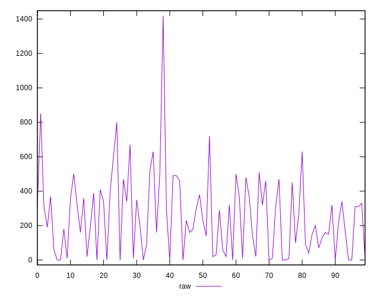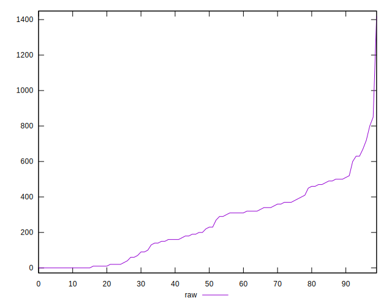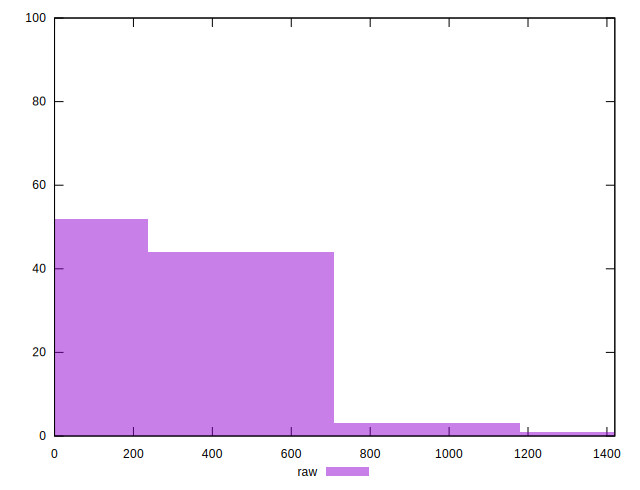
## Score


```yaml
p90min: 0.52
p90max: 1
p90range: 0.48
p90mean: 0.8146808510638298
median: 0.815
p90stdev: 0.13834663624742677
mad: 0.13
stdevBySn: 0.17590850000000005
lfitCenter: 0.8119654044756067
lfitStdev: 0.1312615394165055
mfitCenter: 0.8119654044756067
mfitStdev: 0.16451194320204104
mfitConfidence: 0.016451194320204105
p90skewness: -0.07954907943524124
p90eccentricity: 0.9999999999999999
p90discretization: 2.6857142857142855
outlandishness: 0.9880536527296696

```

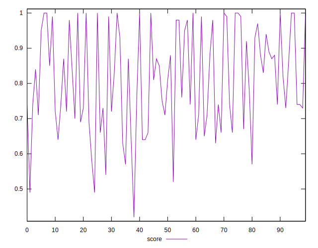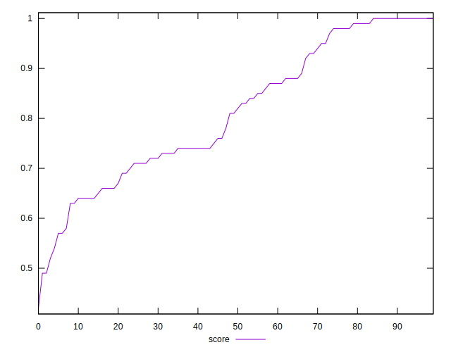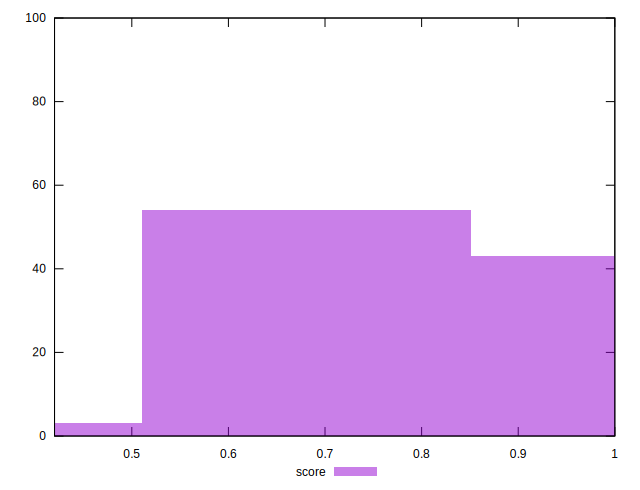
## Raw Estimate

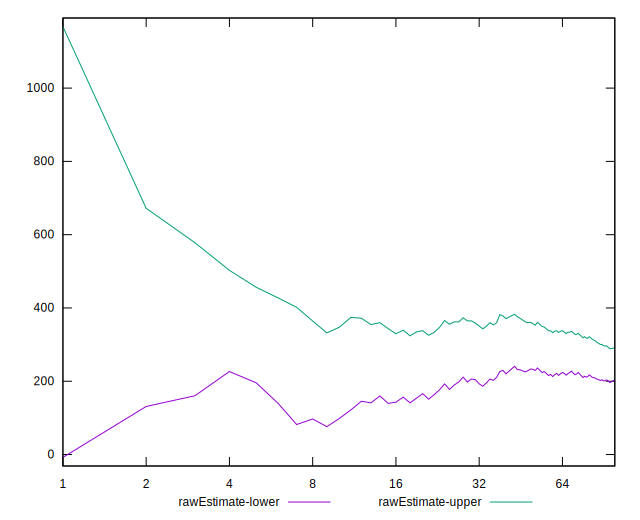
## Score Estimate

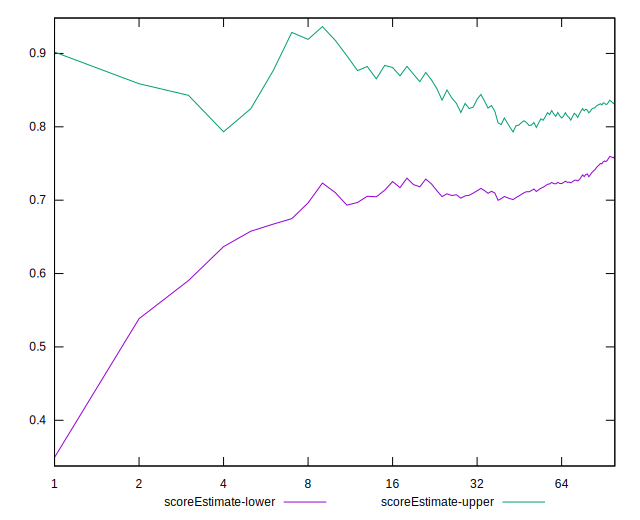
## P Score


```yaml
p90min: 0.5166666666666666
p90max: 1
p90range: 0.4833333333333334
p90mean: 0.8145390070921984
median: 0.8125
p90stdev: 0.1384273807142281
mad: 0.1333333333333333
stdevBySn: 0.17557722222222225
lfitCenter: 0.8117901259979561
lfitStdev: 0.1310763668236913
mfitCenter: 0.8117901259979561
mfitStdev: 0.1642798637733901
mfitConfidence: 0.01642798637733901
p90skewness: -0.07563199262270502
p90eccentricity: 0.9999999999999992
p90discretization: 2.088888888888889
outlandishness: 0.9881584942058802

```

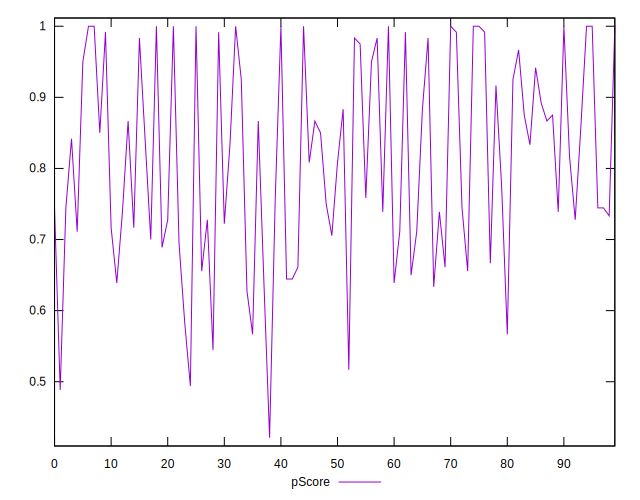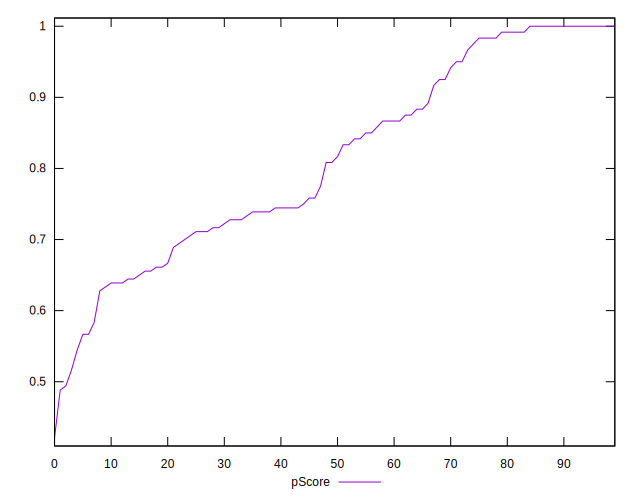
## Score Difference


```yaml
p90min: 0
p90max: 1.1102230246251565e-16
p90range: 1.1102230246251565e-16
p90mean: 9.448706592554524e-18
median: 0
p90stdev: 3.097965630742169e-17
mad: 0
stdevBySn: 0
lfitCenter: 6.522785637084289e-18
lfitStdev: 1.5389591547209988e-17
mfitCenter: 6.522785637084289e-18
mfitStdev: 1.92879926730378e-17
mfitConfidence: 1.92879926730378e-18
p90skewness: 2.9737221214857823
p90eccentricity: 0.9999999999999974
p90discretization: 47
outlandishness: 1.67055625

```

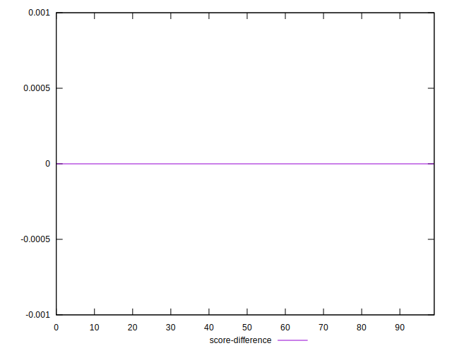
## P Score Difference


```yaml
p90min: -0.0050000000000000044
p90max: 0.004444444444444473
p90range: 0.009444444444444478
p90mean: -0.00008656654151021797
median: 0
p90stdev: 0.0025678514639738254
mad: 0.0016666666666667052
stdevBySn: 0.0026502222222222396
lfitCenter: -0.00009297307806682075
lfitStdev: 0.001998477639808857
mfitCenter: -0.00009297307806682075
mfitStdev: 0.002504720281601711
mfitConfidence: 0.0002504720281601711
p90skewness: 0.014298790519121965
p90eccentricity: 1.0000000000000002
p90discretization: 4.2727272727272725
outlandishness: 1.2826244737988064

```

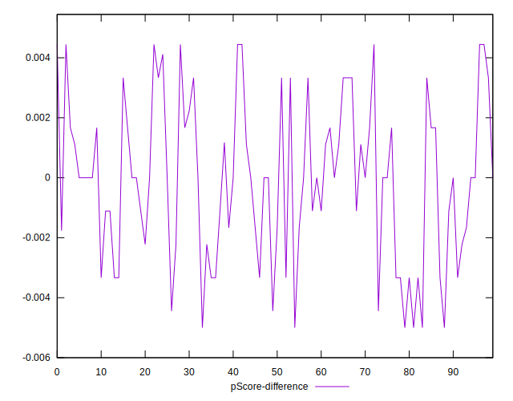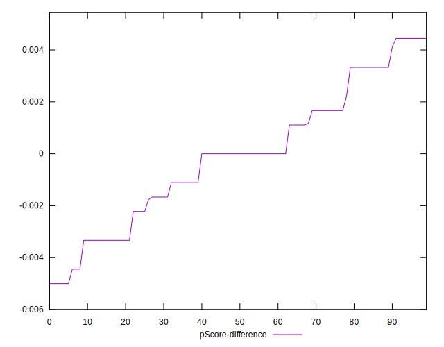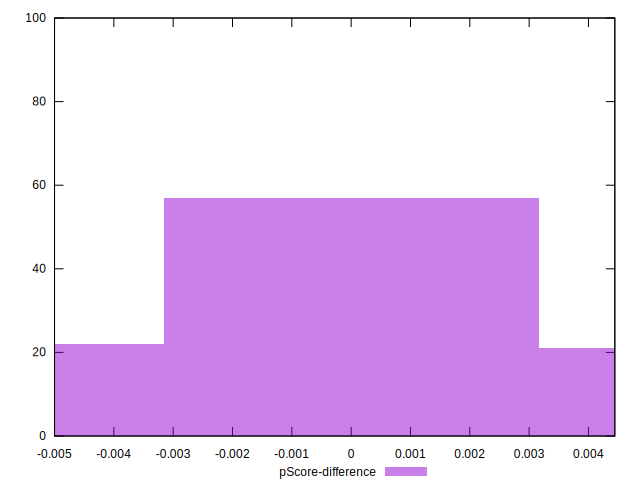