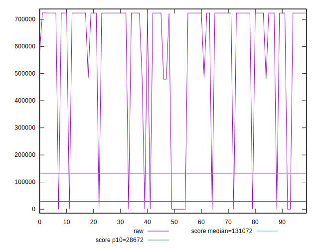

# //uses-long-cache-ttl/samples/agenda

[→ Parent](../..)


## Raw


```yaml
p90min: 0
p90max: 723104.2076833333
p90range: 723104.2076833333
p90mean: 590843.1182455677
median: 723101.0076833334
p90stdev: 264310.4963154864
mad: 1.599999999976717
stdevBySn: 1.9081600001110697
lfitCenter: 632785.143575941
lfitStdev: 188987.12628399115
mfitCenter: 632785.143575941
mfitStdev: 236860.2373806947
mfitConfidence: 23686.02373806947
p90skewness: -1.691003167650681
p90eccentricity: 0.9999999999999988
p90discretization: 5.529411764705882
outlandishness: 0.9540106956636913

```


## Score


```yaml
p90min: 0.07
p90max: 1
p90range: 0.9299999999999999
p90mean: 0.22308510638297888
median: 0.07
p90stdev: 0.33895341610436414
mad: 0
stdevBySn: 0
lfitCenter: 0.1728405448383437
lfitStdev: 0.22114028601757943
mfitCenter: 0.1728405448383437
mfitStdev: 0.2771582470747139
mfitConfidence: 0.027715824707471394
p90skewness: 1.8495259423959542
p90eccentricity: 1.000000000000001
p90discretization: 18.8
outlandishness: 1.1748202922220792

```


## Raw Estimate


## Score Estimate


## P Score


```yaml
p90min: 0.07492508230177308
p90max: 1
p90range: 0.9250749176982269
p90mean: 0.226754994821104
median: 0.07492561012621168
p90stdev: 0.33727316058237605
mad: 2.639128657833112e-7
stdevBySn: 3.1474248373317693e-7
lfitCenter: 0.17687895308302903
lfitStdev: 0.2200606214514398
mfitCenter: 0.17687895308302903
mfitStdev: 0.2758050882090509
mfitConfidence: 0.02758050882090509
p90skewness: 1.8513265175851608
p90eccentricity: 0.9999999999999991
p90discretization: 5.875
outlandishness: 1.1711694951852358

```


## Score Difference


```yaml
p90min: 0
p90max: 0
p90range: 0
p90mean: 0
median: 0
p90stdev: 0
mad: 0
stdevBySn: 0
lfitCenter: 0
lfitStdev: 0
mfitCenter: 0
mfitStdev: 0
mfitConfidence: 0
p90skewness: .nan
p90eccentricity: .nan
p90discretization: 94
outlandishness: .nan

```


## P Score Difference


```yaml
p90min: -0.002923852849396058
p90max: 0.004925610126211677
p90range: 0.007849462975607735
p90mean: 0.0038049606607421203
median: 0.004925346213345894
p90stdev: 0.0021696817987928974
mad: 2.639128657833112e-7
stdevBySn: 3.1474248373317693e-7
lfitCenter: 0.00410005665038722
lfitStdev: 0.0017430055069882382
mfitCenter: 0.00410005665038722
mfitStdev: 0.0021845334455253005
mfitConfidence: 0.00021845334455253005
p90skewness: -1.56100894581878
p90eccentricity: 1.000000000000001
p90discretization: 6.714285714285714
outlandishness: 0.8929720491534738

```

