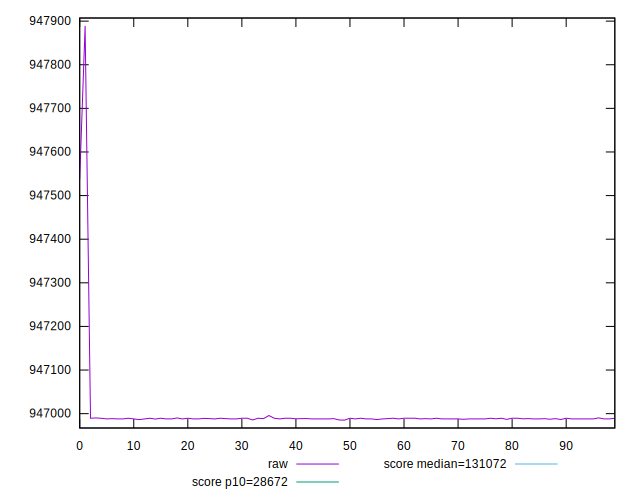
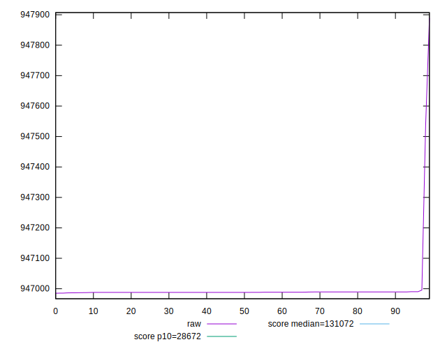
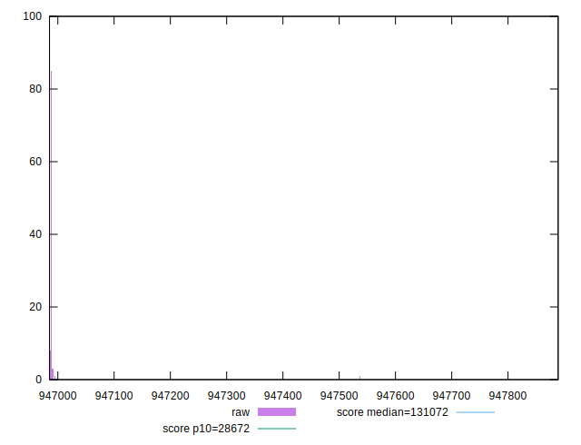
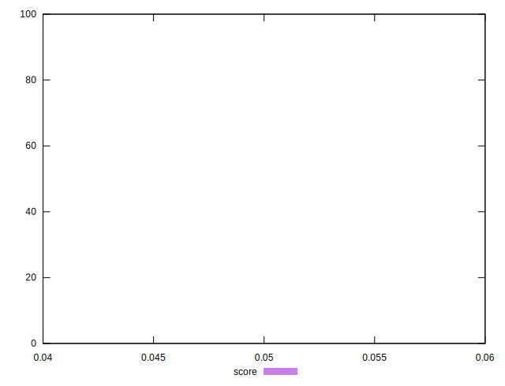
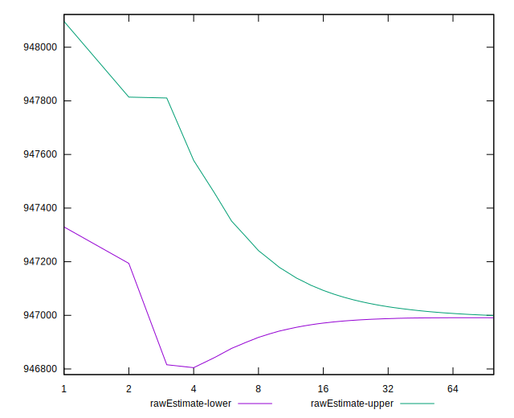
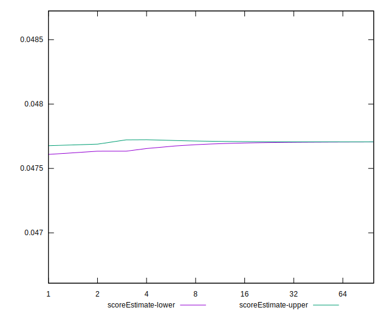
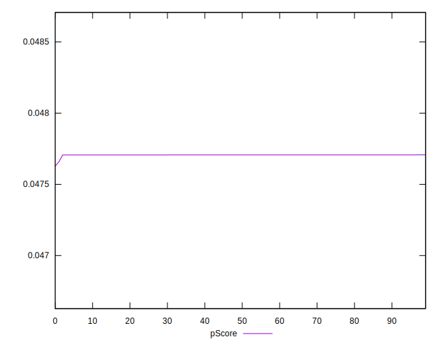
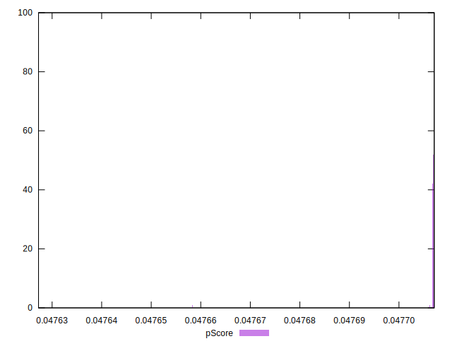
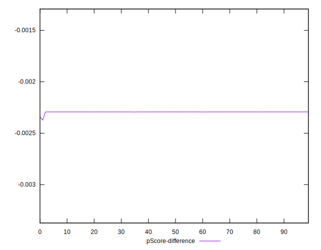
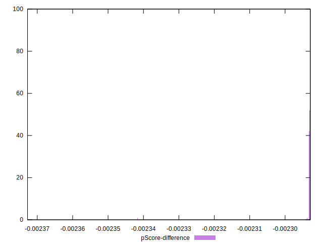

# //uses-long-cache-ttl/samples/astro

[→ Parent](../..)


## Raw


```yaml
p90min: 946986.2980750002
p90max: 946990.2980750002
p90range: 4
p90mean: 946988.446160106
median: 946987.8980750002
p90stdev: 0.8630047417216133
mad: 0.6800000000512227
stdevBySn: 0.8109680000610883
lfitCenter: 946995.1851091238
lfitStdev: 16.920844324158384
mfitCenter: 946995.1851091238
mfitStdev: 21.207133428121963
mfitConfidence: 2.1207133428121963
p90skewness: 0.12589095778005974
p90eccentricity: 0.9999999999999991
p90discretization: 5.875
outlandishness: 1.00003056507121

```


## Score


```yaml
p90min: 0.05
p90max: 0.05
p90range: 0
p90mean: 0.049999999999999906
median: 0.05
p90stdev: 9.71445146547012e-17
mad: 0
stdevBySn: 0
lfitCenter: 0.049999999999999906
lfitStdev: 0
mfitCenter: 0.049999999999999906
mfitStdev: 0
mfitConfidence: 0
p90skewness: 1
p90eccentricity: 1
p90discretization: 94
outlandishness: 1

```


## Raw Estimate


## Score Estimate


## P Score


```yaml
p90min: 0.04770666325378914
p90max: 0.04770701706705105
p90range: 3.5381326191075146e-7
p90mean: 0.047706827061438146
median: 0.04770687554131475
p90stdev: 7.633559142035602e-8
mad: 6.014826364753034e-8
stdevBySn: 7.17328192260447e-8
lfitCenter: 0.047706231564436534
lfitStdev: 0.0000014952584548484737
mfitCenter: 0.047706231564436534
mfitStdev: 0.00000187402856228785
mfitConfidence: 1.87402856228785e-7
p90skewness: -0.1258864189206825
p90eccentricity: 1.000000000000002
p90discretization: 5.875
outlandishness: 0.9999463869386922

```


## Score Difference


```yaml
p90min: 0
p90max: 0
p90range: 0
p90mean: 0
median: 0
p90stdev: 0
mad: 0
stdevBySn: 0
lfitCenter: 0
lfitStdev: 0
mfitCenter: 0
mfitStdev: 0
mfitConfidence: 0
p90skewness: .nan
p90eccentricity: .nan
p90discretization: 94
outlandishness: .nan

```


## P Score Difference


```yaml
p90min: -0.002293336746210864
p90max: -0.002292982932948953
p90range: 3.5381326191075146e-7
p90mean: -0.00229317293856188
median: -0.00229312445868525
p90stdev: 7.63355914203561e-8
mad: 6.014826364753034e-8
stdevBySn: 7.17328192260447e-8
lfitCenter: -0.002293768435563479
lfitStdev: 0.0000014952584548606176
mfitCenter: -0.002293768435563479
mfitStdev: 0.0000018740285623030701
mfitConfidence: 1.8740285623030702e-7
p90skewness: -0.12588641880137633
p90eccentricity: 0.9999999999999997
p90discretization: 5.875
outlandishness: 1.0011156840781987

```

