# //uses-long-cache-ttl/samples/card

[→ Parent](../..)


## Raw


```yaml
p90min: 0
p90max: 723103.2876833335
p90range: 723103.2876833335
p90mean: 552013.1886161293
median: 723101.0076833332
p90stdev: 301143.41669348447
mad: 1.6000000000931323
stdevBySn: 1.9081600001110697
lfitCenter: 601686.1783056845
lfitStdev: 247438.21200193805
mfitCenter: 601686.1783056845
mfitStdev: 310117.80952615256
mfitConfidence: 31168.012575913683
p90skewness: -1.255169551829804
p90eccentricity: 1.0000000000000007
p90discretization: 5.8125
outlandishness: 0.9586331392229692

```

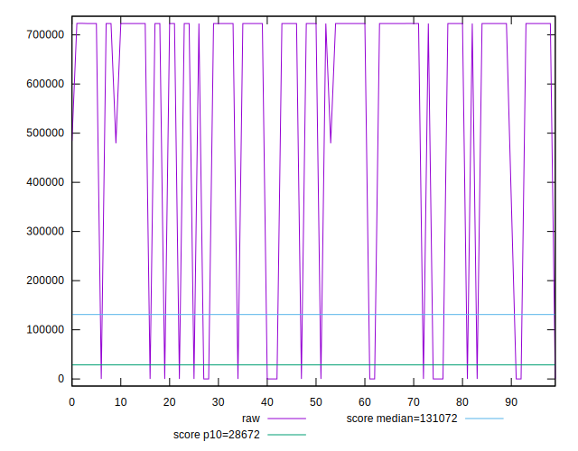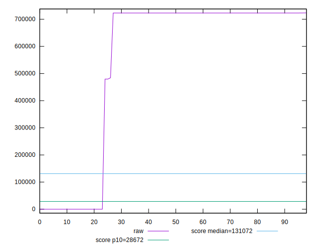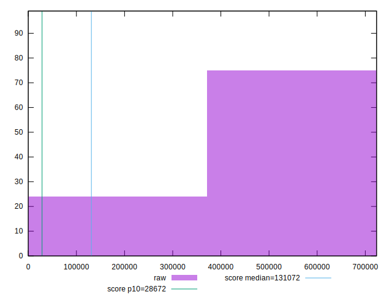
## Score


```yaml
p90min: 0.07
p90max: 1
p90range: 0.9299999999999999
p90mean: 0.28225806451612917
median: 0.07
p90stdev: 0.3878202915836093
mad: 0
stdevBySn: 0
lfitCenter: 0.21923992551734092
lfitStdev: 0.30983286996204845
mfitCenter: 0.21923992551734092
mfitStdev: 0.3883179165192123
mfitConfidence: 0.03902741904444783
p90skewness: 1.30813326291057
p90eccentricity: 0.9999999999999992
p90discretization: 31
outlandishness: 1.111481855587414

```

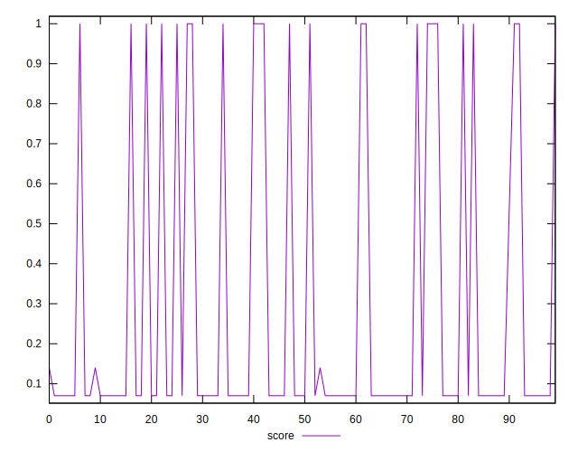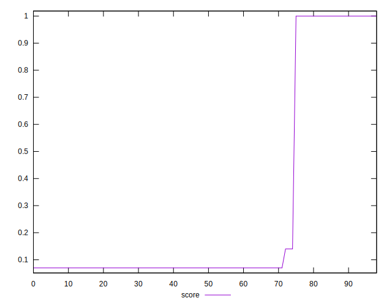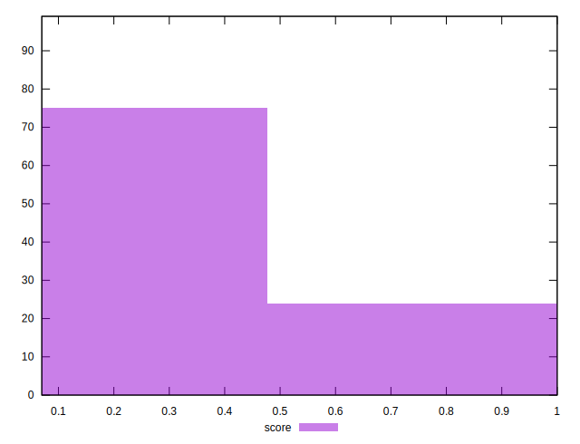
## Raw Estimate

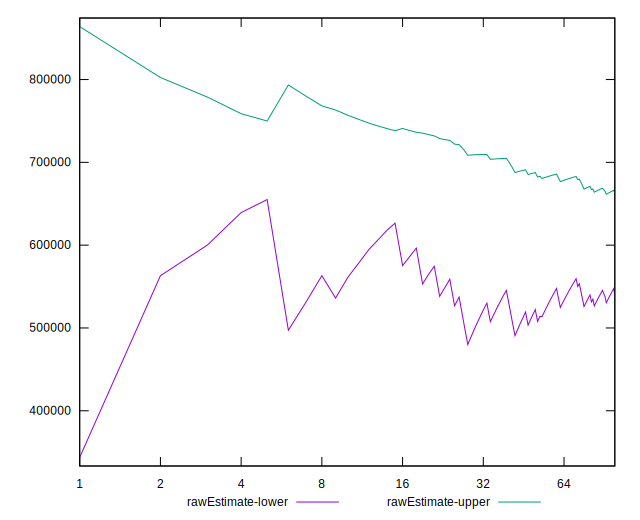
## Score Estimate

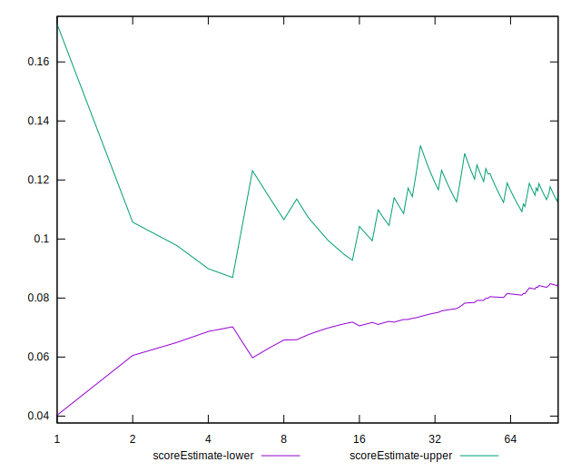
## P Score


```yaml
p90min: 0.0749252340507694
p90max: 1
p90range: 0.9250747659492307
p90mean: 0.285798054224276
median: 0.07492561012621168
p90stdev: 0.38586484421275236
mad: 2.639128657833112e-7
stdevBySn: 3.1474248373317693e-7
lfitCenter: 0.2231417647192839
lfitStdev: 0.30828448387318563
mfitCenter: 0.2231417647192839
mfitStdev: 0.3863773023420652
mfitConfidence: 0.03883237998116172
p90skewness: 1.3088737820853689
p90eccentricity: 0.9999999999999997
p90discretization: 7.153846153846154
outlandishness: 1.1095775133713397

```

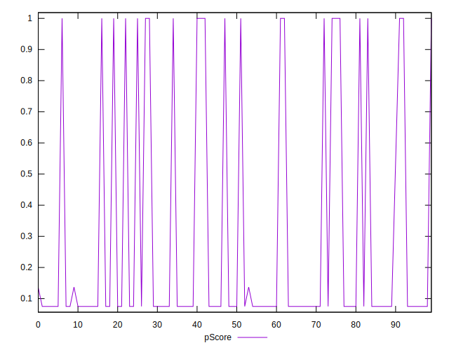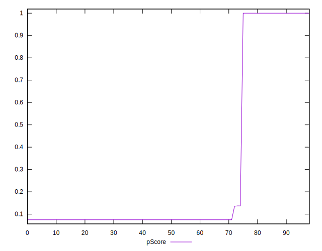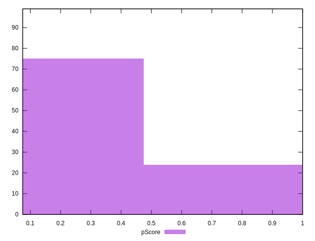
## Score Difference


```yaml
p90min: 0
p90max: 0
p90range: 0
p90mean: 0
median: 0
p90stdev: 0
mad: 0
stdevBySn: 0
lfitCenter: 0
lfitStdev: 0
mfitCenter: 0
mfitStdev: 0
mfitConfidence: 0
p90skewness: .nan
p90eccentricity: .nan
p90discretization: 93
outlandishness: .nan

```


## P Score Difference


```yaml
p90min: 0
p90max: 0.004925834453164302
p90range: 0.004925834453164302
p90mean: 0.0036534928938477735
median: 0.004925346213345894
p90stdev: 0.0021547212883477173
mad: 2.639128657833112e-7
stdevBySn: 3.1474248373317693e-7
lfitCenter: 0.003952425206126518
lfitStdev: 0.0019807831513073072
mfitCenter: 0.003952425206126518
mfitStdev: 0.0024825435289878364
mfitConfidence: 0.00024950501246598296
p90skewness: -1.105787054238188
p90eccentricity: 0.9999999999999989
p90discretization: 8.454545454545455
outlandishness: 0.9040866048161912

```

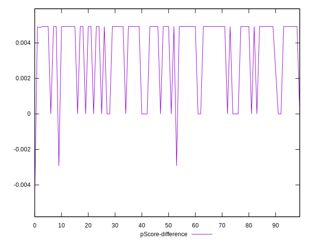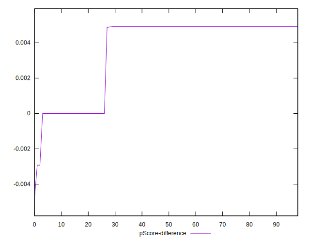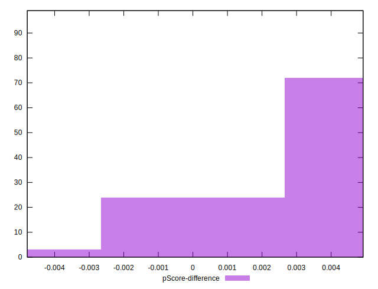