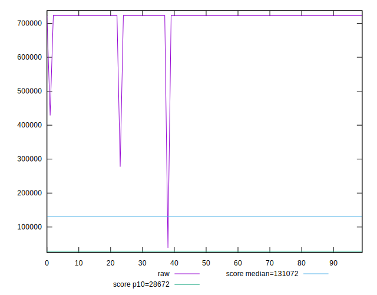

# //uses-long-cache-ttl/samples/music

[→ Parent](../..)


## Raw


```yaml
p90min: 723095.6525055555
p90max: 723100.3325055556
p90range: 4.680000000051223
p90mean: 723098.8942076823
median: 723099.6525055555
p90stdev: 1.1347646098622979
mad: 0.6800000000512227
stdevBySn: 0.8109680000610883
lfitCenter: 716343.4814013607
lfitStdev: 16697.216232366773
mfitCenter: 716343.4814013607
mfitStdev: 20926.857178896622
mfitConfidence: 2092.685717889662
p90skewness: -0.8363974434243016
p90eccentricity: 0.9999999999999997
p90discretization: 6.266666666666667
outlandishness: 0.9610053321254093

```


## Score


```yaml
p90min: 0.07
p90max: 0.07
p90range: 0
p90mean: 0.07000000000000008
median: 0.07
p90stdev: 6.938893903907228e-17
mad: 0
stdevBySn: 0
lfitCenter: 0.07497903451601567
lfitStdev: 0.012301658510931542
mfitCenter: 0.07497903451601567
mfitStdev: 0.015417842539692136
mfitConfidence: 0.0015417842539692135
p90skewness: -1
p90eccentricity: 1
p90discretization: 94
outlandishness: 1.3257877551020425

```


## Raw Estimate


## Score Estimate


## P Score


```yaml
p90min: 0.07492572149416354
p90max: 0.0749264934483147
p90range: 7.719541511574946e-7
p90mean: 0.07492595873690366
median: 0.07492583365775496
p90stdev: 1.871763045737189e-7
mad: 1.1216359141474896e-7
stdevBySn: 1.3376629912122964e-7
lfitCenter: 0.07983843905751693
lfitStdev: 0.01213832373190687
mfitCenter: 0.07983843905751693
mfitStdev: 0.015213132751819222
mfitConfidence: 0.0015213132751819222
p90skewness: 0.8364058646882289
p90eccentricity: 1.0000000000000016
p90discretization: 9.4
outlandishness: 1.2987194738610601

```


## Score Difference


```yaml
p90min: 0
p90max: 0
p90range: 0
p90mean: 0
median: 0
p90stdev: 0
mad: 0
stdevBySn: 0
lfitCenter: 0
lfitStdev: 0
mfitCenter: 0
mfitStdev: 0
mfitConfidence: 0
p90skewness: .nan
p90eccentricity: .nan
p90discretization: 94
outlandishness: .nan

```


## P Score Difference


```yaml
p90min: 0.004835144775958755
p90max: 0.004926381283349379
p90range: 0.00009123650739062406
p90mean: 0.004924970517960593
median: 0.004925833657754952
p90stdev: 0.000009315924024861553
mad: 1.1216359141474896e-7
stdevBySn: 1.3376629912122964e-7
lfitCenter: 0.004859955678479688
lfitStdev: 0.0001621738618697531
mfitCenter: 0.004859955678479688
mfitStdev: 0.00020325479398893633
mfitConfidence: 0.000020325479398893632
p90skewness: -9.535469752886986
p90eccentricity: 1.0000000000000038
p90discretization: 9.4
outlandishness: 0.9446184731531267

```

