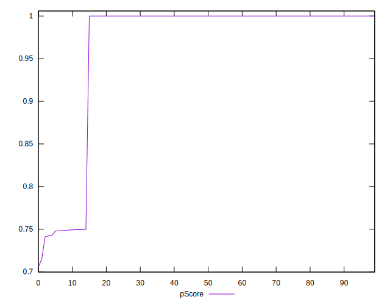

# //uses-rel-preconnect/samples/agenda

[→ Parent](../..)


## Raw


```yaml
p90min: 0
p90max: 314.102
p90range: 314.102
p90mean: 38.791106382978725
median: 0
p90stdev: 101.41506013245532
mad: 0
stdevBySn: 0
lfitCenter: 26.485658209647244
lfitStdev: 60.74983159576408
mfitCenter: 26.485658209647244
mfitStdev: 76.1386228551209
mfitConfidence: 7.61386228551209
p90skewness: 2.232653013451711
p90eccentricity: 0.9999999999999984
p90discretization: 7.833333333333333
outlandishness: 1.4712856950934232

```


## Score


```yaml
p90min: 0.74
p90max: 1
p90range: 0.26
p90mean: 0.9678723404255319
median: 1
p90stdev: 0.08399433036116354
mad: 0
stdevBySn: 0
lfitCenter: 0.978281605628678
lfitStdev: 0.04981521660306044
mfitCenter: 0.978281605628678
mfitStdev: 0.06243411528487334
mfitConfidence: 0.006243411528487334
p90skewness: -2.232667894384448
p90eccentricity: 0.9999999999999989
p90discretization: 31.333333333333332
outlandishness: 0.9868756181016354

```


## Raw Estimate


## Score Estimate


## P Score


```yaml
p90min: 0.7421655555555555
p90max: 1
p90range: 0.2578344444444445
p90mean: 0.9678110874704493
median: 1
p90stdev: 0.08414858288575364
mad: 0
stdevBySn: 0
lfitCenter: 0.9782064994266225
lfitStdev: 0.04998748678379585
mfitCenter: 0.9782064994266225
mfitStdev: 0.06265002393804418
mfitConfidence: 0.006265002393804418
p90skewness: -2.2320245649798727
p90eccentricity: 0.9999999999999988
p90discretization: 7.833333333333333
outlandishness: 0.9867128167157737

```


## Score Difference


```yaml
p90min: 0
p90max: 0
p90range: 0
p90mean: 0
median: 0
p90stdev: 0
mad: 0
stdevBySn: 0
lfitCenter: 0
lfitStdev: 0
mfitCenter: 0
mfitStdev: 0
mfitConfidence: 0
p90skewness: .nan
p90eccentricity: .nan
p90discretization: 94
outlandishness: .nan

```


## P Score Difference


```yaml
p90min: -0.00186888888888892
p90max: 0
p90range: 0.00186888888888892
p90mean: -0.00009030732860520084
median: 0
p90stdev: 0.0003249212955258443
mad: 0
stdevBySn: 0
lfitCenter: -0.00007218256980498157
lfitStdev: 0.00024071058373454713
mfitCenter: -0.00007218256980498157
mfitStdev: 0.00030168597789954367
mfitConfidence: 0.000030168597789954368
p90skewness: -4.059509598668229
p90eccentricity: 0.9999999999999974
p90discretization: 10.444444444444445
outlandishness: 2.4086552463200093

```

