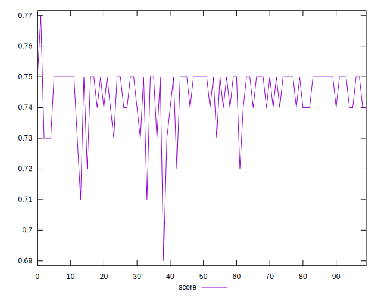
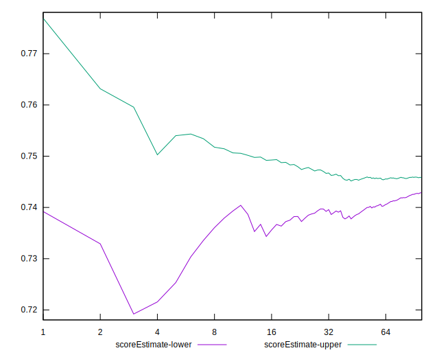

# //uses-rel-preconnect/samples/astro

[→ Parent](../..)


## Raw


```yaml
p90min: 300.452
p90max: 357.836
p90range: 57.384000000000015
p90mean: 311.3148085106383
median: 305.597
p90stdev: 13.440403645531678
mad: 4.7309999999999945
stdevBySn: 6.580766800000001
lfitCenter: 310.1799142281232
lfitStdev: 10.785912822793359
mfitCenter: 310.1799142281232
mfitStdev: 13.518137038261974
mfitConfidence: 1.3518137038261975
p90skewness: 1.7539083645977591
p90eccentricity: 1
p90discretization: 1.010752688172043
outlandishness: 1.010081607821739

```


## Score


```yaml
p90min: 0.72
p90max: 0.75
p90range: 0.030000000000000027
p90mean: 0.7444680851063828
median: 0.75
p90stdev: 0.007938194938798996
mad: 0
stdevBySn: 0
lfitCenter: 0.7453203013739991
lfitStdev: 0.007989165610664041
mfitCenter: 0.7453203013739991
mfitStdev: 0.010012934215275505
mfitConfidence: 0.0010012934215275506
p90skewness: -1.3564880741161967
p90eccentricity: 1.0000000000000004
p90discretization: 23.5
outlandishness: 0.997669264782385

```


## Raw Estimate


## Score Estimate


## P Score


```yaml
p90min: 0.7178688888888889
p90max: 0.7497488888888889
p90range: 0.03188000000000002
p90mean: 0.7437139952718675
median: 0.7468905555555556
p90stdev: 0.007466890914184261
mad: 0.0026283333333332326
stdevBySn: 0.003655981555555608
lfitCenter: 0.744370364825552
lfitStdev: 0.006011501256180649
mfitCenter: 0.744370364825552
mfitStdev: 0.007534299518442428
mfitConfidence: 0.0007534299518442429
p90skewness: -1.753908364597785
p90eccentricity: 0.9999999999999996
p90discretization: 1.010752688172043
outlandishness: 0.9978120851530065

```


## Score Difference


```yaml
p90min: 0
p90max: 0
p90range: 0
p90mean: 0
median: 0
p90stdev: 0
mad: 0
stdevBySn: 0
lfitCenter: 5.166535369026208e-19
lfitStdev: 1.2890316797319448e-18
mfitCenter: 5.166535369026208e-19
mfitStdev: 1.6155616292812394e-18
mfitConfidence: 1.6155616292812395e-19
p90skewness: .nan
p90eccentricity: .nan
p90discretization: 94
outlandishness: .inf

```


## P Score Difference


```yaml
p90min: -0.004852222222222258
p90max: 0.0044800000000000395
p90range: 0.009332222222222297
p90mean: -0.000738720462203865
median: -0.0008022222222222042
p90stdev: 0.0020091464002271087
mad: 0.001178888888888896
stdevBySn: 0.0019108102222222282
lfitCenter: -0.0007592615020659809
lfitStdev: 0.0014748537362223584
mfitCenter: -0.0007592615020659809
mfitStdev: 0.0018484550399400614
mfitConfidence: 0.00018484550399400614
p90skewness: 0.35205149959670184
p90eccentricity: 0.9999999999999996
p90discretization: 1.0217391304347827
outlandishness: 0.898023160578916

```

