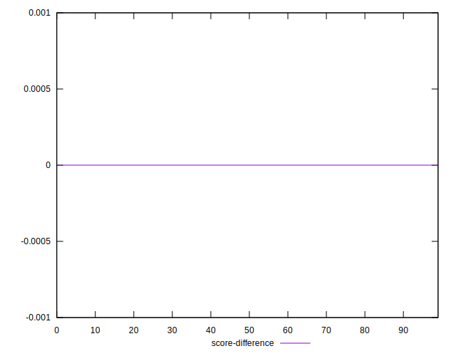

# //uses-rel-preconnect/samples/card

[→ Parent](../..)


## Raw


```yaml
p90min: 0
p90max: 303.97
p90range: 303.97
p90mean: 45.3259569892473
median: 0
p90stdev: 107.67129346760638
mad: 0
stdevBySn: 0
lfitCenter: 30.525487756728577
lfitStdev: 68.82930203555026
mfitCenter: 30.525487756728577
mfitStdev: 86.26473738951692
mfitConfidence: 8.669932319986975
p90skewness: 1.9545668260554652
p90eccentricity: 0.999999999999998
p90discretization: 6.2
outlandishness: 1.3317307708706834

```


## Score


```yaml
p90min: 0.75
p90max: 1
p90range: 0.25
p90mean: 0.9623655913978495
median: 1
p90stdev: 0.08939940402320375
mad: 0
stdevBySn: 0
lfitCenter: 0.9747403276738273
lfitStdev: 0.05695586683865288
mfitCenter: 0.9747403276738273
mfitStdev: 0.07138359318377195
mfitConfidence: 0.007174321053877055
p90skewness: -1.9545005328038558
p90eccentricity: 0.9999999999999992
p90discretization: 46.5
outlandishness: 0.9884001804964706

```


## Raw Estimate


## Score Estimate


## P Score


```yaml
p90min: 0.7477944444444444
p90max: 1
p90range: 0.25220555555555557
p90mean: 0.9622741099163681
median: 1
p90stdev: 0.08961702995765101
mad: 0
stdevBySn: 0
lfitCenter: 0.9746697875221043
lfitStdev: 0.05711492177160862
mfitCenter: 0.9746697875221043
mfitStdev: 0.07158293898005574
mfitConfidence: 0.007194356060234872
p90skewness: -1.9545300348151875
p90eccentricity: 0.9999999999999991
p90discretization: 6.2
outlandishness: 0.9883059016610766

```


## Score Difference


```yaml
p90min: 0
p90max: 0
p90range: 0
p90mean: 0
median: 0
p90stdev: 0
mad: 0
stdevBySn: 0
lfitCenter: 0
lfitStdev: 0
mfitCenter: 0
mfitStdev: 0
mfitConfidence: 0
p90skewness: .nan
p90eccentricity: .nan
p90discretization: 93
outlandishness: .nan

```


## P Score Difference


```yaml
p90min: -0.0015644444444444794
p90max: 0
p90range: 0.0015644444444444794
p90mean: -0.00006776583034647657
median: 0
p90stdev: 0.00023463026347199161
mad: 0
stdevBySn: 0
lfitCenter: -0.00006995873588581311
lfitStdev: 0.00019236812398697376
mfitCenter: -0.00006995873588581311
mfitStdev: 0.00024109768960433795
mfitConfidence: 0.000024231229522398746
p90skewness: -4.503483655316533
p90eccentricity: 1.000000000000002
p90discretization: 7.153846153846154
outlandishness: 4.0619338432679095

```

