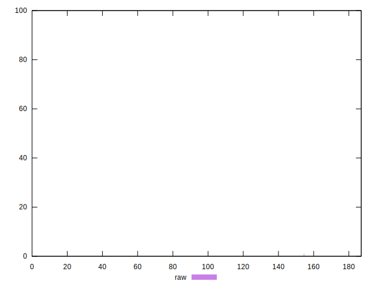

# //uses-rel-preconnect/samples/music

[→ Parent](../..)


## Raw


```yaml
p90min: 0
p90max: 0
p90range: 0
p90mean: 0
median: 0
p90stdev: 0
mad: 0
stdevBySn: 0
lfitCenter: 2.342573002340575
lfitStdev: 5.7877753245185
mfitCenter: 2.342573002340575
mfitStdev: 7.253900645124026
mfitConfidence: 0.7253900645124026
p90skewness: .nan
p90eccentricity: .nan
p90discretization: 94
outlandishness: .inf

```


## Score


```yaml
p90min: 1
p90max: 1
p90range: 0
p90mean: 1
median: 1
p90stdev: 0
mad: 0
stdevBySn: 0
lfitCenter: 0.9980456795674099
lfitStdev: 0.0048285229807763
mfitCenter: 0.9980456795674099
mfitStdev: 0.006051656120249149
mfitConfidence: 0.0006051656120249149
p90skewness: .nan
p90eccentricity: .nan
p90discretization: 94
outlandishness: 0.99181681

```


## Raw Estimate


## Score Estimate


## P Score


```yaml
p90min: 1
p90max: 1
p90range: 0
p90mean: 1
median: 1
p90stdev: 0
mad: 0
stdevBySn: 0
lfitCenter: 0.9980478558313829
lfitStdev: 0.004823146103765371
mfitCenter: 0.9980478558313829
mfitStdev: 0.006044917204269965
mfitConfidence: 0.0006044917204269965
p90skewness: .nan
p90eccentricity: .nan
p90discretization: 94
outlandishness: 0.9918305368952487

```


## Score Difference


```yaml
p90min: 0
p90max: 0
p90range: 0
p90mean: 0
median: 0
p90stdev: 0
mad: 0
stdevBySn: 0
lfitCenter: 0
lfitStdev: 0
mfitCenter: 0
mfitStdev: 0
mfitConfidence: 0
p90skewness: .nan
p90eccentricity: .nan
p90discretization: 94
outlandishness: .nan

```


## P Score Difference


```yaml
p90min: 0
p90max: 0
p90range: 0
p90mean: 0
median: 0
p90stdev: 0
mad: 0
stdevBySn: 0
lfitCenter: 0.000003360418252758655
lfitStdev: 0.00006315893687967537
mfitCenter: 0.000003360418252758655
mfitStdev: 0.0000791579885687666
mfitConfidence: 0.00000791579885687666
p90skewness: .nan
p90eccentricity: .nan
p90discretization: 94
outlandishness: .inf

```

