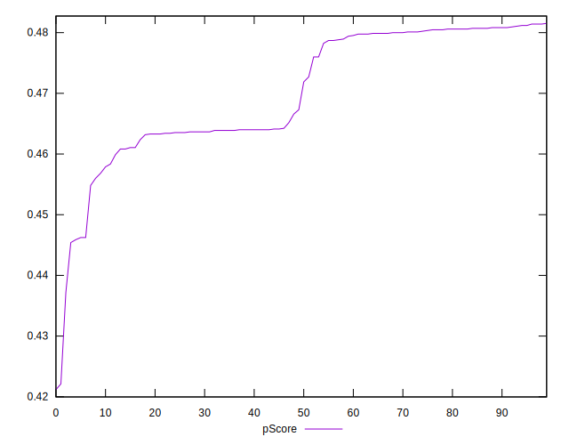

# //uses-rel-preload/samples/agenda

[→ Parent](../..)


## Raw


```yaml
p90min: 908
p90max: 1214
p90range: 306
p90mean: 1000.8191489361702
median: 1008.5
p90stdev: 85.08068295472039
mad: 86.5
stdevBySn: 120.4526
lfitCenter: 1001.5546103131566
lfitStdev: 93.52980940362214
mfitCenter: 1001.5546103131566
mfitStdev: 117.22223250393783
mfitConfidence: 11.722223250393784
p90skewness: 0.49460670223190145
p90eccentricity: 1
p90discretization: 2
outlandishness: 1.0167375044737632

```


## Score


```yaml
p90min: 0.45
p90max: 0.48
p90range: 0.02999999999999997
p90mean: 0.4695744680851062
median: 0.47
p90stdev: 0.010509863008705064
mad: 0.010000000000000009
stdevBySn: 0.011926000000000011
lfitCenter: 0.4694296860402639
lfitStdev: 0.012434635417541804
mfitCenter: 0.4694296860402639
mfitStdev: 0.015584504376850963
mfitConfidence: 0.0015584504376850964
p90skewness: -0.1900402340445993
p90eccentricity: 0.9999999999999994
p90discretization: 23.5
outlandishness: 0.9958538760696545

```


## Raw Estimate


## Score Estimate


## P Score


```yaml
p90min: 0.44541176470588234
p90max: 0.4814117647058824
p90range: 0.03600000000000003
p90mean: 0.47049186483103866
median: 0.46958823529411764
p90stdev: 0.010009492112320053
mad: 0.010176470588235287
stdevBySn: 0.014170894117647074
lfitCenter: 0.47040533996315814
lfitStdev: 0.011003506988661437
mfitCenter: 0.47040533996315814
mfitStdev: 0.013790850882816227
mfitConfidence: 0.0013790850882816226
p90skewness: -0.49460670223179565
p90eccentricity: 0.9999999999999992
p90discretization: 2
outlandishness: 0.9958330701369437

```


## Score Difference


```yaml
p90min: 0
p90max: 5.551115123125783e-17
p90range: 5.551115123125783e-17
p90mean: 1.1810883240693154e-18
median: 0
p90stdev: 8.010530753054493e-18
mad: 0
stdevBySn: 0
lfitCenter: 1.3627910306422e-18
lfitStdev: 3.332147950479324e-18
mfitCenter: 1.3627910306422e-18
mfitStdev: 4.176228138164904e-18
mfitConfidence: 4.1762281381649044e-19
p90skewness: 6.634888026970372
p90eccentricity: 0.9999999999999988
p90discretization: 47
outlandishness: 5.522500000000001

```


## P Score Difference


```yaml
p90min: -0.0040000000000000036
p90max: 0.004117647058823504
p90range: 0.008117647058823507
p90mean: 0.0009724655819774695
median: 0.0008235294117646674
p90stdev: 0.002216585666195338
mad: 0.0017058823529411404
stdevBySn: 0.0022799705882353225
lfitCenter: 0.0009589707483605424
lfitStdev: 0.0017216427153391618
mfitCenter: 0.0009589707483605424
mfitStdev: 0.002157759156712046
mfitConfidence: 0.0002157759156712046
p90skewness: -0.3844685617295465
p90eccentricity: 0.9999999999999992
p90discretization: 2.088888888888889
outlandishness: 0.8767900061120125

```

