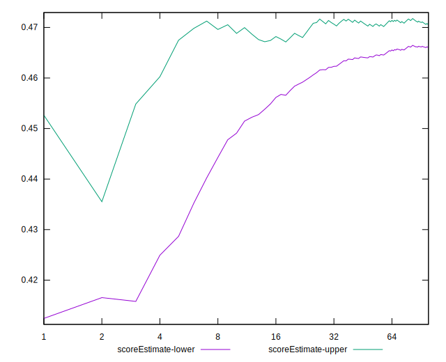
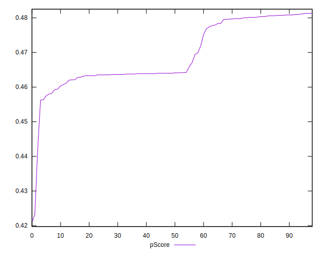
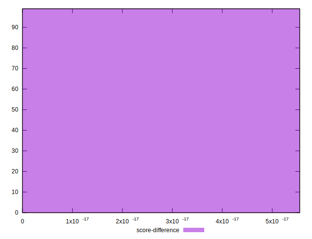
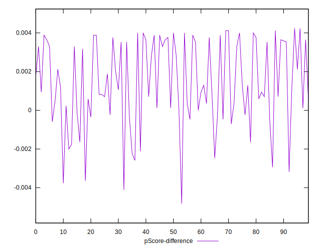

# //uses-rel-preload/samples/card

[→ Parent](../..)


## Raw


```yaml
p90min: 910
p90max: 1122
p90range: 212
p90mean: 1008.2688172043011
median: 1056
p90stdev: 71.30264737200793
mad: 46
stdevBySn: 62.01520000000001
lfitCenter: 1017.5217581850699
lfitStdev: 78.87111610522665
mfitCenter: 1017.5217581850699
mfitStdev: 98.85028494000015
mfitConfidence: 9.934827441384835
p90skewness: -0.29571572356837444
p90eccentricity: 1.0000000000000004
p90discretization: 1.9787234042553192
outlandishness: 1.0150107801568693

```


## Score


```yaml
p90min: 0.46
p90max: 0.48
p90range: 0.019999999999999962
p90mean: 0.4682795698924732
median: 0.46
p90stdev: 0.009574120124538501
mad: 0
stdevBySn: 0
lfitCenter: 0.46687736146980335
lfitStdev: 0.01145241041768906
mfitCenter: 0.46687736146980335
mfitStdev: 0.014353467897272081
mfitConfidence: 0.001442577801686757
p90skewness: 0.34885211361938
p90eccentricity: 1.0000000000000002
p90discretization: 31
outlandishness: 0.9961349737936797

```


## Raw Estimate


## Score Estimate


## P Score


```yaml
p90min: 0.45623529411764707
p90max: 0.4811764705882353
p90range: 0.024941176470588244
p90mean: 0.4696154332700823
median: 0.46399999999999997
p90stdev: 0.008388546749647993
mad: 0.005411764705882394
stdevBySn: 0.007295905882352913
lfitCenter: 0.46852685197822685
lfitStdev: 0.009278954835908959
mfitCenter: 0.46852685197822685
mfitStdev: 0.011629445287058768
mfitConfidence: 0.0011688032283982085
p90skewness: 0.2957157235683024
p90eccentricity: 0.9999999999999996
p90discretization: 1.9787234042553192
outlandishness: 0.9962261267210366

```


## Score Difference


```yaml
p90min: 0
p90max: 5.551115123125783e-17
p90range: 5.551115123125783e-17
p90mean: 1.1937881985216738e-18
median: 0
p90stdev: 8.052541646169721e-18
mad: 0
stdevBySn: 0
lfitCenter: 1.3772619907040874e-18
lfitStdev: 3.3666308024413447e-18
mfitCenter: 1.3772619907040874e-18
mfitStdev: 4.21944598406735e-18
mfitConfidence: 4.240702773431306e-19
p90skewness: 6.597118918283819
p90eccentricity: 1.000000000000002
p90discretization: 46.5
outlandishness: 5.5153810835629

```


## P Score Difference


```yaml
p90min: -0.0036470588235294477
p90max: 0.004117647058823504
p90range: 0.007764705882352951
p90mean: 0.001443390259329533
median: 0.0011764705882352788
p90stdev: 0.0021081479115340703
mad: 0.002117647058823502
stdevBySn: 0.0029464235294116934
lfitCenter: 0.0014495130062834051
lfitStdev: 0.0019549756071526765
mfitCenter: 0.0014495130062834051
mfitStdev: 0.002450198569016897
mfitConfidence: 0.000246254221675599
p90skewness: -0.3794347695985114
p90eccentricity: 1.0000000000000002
p90discretization: 1.9787234042553192
outlandishness: 0.8809148309190591

```

