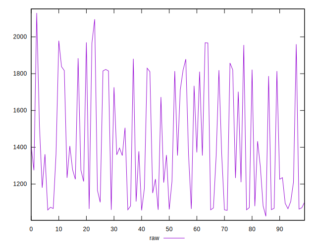
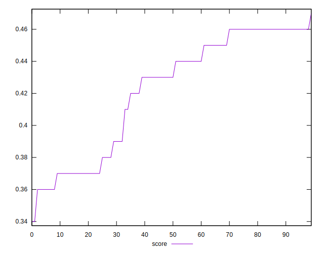

# //uses-rel-preload/samples/music

[→ Parent](../..)


## Raw


```yaml
p90min: 1059
p90max: 1970
p90range: 911
p90mean: 1407.3936170212767
median: 1354.5
p90stdev: 317.2774883916422
mad: 287
stdevBySn: 351.2207
lfitCenter: 1387.0592151209346
lfitStdev: 287.87751565890875
mfitCenter: 1387.0592151209346
mfitStdev: 360.8009605536279
mfitConfidence: 36.08009605536279
p90skewness: 0.4906243197427723
p90eccentricity: 1.0000000000000007
p90discretization: 1.2702702702702702
outlandishness: 1.0128253195720782

```


## Score


```yaml
p90min: 0.36
p90max: 0.46
p90range: 0.10000000000000003
p90mean: 0.4222340425531917
median: 0.43
p90stdev: 0.036876858202561216
mad: 0.030000000000000027
stdevBySn: 0.03577800000000003
lfitCenter: 0.4249654328303648
lfitStdev: 0.03425501311564998
mfitCenter: 0.4249654328303648
mfitStdev: 0.042932292254972304
mfitConfidence: 0.00429322922549723
p90skewness: -0.5211681572938938
p90eccentricity: 1.0000000000000002
p90discretization: 9.4
outlandishness: 0.9951080383173675

```


## Raw Estimate


## Score Estimate


## P Score


```yaml
p90min: 0.3564705882352941
p90max: 0.4636470588235294
p90range: 0.10717647058823532
p90mean: 0.4226595744680853
median: 0.4288823529411765
p90stdev: 0.0373267633401932
mad: 0.03376470588235292
stdevBySn: 0.041320082352941157
lfitCenter: 0.42505185704459586
lfitStdev: 0.03386794301869517
mfitCenter: 0.42505185704459586
mfitStdev: 0.0424471718298386
mfitConfidence: 0.00424471718298386
p90skewness: -0.4906243197427828
p90eccentricity: 1.0000000000000002
p90discretization: 1.2702702702702702
outlandishness: 0.9949979942539589

```


## Score Difference


```yaml
p90min: 0
p90max: 0
p90range: 0
p90mean: 0
median: 0
p90stdev: 0
mad: 0
stdevBySn: 0
lfitCenter: 7.958455817343958e-19
lfitStdev: 1.966288954703721e-18
mfitCenter: 7.958455817343958e-19
mfitStdev: 2.4643777474572523e-18
mfitConfidence: 2.464377747457252e-19
p90skewness: .nan
p90eccentricity: .nan
p90discretization: 94
outlandishness: .inf

```


## P Score Difference


```yaml
p90min: -0.004705882352941171
p90max: 0.004705882352941171
p90range: 0.009411764705882342
p90mean: 0.00042803504380474624
median: 0.0010588235294117232
p90stdev: 0.0028842986492435747
mad: 0.002764705882352947
stdevBySn: 0.0035778000000000034
lfitCenter: 0.00047622073525029486
lfitStdev: 0.0029068236347105703
mfitCenter: 0.00047622073525029486
mfitStdev: 0.003643163159731491
mfitConfidence: 0.0003643163159731491
p90skewness: -0.15027923930207185
p90eccentricity: 1.0000000000000002
p90discretization: 1.6785714285714286
outlandishness: 0.8784403029992073

```

