# //uses-text-compression/samples/agenda

[→ Parent](../..)


## Raw


```yaml
p90min: 300
p90max: 5020
p90range: 4720
p90mean: 3807.2340425531916
median: 4660
p90stdev: 1635.100624306364
mad: 130
stdevBySn: 214.668
lfitCenter: 4061.6765604619277
lfitStdev: 1235.0841107902274
mfitCenter: 4061.6765604619277
mfitStdev: 1547.948378384747
mfitConfidence: 154.7948378384747
p90skewness: -1.4917386342492098
p90eccentricity: 1.0000000000000009
p90discretization: 2.088888888888889
outlandishness: 0.9653024065367418

```

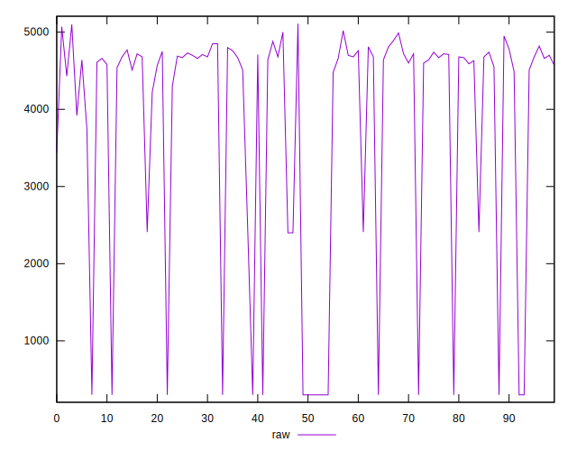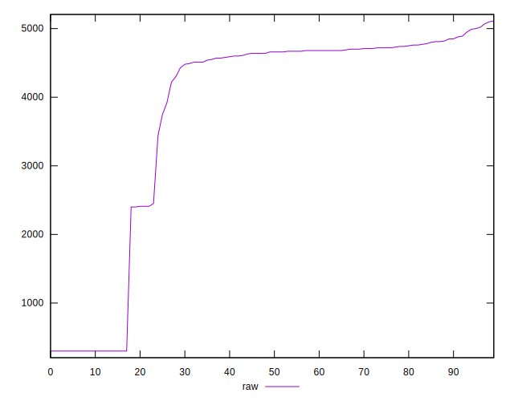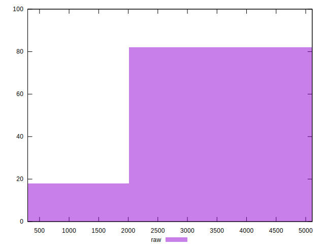
## Score


```yaml
p90min: 0
p90max: 0.75
p90range: 0.75
p90mean: 0.17191489361702117
median: 0.04
p90stdev: 0.2609527412817031
mad: 0.015
stdevBySn: 0.023852000000000005
lfitCenter: 0.131798768321898
lfitStdev: 0.1880637777564445
mfitCenter: 0.131798768321898
mfitStdev: 0.23570299161628658
mfitConfidence: 0.023570299161628658
p90skewness: 1.6368232905649276
p90eccentricity: 1
p90discretization: 5.875
outlandishness: 1.146781217680864

```

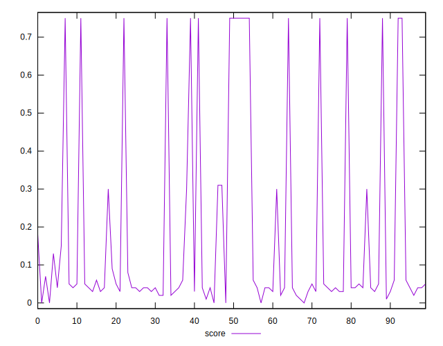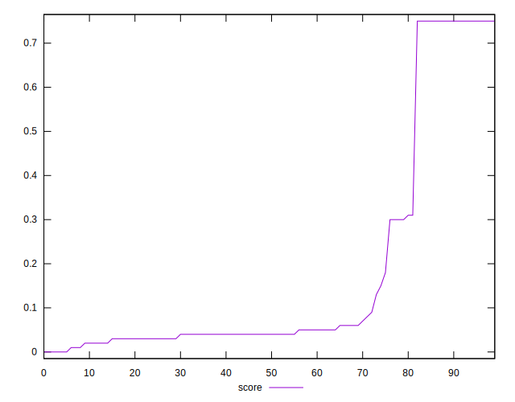
## Raw Estimate

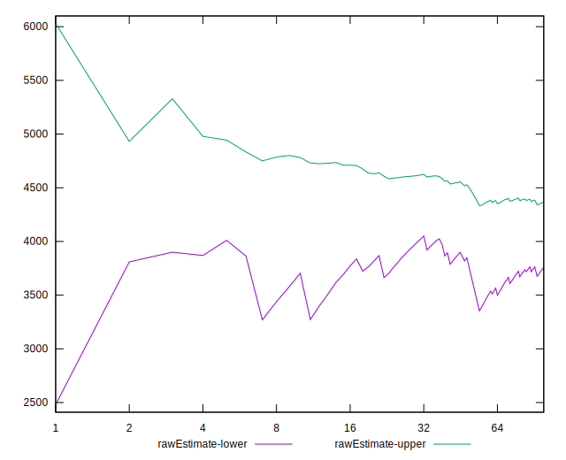
## Score Estimate

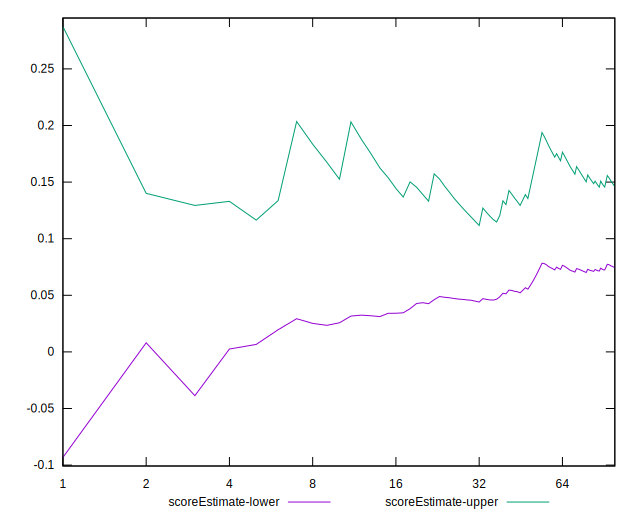
## P Score


```yaml
p90min: 0
p90max: 0.75
p90range: 0.75
p90mean: 0.17179599499374212
median: 0.03999999999999998
p90stdev: 0.2610617097121995
mad: 0.01529411764705882
stdevBySn: 0.02525505882352942
lfitCenter: 0.13157734549264966
lfitStdev: 0.1883075852226299
mfitCenter: 0.13157734549264966
mfitStdev: 0.23600855896074727
mfitConfidence: 0.023600855896074725
p90skewness: 1.6359466662167845
p90eccentricity: 1.0000000000000004
p90discretization: 2.1363636363636362
outlandishness: 1.1469752264920423

```

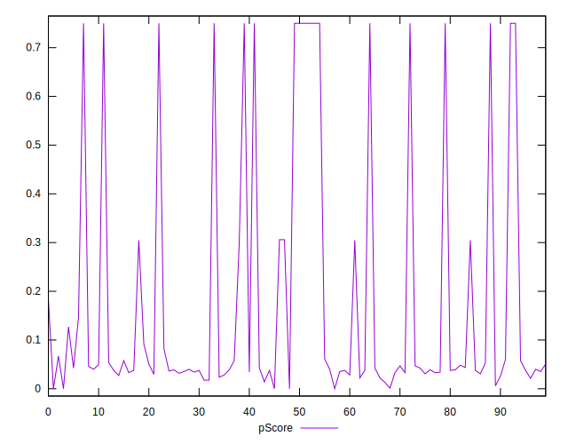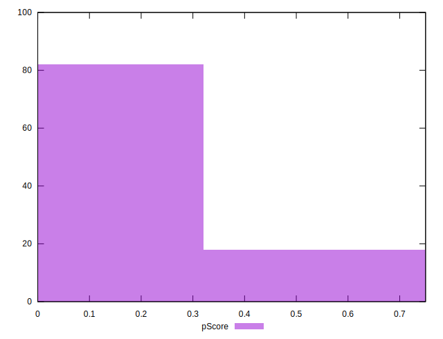
## Score Difference


```yaml
p90min: 0
p90max: 0
p90range: 0
p90mean: 0
median: 0
p90stdev: 0
mad: 0
stdevBySn: 0
lfitCenter: 0
lfitStdev: 0
mfitCenter: 0
mfitStdev: 0
mfitConfidence: 0
p90skewness: .nan
p90eccentricity: .nan
p90discretization: 94
outlandishness: .nan

```


## P Score Difference


```yaml
p90min: -0.0041176470588235505
p90max: 0.0041176470588235314
p90range: 0.008235294117647082
p90mean: -0.00011889862327910575
median: 0
p90stdev: 0.0022252256398960003
mad: 0.0023529411764705768
stdevBySn: 0.002806117647058811
lfitCenter: -0.00013398901022293716
lfitStdev: 0.0017017303972929648
mfitCenter: -0.00013398901022293716
mfitStdev: 0.0021328027669729123
mfitConfidence: 0.00021328027669729124
p90skewness: 0.150819641738442
p90eccentricity: 1.0000000000000016
p90discretization: 2.611111111111111
outlandishness: 0.8836000000000097

```

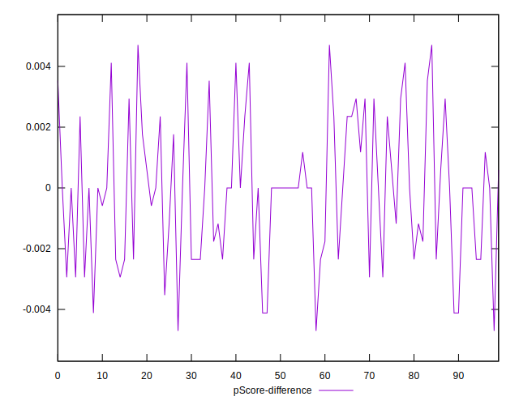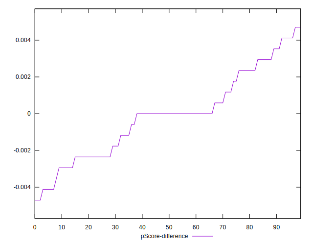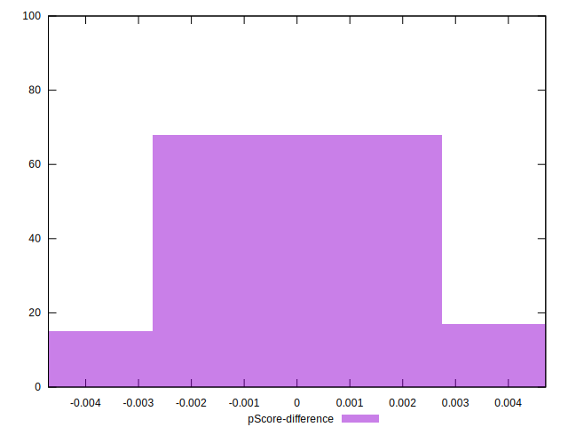