# //uses-text-compression/samples/card

[→ Parent](../..)


## Raw


```yaml
p90min: 300
p90max: 4970
p90range: 4670
p90mean: 3603.1182795698924
median: 4610
p90stdev: 1831.4011197110153
mad: 200
stdevBySn: 310.076
lfitCenter: 3883.627373598019
lfitStdev: 1527.5890904857176
mfitCenter: 3883.627373598019
mfitStdev: 1914.5490050411775
mfitConfidence: 192.41941492332833
p90skewness: -1.168877848607186
p90eccentricity: 1.0000000000000004
p90discretization: 2.2142857142857144
outlandishness: 0.9678071232869606

```

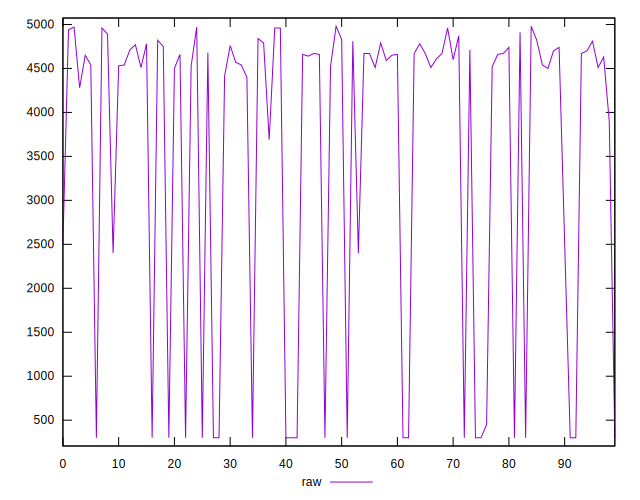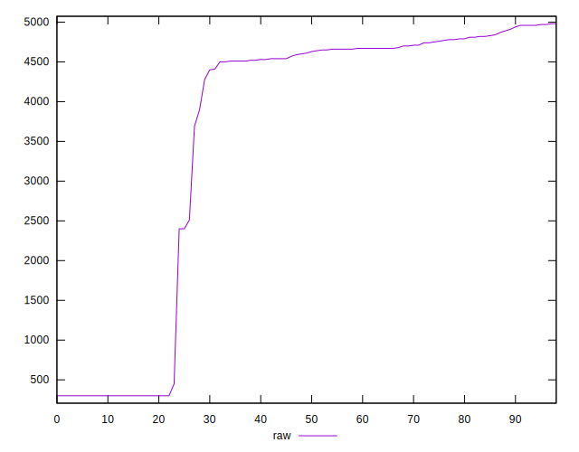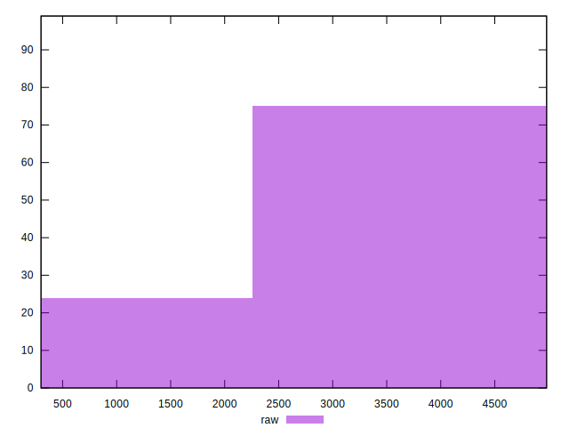
## Score


```yaml
p90min: 0
p90max: 0.75
p90range: 0.75
p90mean: 0.20817204301075257
median: 0.05
p90stdev: 0.29513236045230395
mad: 0.03
stdevBySn: 0.035778000000000004
lfitCenter: 0.16208351286865538
lfitStdev: 0.24163956057907762
mfitCenter: 0.16208351286865538
mfitStdev: 0.30285027771320405
mfitConfidence: 0.030437598146352426
p90skewness: 1.22800001454938
p90eccentricity: 1
p90discretization: 6.2
outlandishness: 1.0994977266380859

```

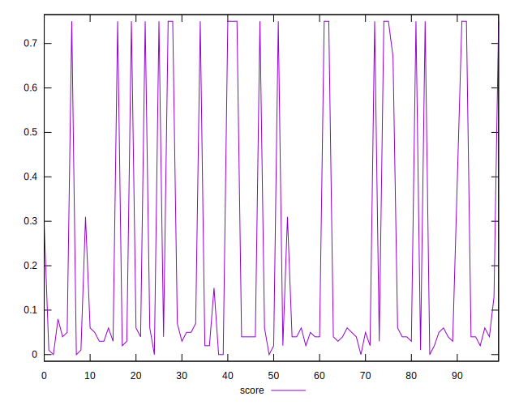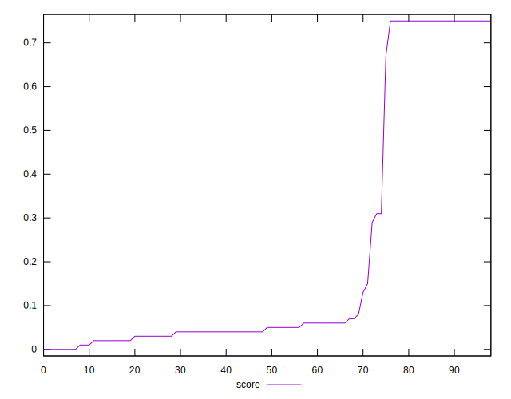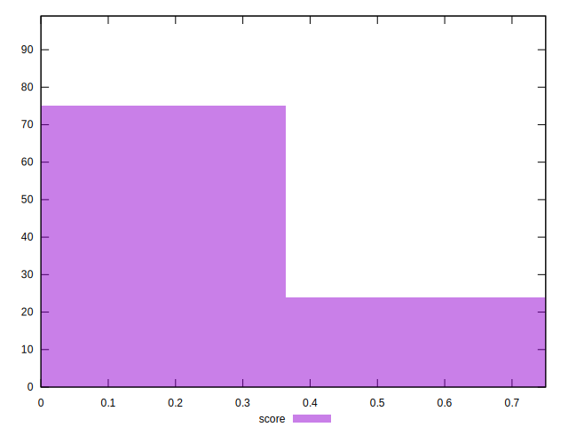
## Raw Estimate

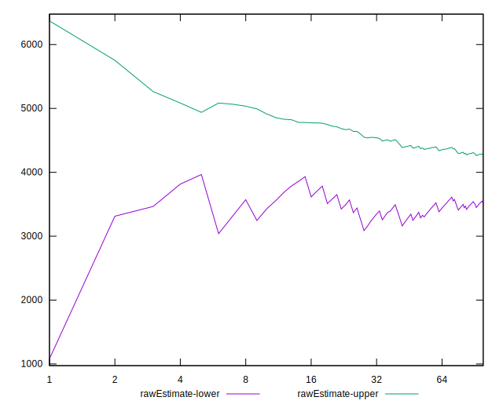
## Score Estimate

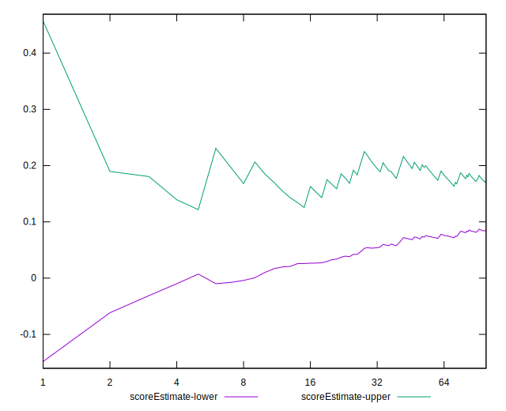
## P Score


```yaml
p90min: 0.003529411764705892
p90max: 0.75
p90range: 0.7464705882352941
p90mean: 0.20812987560615642
median: 0.045882352941176485
p90stdev: 0.2950018427114228
mad: 0.023529411764705854
stdevBySn: 0.036479529411764765
lfitCenter: 0.1619432719213923
lfitStdev: 0.24150813617842407
mfitCenter: 0.1619432719213923
mfitStdev: 0.30268556165371097
mfitConfidence: 0.03042104355949532
p90skewness: 1.2296514397202076
p90eccentricity: 1.0000000000000002
p90discretization: 2.2142857142857144
outlandishness: 1.1003824701365907

```

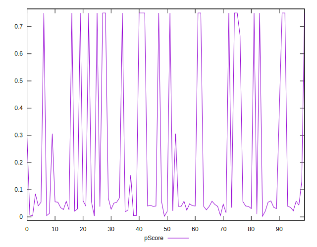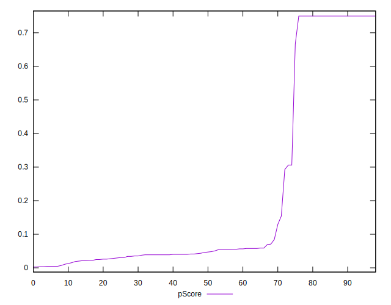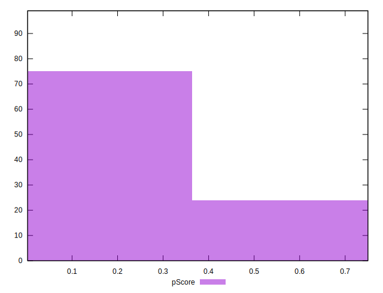
## Score Difference


```yaml
p90min: 0
p90max: 0
p90range: 0
p90mean: 0
median: 0
p90stdev: 0
mad: 0
stdevBySn: 0
lfitCenter: 0
lfitStdev: 0
mfitCenter: 0
mfitStdev: 0
mfitConfidence: 0
p90skewness: .nan
p90eccentricity: .nan
p90discretization: 93
outlandishness: .nan

```


## P Score Difference


```yaml
p90min: -0.004705882352941171
p90max: 0.004705882352941171
p90range: 0.009411764705882342
p90mean: 0.00004638414505586341
median: 0
p90stdev: 0.002404969411692463
mad: 0.0011764705882352997
stdevBySn: 0.0021045882352941567
lfitCenter: 0.000004209674129535016
lfitStdev: 0.001615278454623055
mfitCenter: 0.000004209674129535016
mfitStdev: 0.0020244513249172975
mfitConfidence: 0.0002034650136693498
p90skewness: 0.1798803691431385
p90eccentricity: 1
p90discretization: 2.5135135135135136
outlandishness: 0.88246097337005

```

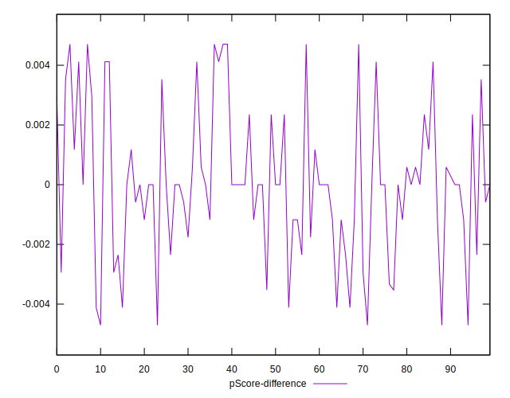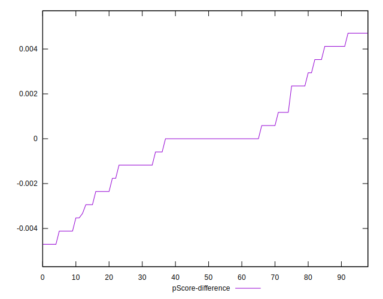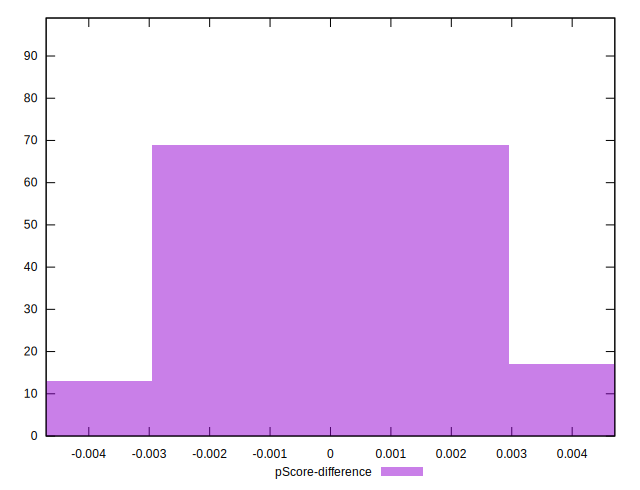