# //uses-text-compression/samples/music

[→ Parent](../..)


## Raw


```yaml
p90min: 4500
p90max: 6120
p90range: 1620
p90mean: 5593.829787234043
median: 5560
p90stdev: 209.66085270091287
mad: 90
stdevBySn: 137.149
lfitCenter: 5557.775683666055
lfitStdev: 171.40932098044374
mfitCenter: 5557.775683666055
mfitStdev: 214.82972546861131
mfitConfidence: 21.48297254686113
p90skewness: -0.9985945924812075
p90eccentricity: 1.0000000000000002
p90discretization: 2.186046511627907
outlandishness: 0.9770966446227879

```

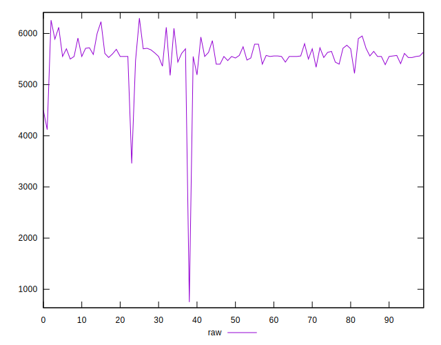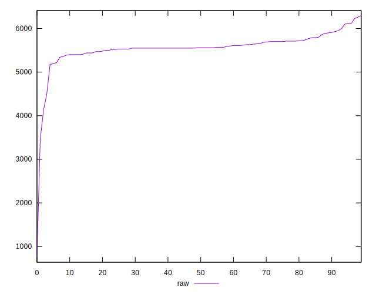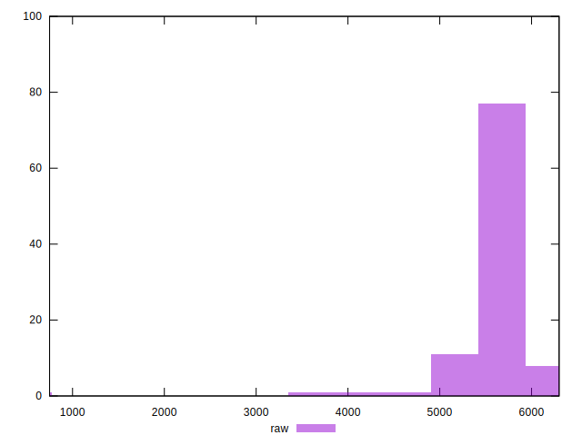
## Score


```yaml
p90min: 0
p90max: 0.06
p90range: 0.06
p90mean: 0.0006382978723404255
median: 0
p90stdev: 0.0061555217623359285
mad: 0
stdevBySn: 0
lfitCenter: 0.003979592084966481
lfitStdev: 0.009782087880137222
mfitCenter: 0.003979592084966481
mfitStdev: 0.012260029044975156
mfitConfidence: 0.0012260029044975156
p90skewness: 9.53995559151989
p90eccentricity: 1.0000000000000044
p90discretization: 47
outlandishness: 173.1856

```

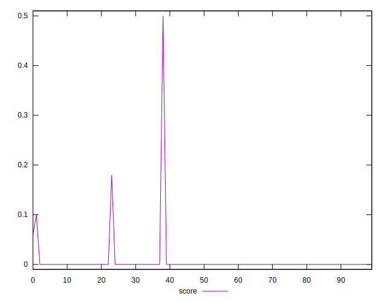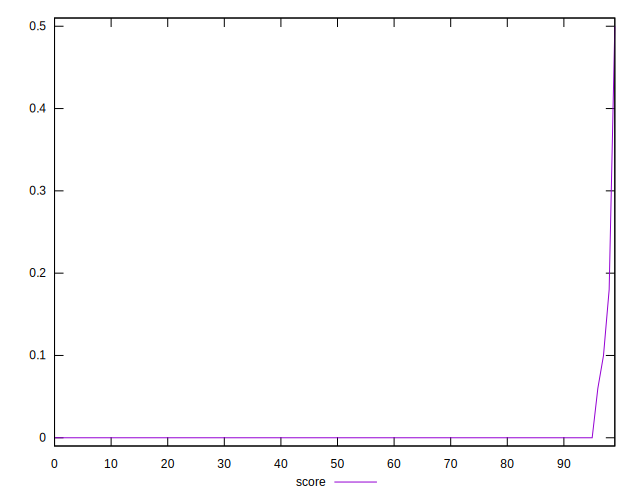
## Raw Estimate

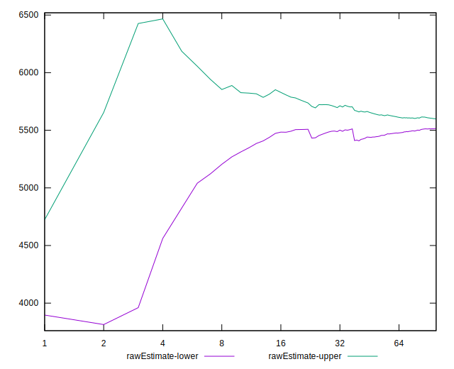
## Score Estimate

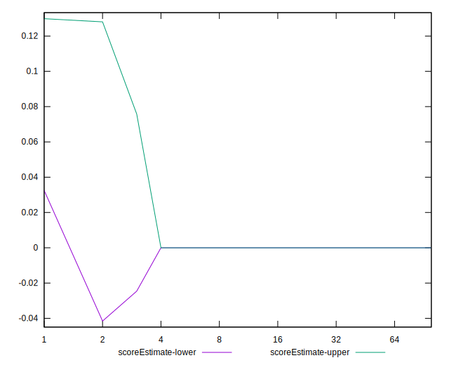
## P Score


```yaml
p90min: 0
p90max: 0.05882352941176472
p90range: 0.05882352941176472
p90mean: 0.000625782227784731
median: 0
p90stdev: 0.006034825257192088
mad: 0
stdevBySn: 0
lfitCenter: 0.003996599361226981
lfitStdev: 0.009823892835878908
mfitCenter: 0.003996599361226981
mfitStdev: 0.012312423787068781
mfitConfidence: 0.0012312423787068782
p90skewness: 9.53995559151989
p90eccentricity: 1.0000000000000044
p90discretization: 47
outlandishness: 181.6996161599999

```

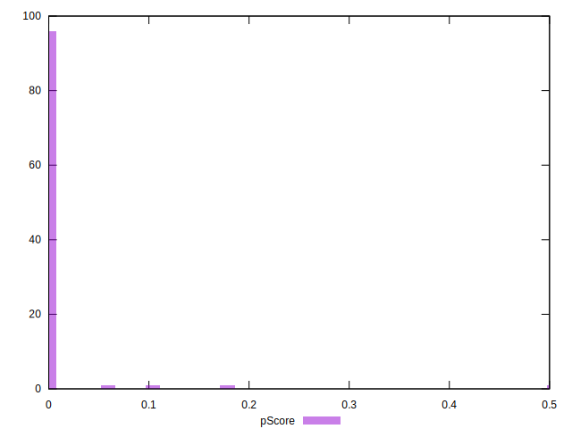
## Score Difference


```yaml
p90min: 0
p90max: 0
p90range: 0
p90mean: 0
median: 0
p90stdev: 0
mad: 0
stdevBySn: 0
lfitCenter: 0
lfitStdev: 0
mfitCenter: 0
mfitStdev: 0
mfitConfidence: 0
p90skewness: .nan
p90eccentricity: .nan
p90discretization: 94
outlandishness: .nan

```


## P Score Difference


```yaml
p90min: 0
p90max: 0
p90range: 0
p90mean: 0
median: 0
p90stdev: 0
mad: 0
stdevBySn: 0
lfitCenter: 0.000016570220020508257
lfitStdev: 0.00005486700977558508
mfitCenter: 0.000016570220020508257
mfitStdev: 0.00006876559909316341
mfitConfidence: 0.000006876559909316341
p90skewness: .nan
p90eccentricity: .nan
p90discretization: 94
outlandishness: .inf

```

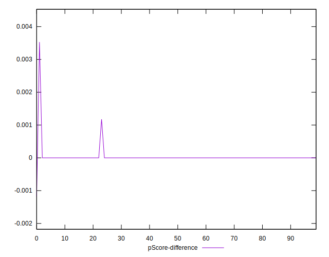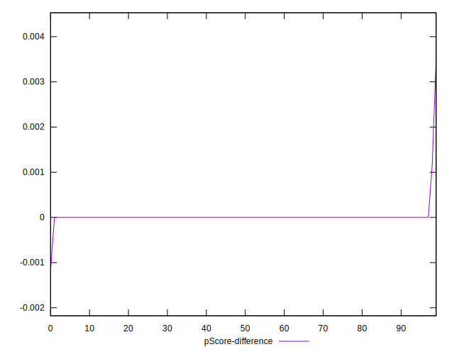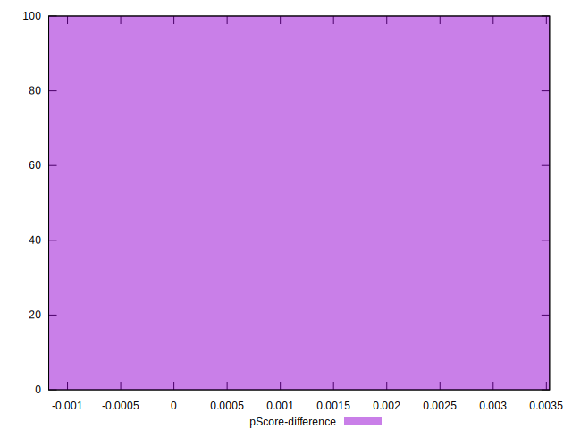