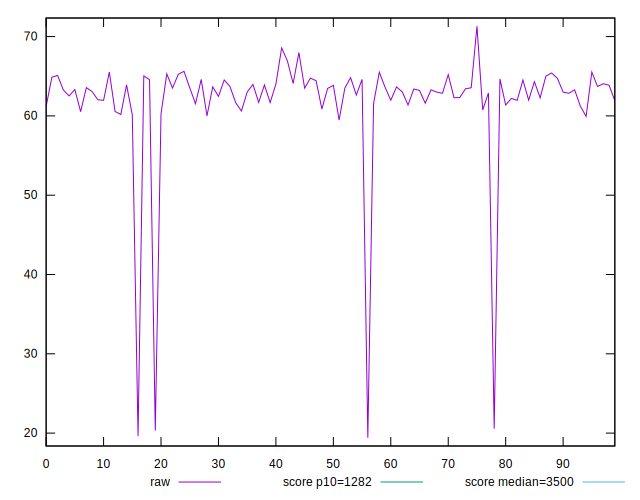

# //bootup-time/samples/agenda

[→ Parent](../..)


## Raw


```yaml
p90min: 20.556
p90max: 66.93599999999999
p90range: 46.379999999999995
p90mean: 62.65540425531912
median: 63.307999999999986
p90stdev: 4.639967349754779
mad: 1.3120000000000047
stdevBySn: 1.8389891999999979
lfitCenter: 62.3955458611943
lfitStdev: 2.656973416257802
mfitCenter: 62.3955458611943
mfitStdev: 3.3300223484181743
mfitConfidence: 0.33300223484181746
p90skewness: -7.920967626331673
p90eccentricity: 1
p90discretization: 1
outlandishness: 0.965600614998498

```


## Score


```yaml
p90min: 1
p90max: 1
p90range: 0
p90mean: 1
median: 1
p90stdev: 0
mad: 0
stdevBySn: 0
lfitCenter: 1
lfitStdev: 0
mfitCenter: 1
mfitStdev: 0
mfitConfidence: 0
p90skewness: .nan
p90eccentricity: .nan
p90discretization: 94
outlandishness: 1

```


## Raw Estimate


## Score Estimate


## P Score


```yaml
p90min: 0.9999997774496879
p90max: 0.9999999999721007
p90range: 2.2252241271836226e-7
p90mean: 0.9999998500690638
median: 0.9999998469651238
p90stdev: 2.9503359682814717e-8
mad: 2.096791695826994e-8
stdevBySn: 2.930730996208997e-8
lfitCenter: 0.9999998495598312
lfitStdev: 2.4980096850177104e-8
mfitCenter: 0.9999998495598312
mfitStdev: 3.130790856534071e-8
mfitConfidence: 3.130790856534071e-9
p90skewness: 1.24163658583148
p90eccentricity: 1
p90discretization: 1.032967032967033
outlandishness: 1.0000000010559806

```


## Score Difference


```yaml
p90min: 0
p90max: 0
p90range: 0
p90mean: 0
median: 0
p90stdev: 0
mad: 0
stdevBySn: 0
lfitCenter: 0
lfitStdev: 0
mfitCenter: 0
mfitStdev: 0
mfitConfidence: 0
p90skewness: .nan
p90eccentricity: .nan
p90discretization: 94
outlandishness: .nan

```


## P Score Difference


```yaml
p90min: -2.2255031206785958e-7
p90max: -2.789934949731787e-11
p90range: 2.2252241271836226e-7
p90mean: -1.499309365265634e-7
median: -1.5303487621576295e-7
p90stdev: 2.9503359682814717e-8
mad: 2.096791695826994e-8
stdevBySn: 2.930730996208997e-8
lfitCenter: -1.5044016872841743e-7
lfitStdev: 2.498009685685201e-8
mfitCenter: -1.5044016872841743e-7
mfitStdev: 3.130790857370647e-8
mfitConfidence: 3.130790857370647e-9
p90skewness: 1.2416365716600342
p90eccentricity: 0.9999999999999999
p90discretization: 1.032967032967033
outlandishness: 0.9929692870444162

```

