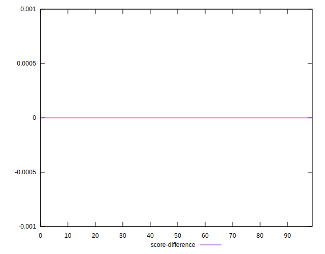

# //bootup-time/samples/astro

[→ Parent](../..)


## Raw


```yaml
p90min: 829.9440000000003
p90max: 919.7080000000005
p90range: 89.76400000000024
p90mean: 881.5176170212769
median: 889.0200000000004
p90stdev: 24.481344451463436
mad: 14.816000000000031
stdevBySn: 22.956357400000098
lfitCenter: 884.1494299819383
lfitStdev: 25.057297465102327
mfitCenter: 884.1494299819383
mfitStdev: 31.404665187533304
mfitConfidence: 3.1404665187533305
p90skewness: -0.6771133673305972
p90eccentricity: 1.0000000000000002
p90discretization: 1
outlandishness: 1.0022006503492324

```


## Score


```yaml
p90min: 0.96
p90max: 0.97
p90range: 0.010000000000000009
p90mean: 0.9614893617021265
median: 0.96
p90stdev: 0.0035602554320598996
mad: 0
stdevBySn: 0
lfitCenter: 0.9606651354889415
lfitStdev: 0.002554777075956712
mfitCenter: 0.9606651354889415
mfitStdev: 0.0032019382302080294
mfitConfidence: 0.00032019382302080296
p90skewness: 1.9721272054028733
p90eccentricity: 1.0000000000000018
p90discretization: 47
outlandishness: 0.9989823347229396

```


## Raw Estimate


## Score Estimate


## P Score


```yaml
p90min: 0.9559346145291571
p90max: 0.9668496834300335
p90range: 0.010915068900876457
p90mean: 0.9606978677773311
median: 0.9598237783093827
p90stdev: 0.002971130256947687
mad: 0.0018402739703197724
stdevBySn: 0.0028790095255457095
lfitCenter: 0.9602445370472291
lfitStdev: 0.0030107753226582563
mfitCenter: 0.9602445370472291
mfitStdev: 0.0037734472799652325
mfitConfidence: 0.00037734472799652325
p90skewness: 0.6367663294349439
p90eccentricity: 1
p90discretization: 1
outlandishness: 0.9990988011975049

```


## Score Difference


```yaml
p90min: 0
p90max: 0
p90range: 0
p90mean: 0
median: 0
p90stdev: 0
mad: 0
stdevBySn: 0
lfitCenter: 5.166535369026208e-19
lfitStdev: 1.2890316797319448e-18
mfitCenter: 5.166535369026208e-19
mfitStdev: 1.6155616292812394e-18
mfitConfidence: 1.6155616292812395e-19
p90skewness: .nan
p90eccentricity: .nan
p90discretization: 94
outlandishness: .inf

```


## P Score Difference


```yaml
p90min: -0.004376927733447555
p90max: 0.004317797407649149
p90range: 0.008694725141096704
p90mean: -0.0007881795223590945
median: -0.0010001942012815013
p90stdev: 0.0022386119822448316
mad: 0.001411517091718939
stdevBySn: 0.002343395662967423
lfitCenter: -0.0008459151562380648
lfitStdev: 0.0017668940224768684
mfitCenter: -0.0008459151562380648
mfitStdev: 0.0022144732597368074
mfitConfidence: 0.00022144732597368074
p90skewness: 0.49528091773760685
p90eccentricity: 0.9999999999999994
p90discretization: 1
outlandishness: 0.8698929377969878

```

