# //bootup-time/samples/card

[→ Parent](../..)


## Raw


```yaml
p90min: 60.75199999999999
p90max: 70.05599999999995
p90range: 9.303999999999967
p90mean: 65.46791397849461
median: 65.57599999999998
p90stdev: 1.7122199615999607
mad: 1.2959999999999923
stdevBySn: 2.0512719999999987
lfitCenter: 65.34535477077145
lfitStdev: 1.7481187252149368
mfitCenter: 65.34535477077145
mfitStdev: 2.1909419142224493
mfitConfidence: 0.22019794748299665
p90skewness: -0.17988128290775485
p90eccentricity: 1
p90discretization: 1
outlandishness: 0.9897189497126471

```

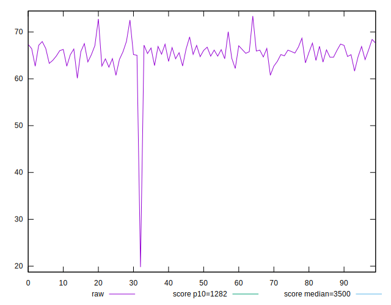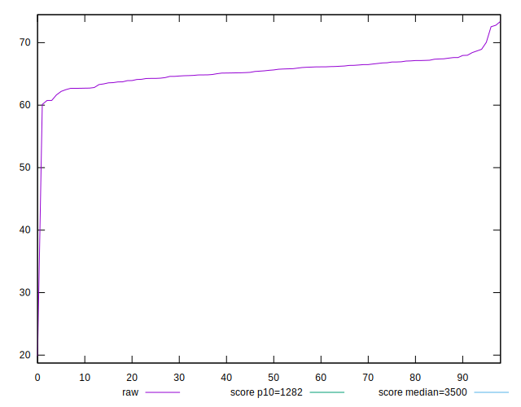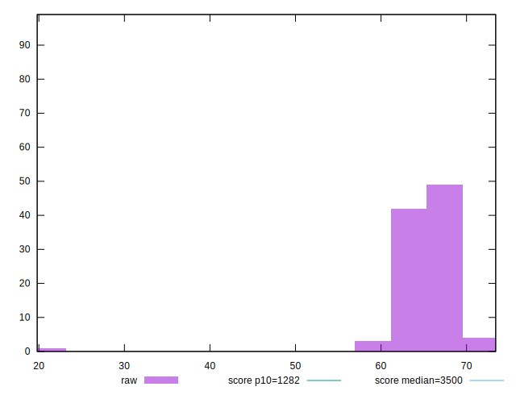
## Score


```yaml
p90min: 1
p90max: 1
p90range: 0
p90mean: 1
median: 1
p90stdev: 0
mad: 0
stdevBySn: 0
lfitCenter: 1
lfitStdev: 0
mfitCenter: 1
mfitStdev: 0
mfitConfidence: 0
p90skewness: .nan
p90eccentricity: .nan
p90discretization: 93
outlandishness: 1

```

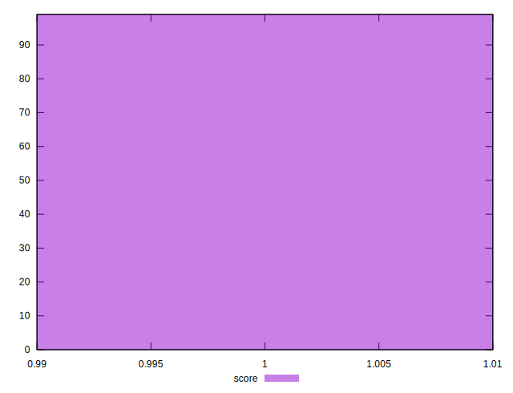
## Raw Estimate

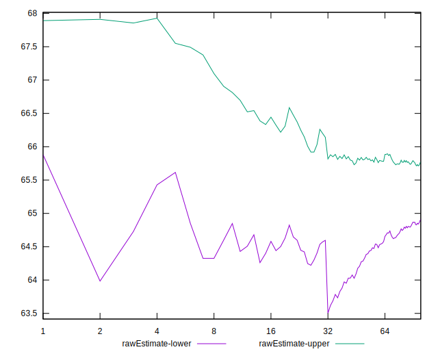
## Score Estimate

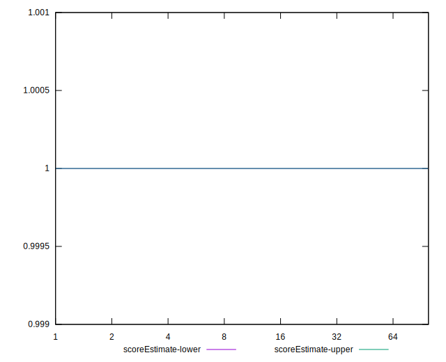
## P Score


```yaml
p90min: 0.9999996988276558
p90max: 0.9999998843505014
p90range: 1.85522845530528e-7
p90mean: 0.9999998057511021
median: 0.9999998060163081
p90stdev: 3.366895095152897e-8
mad: 2.4600133707863847e-8
stdevBySn: 3.7755061751765245e-8
lfitCenter: 0.9999998048053218
lfitStdev: 3.0659796611185046e-8
mfitCenter: 0.9999998048053218
mfitStdev: 3.842635657868232e-8
mfitConfidence: 3.8619941464210326e-9
p90skewness: -0.24603036210227205
p90eccentricity: 1
p90discretization: 1.0333333333333334
outlandishness: 0.9999999952877847

```

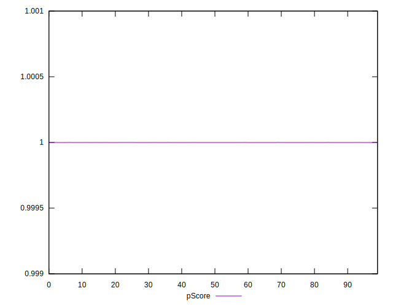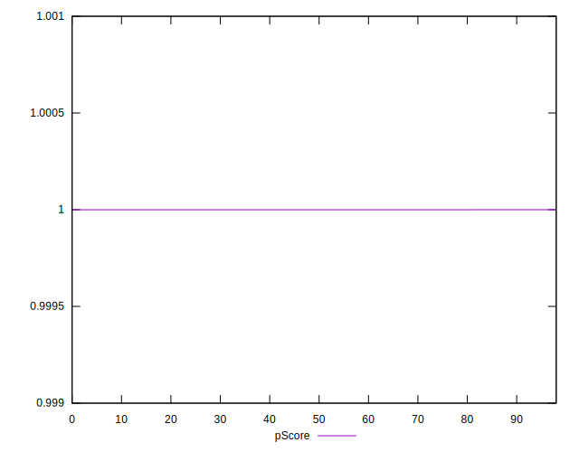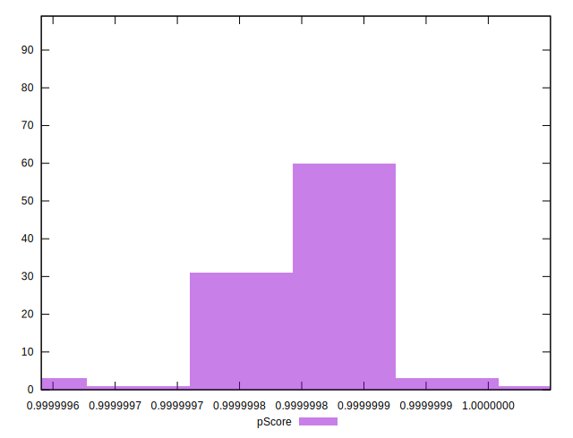
## Score Difference


```yaml
p90min: 0
p90max: 0
p90range: 0
p90mean: 0
median: 0
p90stdev: 0
mad: 0
stdevBySn: 0
lfitCenter: 0
lfitStdev: 0
mfitCenter: 0
mfitStdev: 0
mfitConfidence: 0
p90skewness: .nan
p90eccentricity: .nan
p90discretization: 93
outlandishness: .nan

```


## P Score Difference


```yaml
p90min: -3.01172344174816e-7
p90max: -1.1564949864428797e-7
p90range: 1.85522845530528e-7
p90mean: -1.942488976694557e-7
median: -1.939836918873894e-7
p90stdev: 3.366895095152898e-8
mad: 2.4600133707863847e-8
stdevBySn: 3.7755061751765245e-8
lfitCenter: -1.9519467825878325e-7
lfitStdev: 3.0659796615264575e-8
mfitCenter: -1.9519467825878325e-7
mfitStdev: 3.842635658379525e-8
mfitConfidence: 3.861994146934902e-9
p90skewness: -0.24603037869598474
p90eccentricity: 1
p90discretization: 1.0333333333333334
outlandishness: 1.024405762280799

```

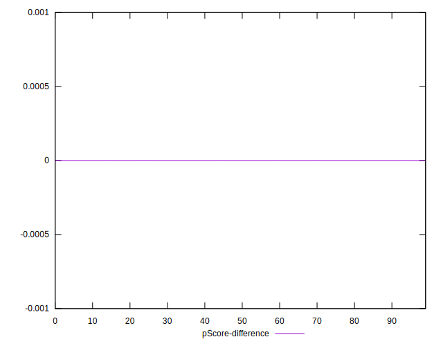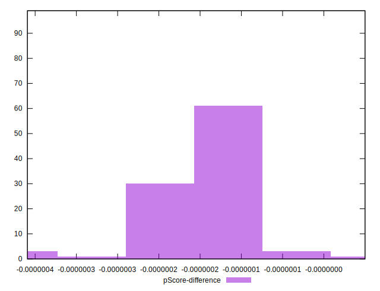