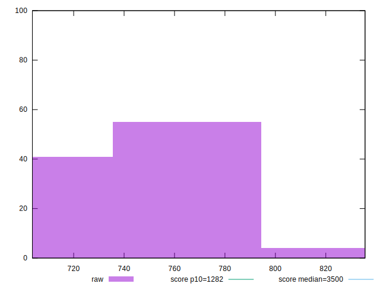

# //bootup-time/samples/music

[→ Parent](../..)


## Raw


```yaml
p90min: 714.9680000000003
p90max: 796.0080000000003
p90range: 81.03999999999996
p90mean: 750.1316595744685
median: 739.6480000000004
p90stdev: 23.91266444596644
mad: 17.760000000000048
stdevBySn: 26.070235999999916
lfitCenter: 748.7966299915536
lfitStdev: 23.56344926136701
mfitCenter: 748.7966299915536
mfitStdev: 29.532404112904512
mfitConfidence: 2.953240411290451
p90skewness: 0.3589193145583217
p90eccentricity: 1.0000000000000004
p90discretization: 1
outlandishness: 1.0015109729851701

```


## Score


```yaml
p90min: 0.97
p90max: 0.98
p90range: 0.010000000000000009
p90mean: 0.9759574468085105
median: 0.98
p90stdev: 0.004907473444540771
mad: 0
stdevBySn: 0
lfitCenter: 0.9764683699993274
lfitStdev: 0.0057261139493850755
mfitCenter: 0.9764683699993274
mfitStdev: 0.0071766195718652274
mfitConfidence: 0.0007176619571865227
p90skewness: -0.39019948628577383
p90eccentricity: 0.9999999999999989
p90discretization: 47
outlandishness: 0.9998822794621194

```


## Raw Estimate


## Score Estimate


## P Score


```yaml
p90min: 0.9705981479312012
p90max: 0.9786516915784669
p90range: 0.008053543647265626
p90mean: 0.9752597998169157
median: 0.9763364867987846
p90stdev: 0.002372180359669828
mad: 0.0017091754133317094
stdevBySn: 0.002491611504407753
lfitCenter: 0.9753991867015223
lfitStdev: 0.00233990939053828
mfitCenter: 0.9753991867015223
mfitStdev: 0.002932641522149871
mfitConfidence: 0.0002932641522149871
p90skewness: -0.39724610339957284
p90eccentricity: 1.000000000000001
p90discretization: 1
outlandishness: 0.9998589258569178

```


## Score Difference


```yaml
p90min: 0
p90max: 0
p90range: 0
p90mean: 0
median: 0
p90stdev: 0
mad: 0
stdevBySn: 0
lfitCenter: 0
lfitStdev: 0
mfitCenter: 0
mfitStdev: 0
mfitConfidence: 0
p90skewness: .nan
p90eccentricity: .nan
p90discretization: 94
outlandishness: .nan

```


## P Score Difference


```yaml
p90min: -0.00423268681116773
p90max: 0.004021196658178017
p90range: 0.008253883469345746
p90mean: -0.0007558042907825275
median: -0.0019001201139146606
p90stdev: 0.0026418926224091558
mad: 0.0017633930873007242
stdevBySn: 0.0026414433522682244
lfitCenter: -0.0009404032205415917
lfitStdev: 0.002646075897797044
mfitCenter: -0.0009404032205415917
mfitStdev: 0.003316364334455907
mfitConfidence: 0.0003316364334455907
p90skewness: 0.4066295906238427
p90eccentricity: 1.0000000000000007
p90discretization: 1
outlandishness: 0.8799684952462008

```

