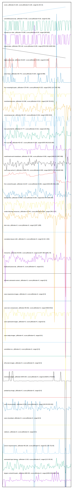

# //correlation/astro

[→ Parent](../..)

[0. score, p90stdev=0.105, score:p90stdev=0.105, range=[0.29:0.5]](../../meta/score/samples/astro)  
[1. unminified-javascript, p90stdev=74.932, score:p90stdev=0.06, range=[0:150]](../../unminified-javascript/samples/astro/)  
[2. unused-css-rules, p90stdev=74.983, score:p90stdev=0.04, range=[300:600]](../../unused-css-rules/samples/astro/)  
[3. speed-index, p90stdev=783.118, score:p90stdev=0.035, range=[8739.358:10305.594]](../../speed-index/samples/astro/)  
[4. legacy-javascript, p90stdev=36.667, score:p90stdev=0.029, range=[0:150]](../../legacy-javascript/samples/astro/)  
[5. uses-http2, p90stdev=28.779, score:p90stdev=0.024, range=[0:680]](../../uses-http2/samples/astro/)  
[6. first-meaningful-paint, p90stdev=178.404, score:p90stdev=0.023, range=[3432.114:7149.796]](../../first-meaningful-paint/samples/astro/)  
[7. total-blocking-time, p90stdev=10.096, score:p90stdev=0.014, range=[136:726.921]](../../total-blocking-time/samples/astro/)  
[8. unused-javascript, p90stdev=96.107, score:p90stdev=0.013, range=[1500:4210]](../../unused-javascript/samples/astro/)  
[9. max-potential-fid, p90stdev=5.777, score:p90stdev=0.012, range=[133:391]](../../max-potential-fid/samples/astro/)  
[10. first-cpu-idle, p90stdev=65.427, score:p90stdev=0.008, range=[4878.592:8142.665]](../../first-cpu-idle/samples/astro/)  
[11. mainthread-work-breakdown, p90stdev=31.299, score:p90stdev=0.006, range=[1806.02:2857.008]](../../mainthread-work-breakdown/samples/astro/)  
[12. uses-long-cache-ttl, p90stdev=11880.476, score:p90stdev=0.005, range=[500734.502:991028.549]](../../uses-long-cache-ttl/samples/astro/)  
[13. first-contentful-paint, p90stdev=16.637, score:p90stdev=0.005, range=[2530.685:3911.193]](../../first-contentful-paint/samples/astro/)  
[14. bootup-time, p90stdev=24.481, score:p90stdev=0.004, range=[510.644:1385.884]](../../bootup-time/samples/astro/)  
[15. render-blocking-resources, p90stdev=13.444, score:p90stdev=0.003, range=[780:1747]](../../render-blocking-resources/samples/astro/)  
[16. dom-size, p90stdev=0, score:p90stdev=0, range=[1287:1288]](../../dom-size/samples/astro/)  
[17. cumulative-layout-shift, p90stdev=0, score:p90stdev=0, range=[0.02:1.504]](../../cumulative-layout-shift/samples/astro/)  
[18. interactive, p90stdev=83.864, score:p90stdev=0, range=[11287.496:15381.44]](../../interactive/samples/astro/)  
[19. uses-passive-event-listeners, p90stdev=NaN, score:p90stdev=0, range=[NaN:NaN]](../../uses-passive-event-listeners/samples/astro/)  
[20. no-document-write, p90stdev=NaN, score:p90stdev=0, range=[NaN:NaN]](../../no-document-write/samples/astro/)  
[21. duplicated-javascript, p90stdev=0, score:p90stdev=0, range=[0:0]](../../duplicated-javascript/samples/astro/)  
[22. efficient-animated-content, p90stdev=0, score:p90stdev=0, range=[0:0]](../../efficient-animated-content/samples/astro/)  
[23. uses-responsive-images, p90stdev=0, score:p90stdev=0, range=[0:0]](../../uses-responsive-images/samples/astro/)  
[24. uses-text-compression, p90stdev=95.502, score:p90stdev=0, range=[4650:8410]](../../uses-text-compression/samples/astro/)  
[25. uses-optimized-images, p90stdev=0, score:p90stdev=0, range=[0:0]](../../uses-optimized-images/samples/astro/)  
[26. uses-webp-images, p90stdev=0, score:p90stdev=0, range=[0:0]](../../uses-webp-images/samples/astro/)  
[27. unminified-css, p90stdev=0, score:p90stdev=0, range=[0:0]](../../unminified-css/samples/astro/)  
[28. offscreen-images, p90stdev=0, score:p90stdev=0, range=[0:0]](../../offscreen-images/samples/astro/)  
[29. total-byte-weight, p90stdev=2644.634, score:p90stdev=0, range=[1136241:1741426]](../../total-byte-weight/samples/astro/)  
[30. preload-lcp-image, p90stdev=0, score:p90stdev=0, range=[0:0]](../../preload-lcp-image/samples/astro/)  
[31. unsized-images, p90stdev=NaN, score:p90stdev=0, range=[NaN:NaN]](../../unsized-images/samples/astro/)  
[32. third-party-summary, p90stdev=NaN, score:p90stdev=0, range=[NaN:NaN]](../../third-party-summary/samples/astro/)  
[33. font-display, p90stdev=NaN, score:p90stdev=0, range=[NaN:NaN]](../../font-display/samples/astro/)  
[34. uses-rel-preconnect, p90stdev=0.583, score:p90stdev=0, range=[240.58:303.022]](../../uses-rel-preconnect/samples/astro/)  
[35. uses-rel-preload, p90stdev=0, score:p90stdev=0, range=[0:0]](../../uses-rel-preload/samples/astro/)  
[36. redirects, p90stdev=0, score:p90stdev=0, range=[0:0]](../../redirects/samples/astro/)  
[37. server-response-time, p90stdev=96.169, score:p90stdev=0, range=[52.156:732.05]](../../server-response-time/samples/astro/)  
[38. estimated-input-latency, p90stdev=1.619, score:p90stdev=0, range=[12.8:35.04]](../../estimated-input-latency/samples/astro/)  
[39. largest-contentful-paint, p90stdev=688.048, score:p90stdev=0, range=[6359.843:16507.22]](../../largest-contentful-paint/samples/astro/)  
[40. timing-budget, p90stdev=NaN, score:p90stdev=NaN, range=[NaN:NaN]](../../timing-budget/samples/astro/)  
[41. metrics, p90stdev=NaN, score:p90stdev=NaN, range=[NaN:NaN]](../../metrics/samples/astro/)  
[42. screenshot-thumbnails, p90stdev=NaN, score:p90stdev=NaN, range=[NaN:NaN]](../../screenshot-thumbnails/samples/astro/)  
