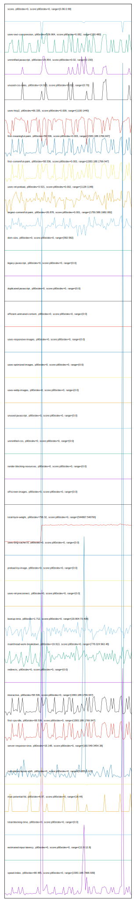

# //correlation/card

[→ Parent](../..)

[0. score, p90stdev=0, score:p90stdev=0, range=[0.86:0.99]](../../meta/score/samples/card)  
[1. uses-text-compression, p90stdev=109.964, score:p90stdev=0.082, range=[150:480]](../../uses-text-compression/samples/card/)  
[2. unminified-javascript, p90stdev=24.854, score:p90stdev=0.02, range=[0:150]](../../unminified-javascript/samples/card/)  
[3. unused-css-rules, p90stdev=14.923, score:p90stdev=0.012, range=[0:70]](../../unused-css-rules/samples/card/)  
[4. uses-http2, p90stdev=66.335, score:p90stdev=0.009, range=[1100:1440]](../../uses-http2/samples/card/)  
[5. first-meaningful-paint, p90stdev=58.536, score:p90stdev=0.003, range=[1583.188:1769.947]](../../first-meaningful-paint/samples/card/)  
[6. first-contentful-paint, p90stdev=58.536, score:p90stdev=0.003, range=[1583.188:1769.947]](../../first-contentful-paint/samples/card/)  
[7. uses-rel-preload, p90stdev=3.521, score:p90stdev=0.002, range=[1128:1148]](../../uses-rel-preload/samples/card/)  
[8. largest-contentful-paint, p90stdev=26.878, score:p90stdev=0.001, range=[1750.588:1982.082]](../../largest-contentful-paint/samples/card/)  
[9. dom-size, p90stdev=0, score:p90stdev=0, range=[582:582]](../../dom-size/samples/card/)  
[10. uses-passive-event-listeners, p90stdev=NaN, score:p90stdev=0, range=[NaN:NaN]](../../uses-passive-event-listeners/samples/card/)  
[11. no-document-write, p90stdev=NaN, score:p90stdev=0, range=[NaN:NaN]](../../no-document-write/samples/card/)  
[12. legacy-javascript, p90stdev=0, score:p90stdev=0, range=[0:0]](../../legacy-javascript/samples/card/)  
[13. duplicated-javascript, p90stdev=0, score:p90stdev=0, range=[0:0]](../../duplicated-javascript/samples/card/)  
[14. efficient-animated-content, p90stdev=0, score:p90stdev=0, range=[0:0]](../../efficient-animated-content/samples/card/)  
[15. uses-responsive-images, p90stdev=0, score:p90stdev=0, range=[0:0]](../../uses-responsive-images/samples/card/)  
[16. uses-optimized-images, p90stdev=0, score:p90stdev=0, range=[0:0]](../../uses-optimized-images/samples/card/)  
[17. uses-webp-images, p90stdev=0, score:p90stdev=0, range=[0:0]](../../uses-webp-images/samples/card/)  
[18. unused-javascript, p90stdev=0, score:p90stdev=0, range=[0:0]](../../unused-javascript/samples/card/)  
[19. unminified-css, p90stdev=0, score:p90stdev=0, range=[0:0]](../../unminified-css/samples/card/)  
[20. render-blocking-resources, p90stdev=0, score:p90stdev=0, range=[0:0]](../../render-blocking-resources/samples/card/)  
[21. offscreen-images, p90stdev=0, score:p90stdev=0, range=[0:0]](../../offscreen-images/samples/card/)  
[22. total-byte-weight, p90stdev=758.32, score:p90stdev=0, range=[544867:546700]](../../total-byte-weight/samples/card/)  
[23. uses-long-cache-ttl, p90stdev=0, score:p90stdev=0, range=[0:0]](../../uses-long-cache-ttl/samples/card/)  
[24. preload-lcp-image, p90stdev=0, score:p90stdev=0, range=[0:0]](../../preload-lcp-image/samples/card/)  
[25. unsized-images, p90stdev=NaN, score:p90stdev=0, range=[NaN:NaN]](../../unsized-images/samples/card/)  
[26. font-display, p90stdev=NaN, score:p90stdev=0, range=[NaN:NaN]](../../font-display/samples/card/)  
[27. uses-rel-preconnect, p90stdev=0, score:p90stdev=0, range=[0:0]](../../uses-rel-preconnect/samples/card/)  
[28. bootup-time, p90stdev=1.712, score:p90stdev=0, range=[19.804:73.408]](../../bootup-time/samples/card/)  
[29. mainthread-work-breakdown, p90stdev=19.913, score:p90stdev=0, range=[778.024:963.48]](../../mainthread-work-breakdown/samples/card/)  
[30. redirects, p90stdev=0, score:p90stdev=0, range=[0:0]](../../redirects/samples/card/)  
[31. interactive, p90stdev=58.536, score:p90stdev=0, range=[1583.188:1769.947]](../../interactive/samples/card/)  
[32. first-cpu-idle, p90stdev=58.536, score:p90stdev=0, range=[1583.188:1769.947]](../../first-cpu-idle/samples/card/)  
[33. server-response-time, p90stdev=16.148, score:p90stdev=0, range=[160.549:3454.38]](../../server-response-time/samples/card/)  
[34. cumulative-layout-shift, p90stdev=0, score:p90stdev=0, range=[0.005:0.127]](../../cumulative-layout-shift/samples/card/)  
[35. max-potential-fid, p90stdev=6.97, score:p90stdev=0, range=[16:44]](../../max-potential-fid/samples/card/)  
[36. total-blocking-time, p90stdev=0, score:p90stdev=0, range=[0:0]](../../total-blocking-time/samples/card/)  
[37. estimated-input-latency, p90stdev=0, score:p90stdev=0, range=[12.8:12.8]](../../estimated-input-latency/samples/card/)  
[38. speed-index, p90stdev=68.485, score:p90stdev=0, range=[1583.188:7968.939]](../../speed-index/samples/card/)  
[39. full-page-screenshot, p90stdev=NaN, score:p90stdev=NaN, range=[NaN:NaN]](../../full-page-screenshot/samples/card/)  
[40. non-composited-animations, p90stdev=NaN, score:p90stdev=NaN, range=[NaN:NaN]](../../non-composited-animations/samples/card/)  
[41. long-tasks, p90stdev=NaN, score:p90stdev=NaN, range=[NaN:NaN]](../../long-tasks/samples/card/)  
[42. layout-shift-elements, p90stdev=NaN, score:p90stdev=NaN, range=[NaN:NaN]](../../layout-shift-elements/samples/card/)  
[43. largest-contentful-paint-element, p90stdev=NaN, score:p90stdev=NaN, range=[NaN:NaN]](../../largest-contentful-paint-element/samples/card/)  
[44. third-party-facades, p90stdev=NaN, score:p90stdev=NaN, range=[NaN:NaN]](../../third-party-facades/samples/card/)  
[45. third-party-summary, p90stdev=NaN, score:p90stdev=NaN, range=[NaN:NaN]](../../third-party-summary/samples/card/)  
[46. resource-summary, p90stdev=NaN, score:p90stdev=NaN, range=[NaN:NaN]](../../resource-summary/samples/card/)  
[47. timing-budget, p90stdev=NaN, score:p90stdev=NaN, range=[NaN:NaN]](../../timing-budget/samples/card/)  
[48. performance-budget, p90stdev=NaN, score:p90stdev=NaN, range=[NaN:NaN]](../../performance-budget/samples/card/)  
[49. metrics, p90stdev=NaN, score:p90stdev=NaN, range=[NaN:NaN]](../../metrics/samples/card/)  
[50. main-thread-tasks, p90stdev=NaN, score:p90stdev=NaN, range=[NaN:NaN]](../../main-thread-tasks/samples/card/)  
[51. network-server-latency, p90stdev=NaN, score:p90stdev=NaN, range=[NaN:NaN]](../../network-server-latency/samples/card/)  
[52. network-rtt, p90stdev=NaN, score:p90stdev=NaN, range=[NaN:NaN]](../../network-rtt/samples/card/)  
[53. network-requests, p90stdev=NaN, score:p90stdev=NaN, range=[NaN:NaN]](../../network-requests/samples/card/)  
[54. diagnostics, p90stdev=NaN, score:p90stdev=NaN, range=[NaN:NaN]](../../diagnostics/samples/card/)  
[55. critical-request-chains, p90stdev=NaN, score:p90stdev=NaN, range=[NaN:NaN]](../../critical-request-chains/samples/card/)  
[56. user-timings, p90stdev=NaN, score:p90stdev=NaN, range=[NaN:NaN]](../../user-timings/samples/card/)  
[57. final-screenshot, p90stdev=NaN, score:p90stdev=NaN, range=[NaN:NaN]](../../final-screenshot/samples/card/)  
[58. screenshot-thumbnails, p90stdev=NaN, score:p90stdev=NaN, range=[NaN:NaN]](../../screenshot-thumbnails/samples/card/)  
