# //cumulative-layout-shift/samples/astro

[→ Parent](../..)


## Raw


```yaml
p90min: 0.113388671875
p90max: 0.11342529296875001
p90range: 0.00003662109375000833
p90mean: 0.1133980998587101
median: 0.113388671875
p90stdev: 0.000015796455464876985
mad: 0
stdevBySn: 0
lfitCenter: 0.11900655943170034
lfitStdev: 0.0161589376760061
mfitCenter: 0.11900655943170034
mfitStdev: 0.02025222505371717
mfitConfidence: 0.002025222505371717
p90skewness: 1.1028324045684972
p90eccentricity: 0.9999999999999984
p90discretization: 31.333333333333332
outlandishness: 1.2244355505350986

```

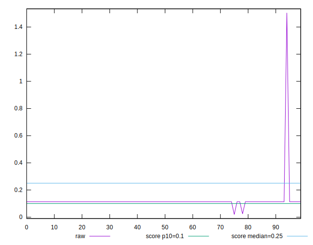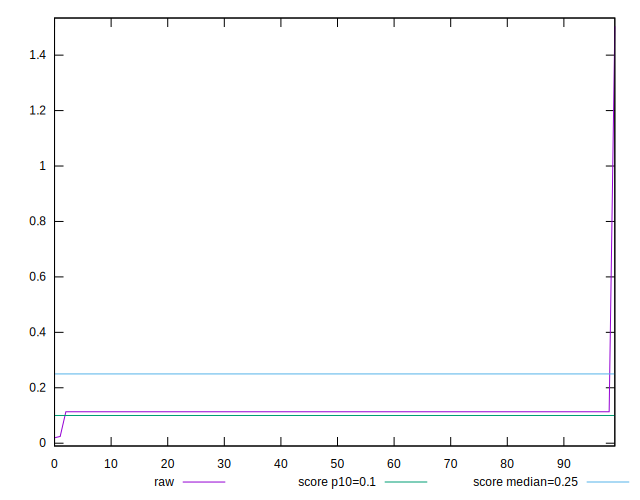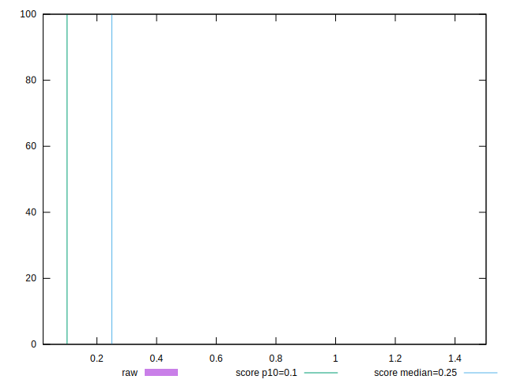
## Score


```yaml
p90min: 0.87
p90max: 0.87
p90range: 0
p90mean: 0.8700000000000002
median: 0.87
p90stdev: 2.220446049250313e-16
mad: 0
stdevBySn: 0
lfitCenter: 0.8672239439732431
lfitStdev: 0.009999387643523025
mfitCenter: 0.8672239439732431
mfitStdev: 0.012532373910735941
mfitConfidence: 0.001253237391073594
p90skewness: -1
p90eccentricity: 1
p90discretization: 94
outlandishness: 0.986254458977408

```

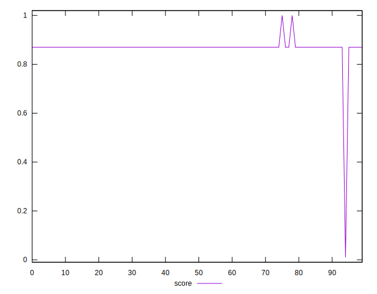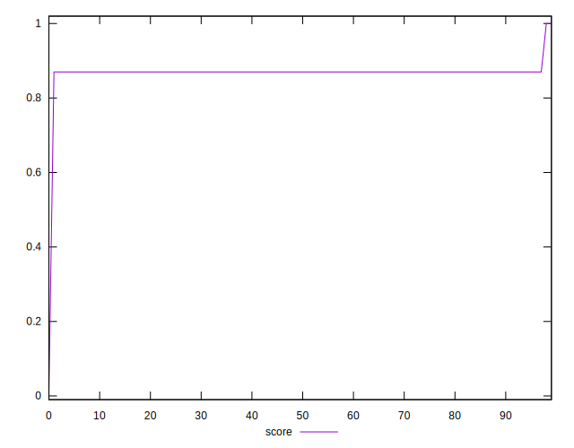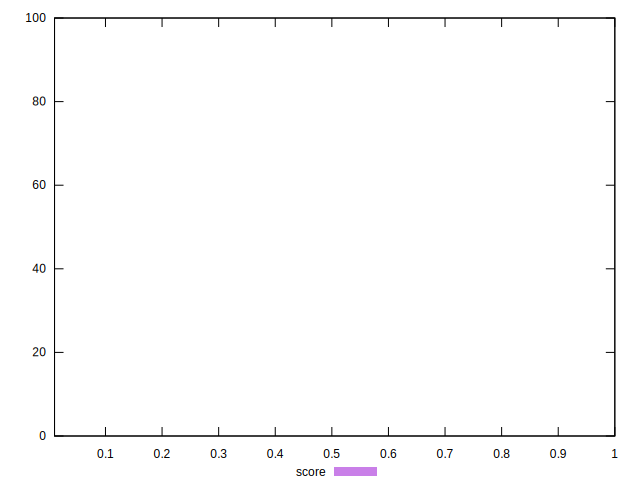
## Raw Estimate

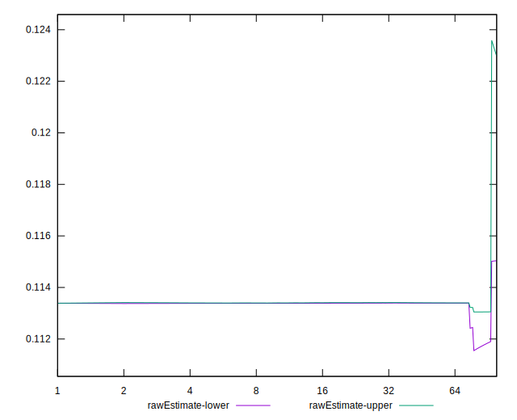
## Score Estimate

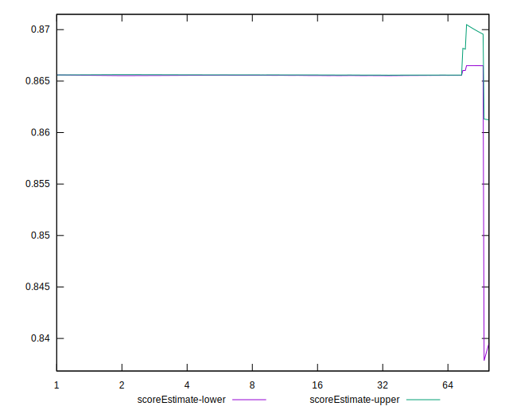
## P Score


```yaml
p90min: 0.8654981956894828
p90max: 0.8655959825000461
p90range: 0.00009778681056327176
p90mean: 0.865570807641793
median: 0.8655959825000461
p90stdev: 0.00004218016337391589
mad: 0
stdevBySn: 0
lfitCenter: 0.8628421498385063
lfitStdev: 0.009994505032473129
mfitCenter: 0.8628421498385063
mfitStdev: 0.012526254465273935
mfitConfidence: 0.0012526254465273935
p90skewness: -1.102836304859063
p90eccentricity: 0.9999999999999989
p90discretization: 31.333333333333332
outlandishness: 0.9863782428071948

```

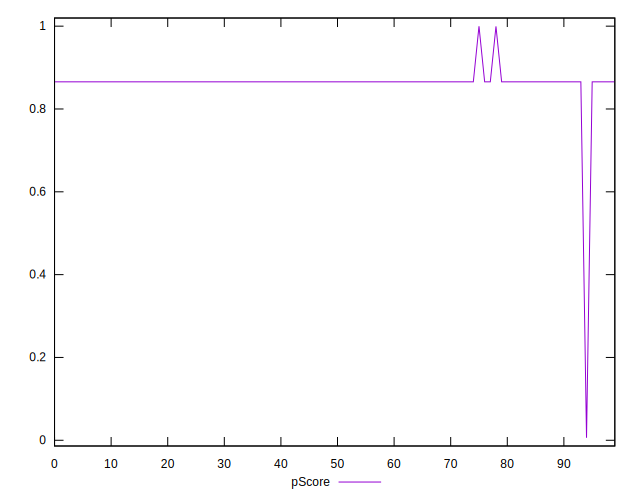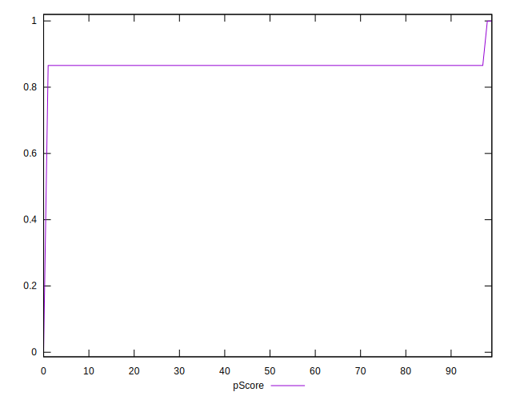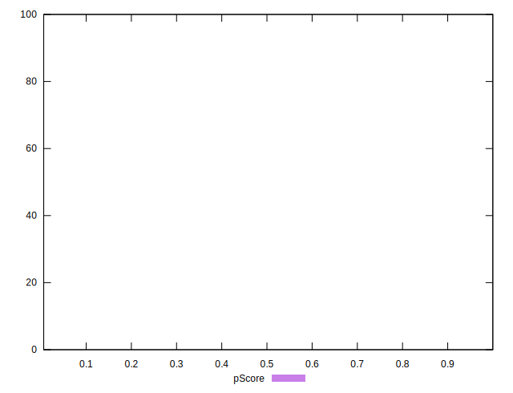
## Score Difference


```yaml
p90min: 0
p90max: 0
p90range: 0
p90mean: 0
median: 0
p90stdev: 0
mad: 0
stdevBySn: 0
lfitCenter: 0
lfitStdev: 0
mfitCenter: 0
mfitStdev: 0
mfitConfidence: 0
p90skewness: .nan
p90eccentricity: .nan
p90discretization: 94
outlandishness: .nan

```


## P Score Difference


```yaml
p90min: -0.004501804310517166
p90max: -0.004404017499953894
p90range: 0.00009778681056327176
p90mean: -0.004428152072987181
median: -0.004404017499953894
p90stdev: 0.00004157806971401224
mad: 0
stdevBySn: 0
lfitCenter: -0.0043811866119734385
lfitStdev: 0.00009972268171522385
mfitCenter: -0.0043811866119734385
mfitStdev: 0.00012498384693046806
mfitConfidence: 0.000012498384693046806
p90skewness: -1.167494923889685
p90eccentricity: 0.9999999999999983
p90discretization: 31.333333333333332
outlandishness: 0.9626653502583764

```

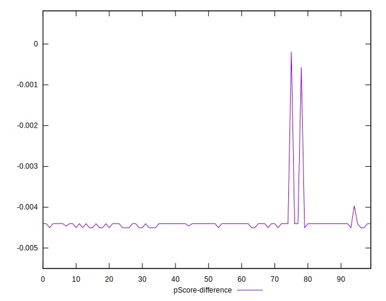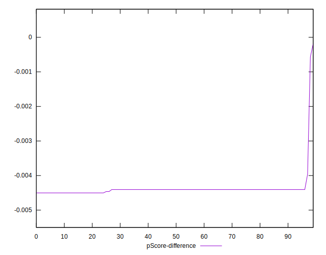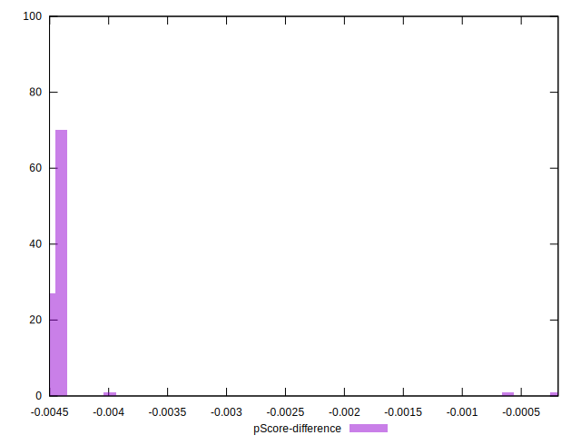