# //cumulative-layout-shift/samples/card

[→ Parent](../..)


## Raw


```yaml
p90min: 0.011352840529547797
p90max: 0.011352840529547797
p90range: 0
p90mean: 0.011352840529547777
median: 0.011352840529547797
p90stdev: 2.0816681711721685e-17
mad: 0
stdevBySn: 0
lfitCenter: 0.011868217440713518
lfitStdev: 0.001357222830339196
mfitCenter: 0.011868217440713518
mfitStdev: 0.0017010265624631162
mfitConfidence: 0.0001709596020035818
p90skewness: 1
p90eccentricity: 1
p90discretization: 93
outlandishness: 1.204628269962785

```

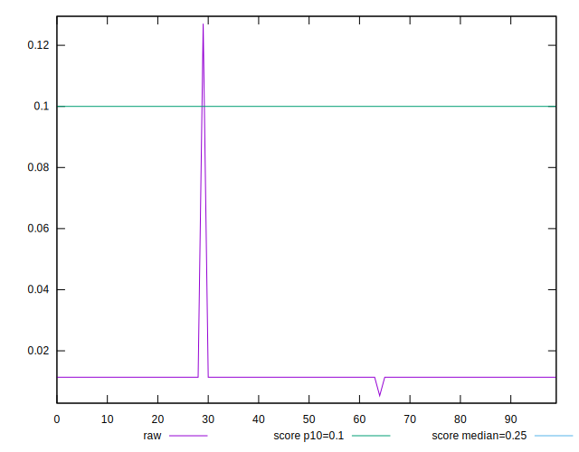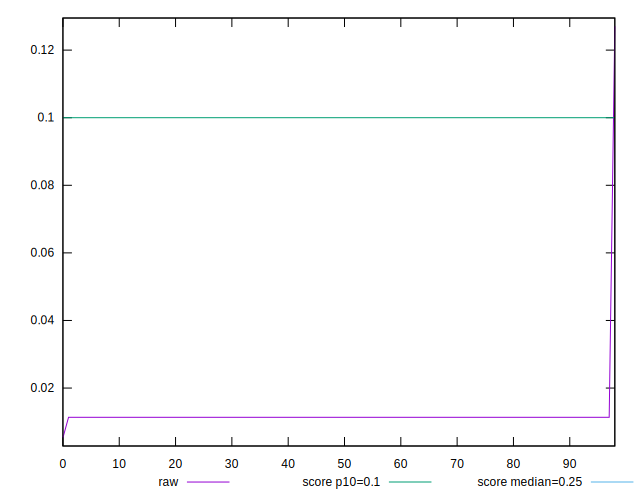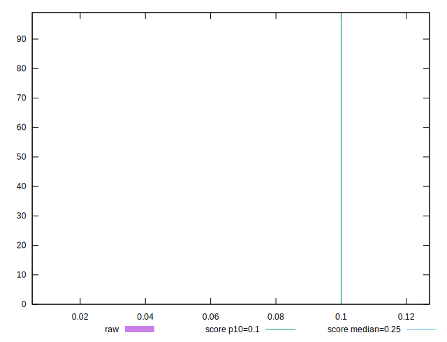
## Score


```yaml
p90min: 1
p90max: 1
p90range: 0
p90mean: 1
median: 1
p90stdev: 0
mad: 0
stdevBySn: 0
lfitCenter: 0.9992009352101544
lfitStdev: 0.001993543729675331
mfitCenter: 0.9992009352101544
mfitStdev: 0.002498536542272896
mfitConfidence: 0.0002511123707791257
p90skewness: .nan
p90eccentricity: .nan
p90discretization: 93
outlandishness: 0.9965686052443626

```

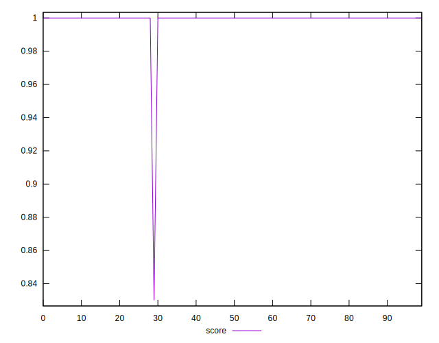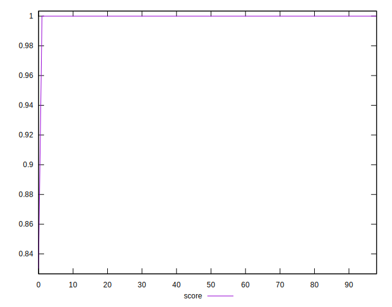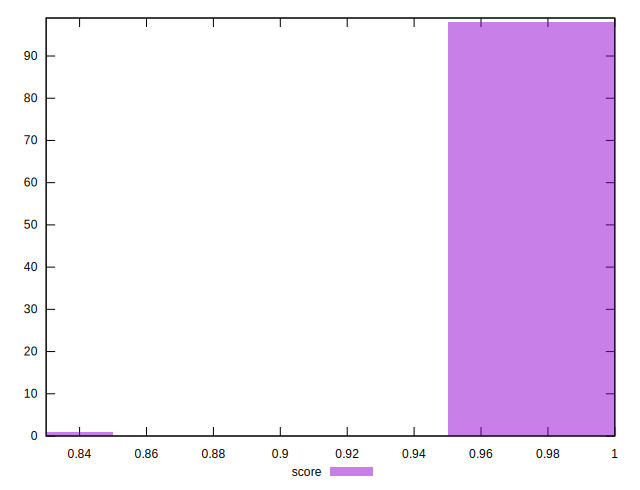
## Raw Estimate

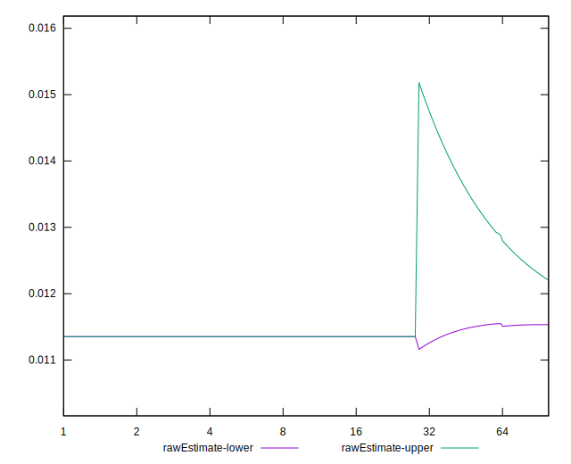
## Score Estimate

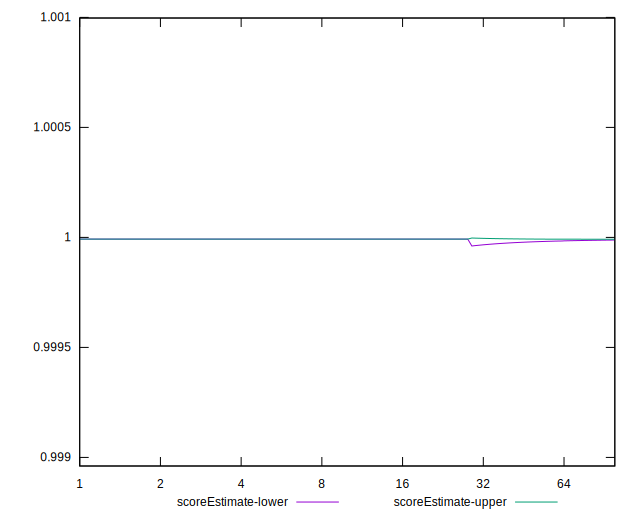
## P Score


```yaml
p90min: 0.9999923522960321
p90max: 0.9999923522960321
p90range: 0
p90mean: 0.9999923522960329
median: 0.9999923522960321
p90stdev: 7.771561172376096e-16
mad: 0
stdevBySn: 0
lfitCenter: 0.9991842988300027
lfitStdev: 0.0020160587902888966
mfitCenter: 0.9991842988300027
mfitStdev: 0.002526754986070788
mfitConfidence: 0.00025394843108959055
p90skewness: -1
p90eccentricity: 1
p90discretization: 93
outlandishness: 0.9965300125287976

```

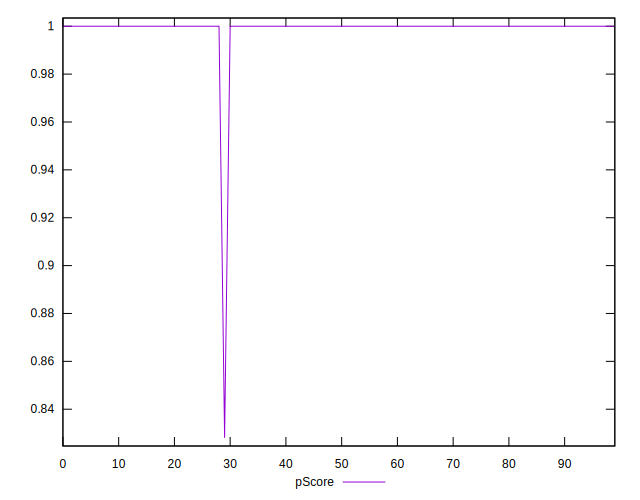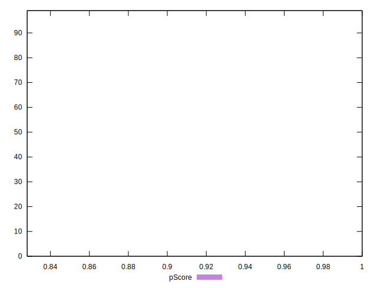
## Score Difference


```yaml
p90min: 0
p90max: 0
p90range: 0
p90mean: 0
median: 0
p90stdev: 0
mad: 0
stdevBySn: 0
lfitCenter: 5.21847134031707e-19
lfitStdev: 1.3019283231074932e-18
mfitCenter: 5.21847134031707e-19
mfitStdev: 1.631725174763995e-18
mfitConfidence: 1.6399455047482617e-19
p90skewness: .nan
p90eccentricity: .nan
p90discretization: 93
outlandishness: .inf

```

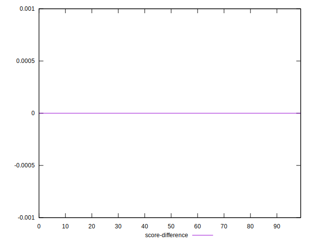
## P Score Difference


```yaml
p90min: -0.000007647703967883501
p90max: -0.000007647703967883501
p90range: 0
p90mean: -0.000007647703967883501
median: -0.000007647703967883501
p90stdev: 0
mad: 0
stdevBySn: 0
lfitCenter: -0.00001663638015189432
lfitStdev: 0.000022515060613803968
mfitCenter: -0.00001663638015189432
mfitStdev: 0.000028218443798190515
mfitConfidence: 0.0000028360603104948257
p90skewness: .nan
p90eccentricity: .nan
p90discretization: 93
outlandishness: 12.43116066305655

```

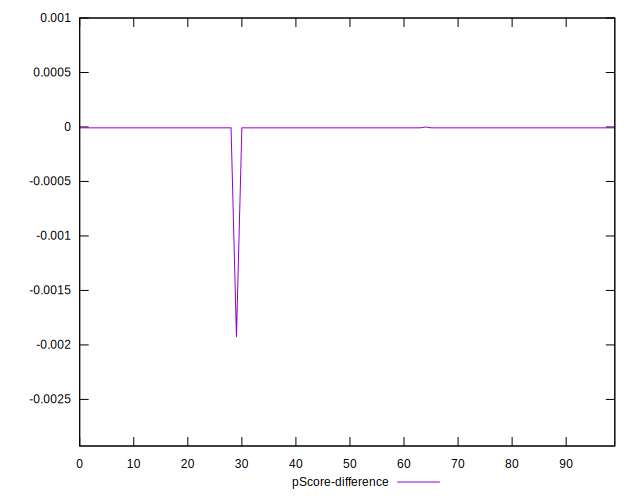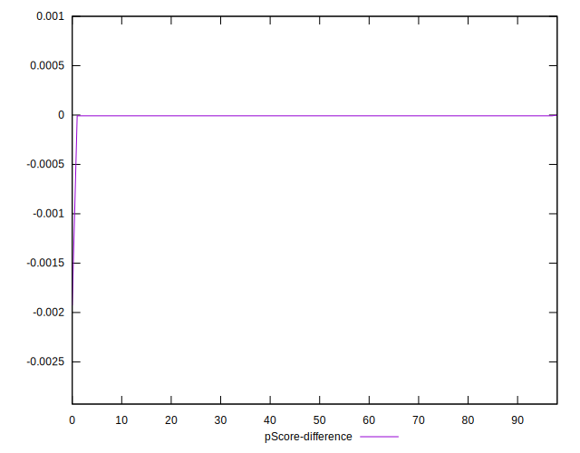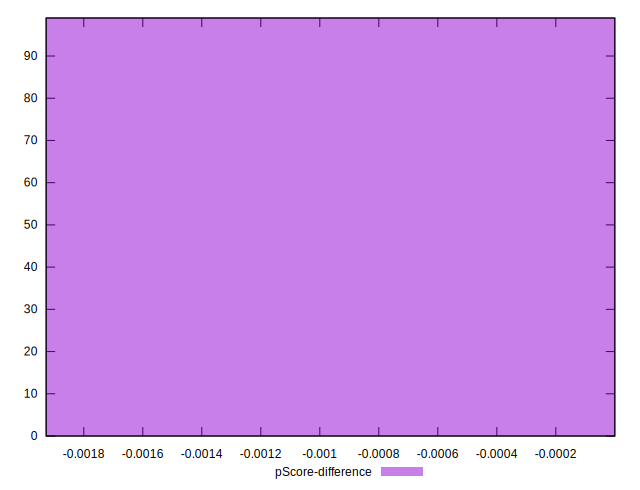