# //cumulative-layout-shift/samples/music

[→ Parent](../..)


## Raw


```yaml
p90min: 0.023033367262946237
p90max: 0.024236980544196235
p90range: 0.0012036132812499982
p90mean: 0.0241523884148744
median: 0.024215007887946234
p90stdev: 0.0002652430234617497
mad: 0
stdevBySn: 0
lfitCenter: 0.02476408521486387
lfitStdev: 0.0015994811859490843
mfitCenter: 0.02476408521486387
mfitStdev: 0.0020046523847373162
mfitConfidence: 0.00020046523847373163
p90skewness: -3.981493572682656
p90eccentricity: 0.9999999999999999
p90discretization: 31.333333333333332
outlandishness: 1.1048876293541514

```

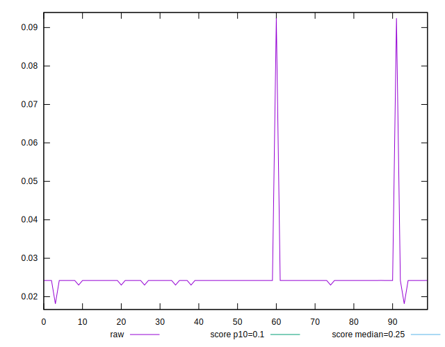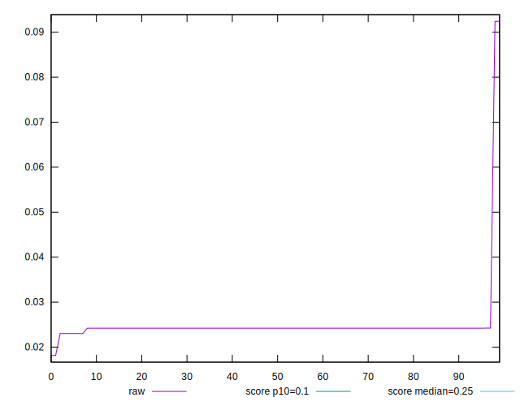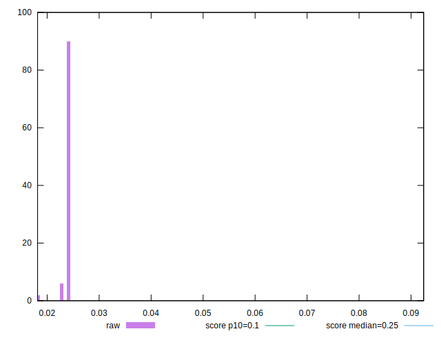
## Score


```yaml
p90min: 1
p90max: 1
p90range: 0
p90mean: 1
median: 1
p90stdev: 0
mad: 0
stdevBySn: 0
lfitCenter: 0.9992455131468094
lfitStdev: 0.0018733818412156218
mfitCenter: 0.9992455131468094
mfitStdev: 0.0023479359485482736
mfitConfidence: 0.00023479359485482736
p90skewness: .nan
p90eccentricity: .nan
p90discretization: 94
outlandishness: 0.9968025600000001

```

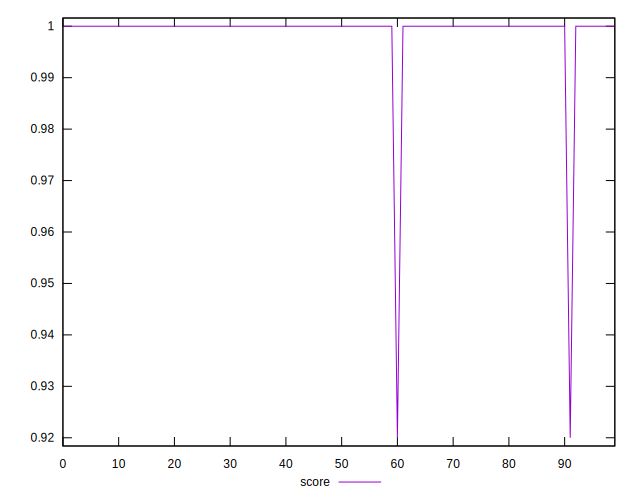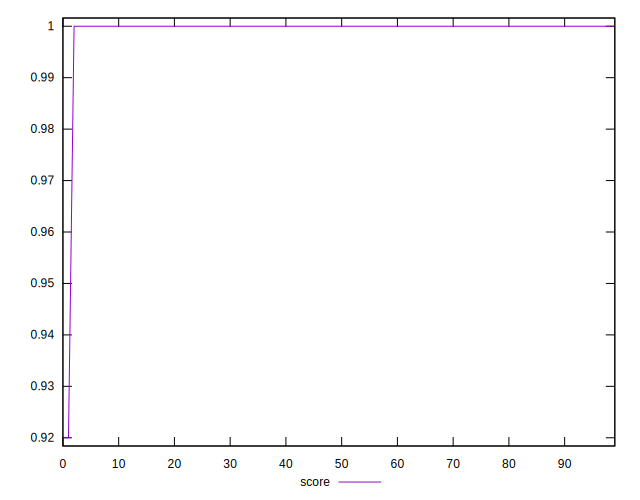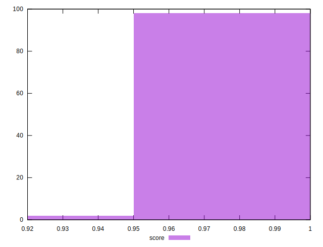
## Raw Estimate

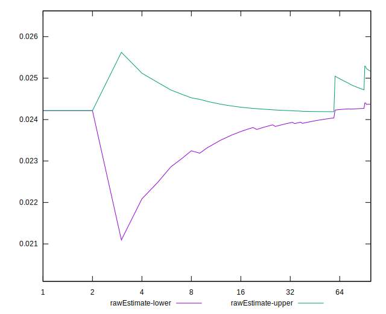
## Score Estimate

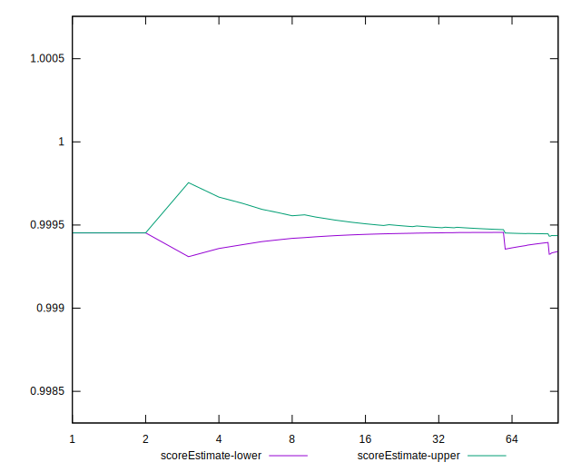
## P Score


```yaml
p90min: 0.9994503276619378
p90max: 0.9995735337766942
p90range: 0.00012320611475646892
p90mean: 0.9994591800923847
median: 0.9994527833197606
p90stdev: 0.00002710559271430154
mad: 0
stdevBySn: 0
lfitCenter: 0.9986923926782364
lfitStdev: 0.0019075661795536357
mfitCenter: 0.9986923926782364
mfitStdev: 0.0023907796631051936
mfitConfidence: 0.00023907796631051937
p90skewness: 3.981397197478946
p90eccentricity: 1.0000000000000009
p90discretization: 31.333333333333332
outlandishness: 0.9967613961472498

```

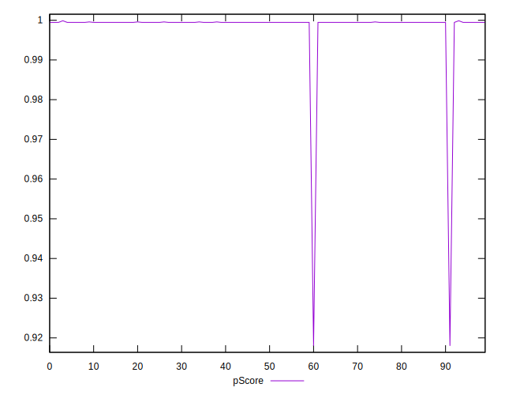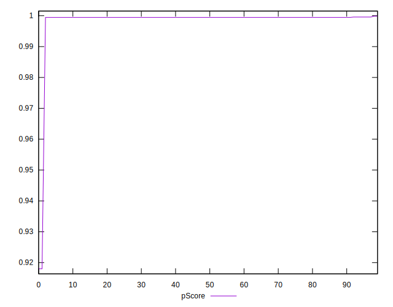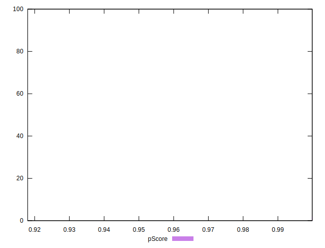
## Score Difference


```yaml
p90min: 0
p90max: 0
p90range: 0
p90mean: 0
median: 0
p90stdev: 0
mad: 0
stdevBySn: 0
lfitCenter: 0
lfitStdev: 0
mfitCenter: 0
mfitStdev: 0
mfitConfidence: 0
p90skewness: .nan
p90eccentricity: .nan
p90discretization: 94
outlandishness: .nan

```


## P Score Difference


```yaml
p90min: -0.0005496723380622459
p90max: -0.000426466223305777
p90range: 0.00012320611475646892
p90mean: -0.0005408199076133696
median: -0.0005472166802393819
p90stdev: 0.00002710559271430153
mad: 0
stdevBySn: 0
lfitCenter: -0.000553120468573543
lfitStdev: 0.00003418433833864299
mfitCenter: -0.000553120468573543
mfitStdev: 0.00004284371455770868
mfitConfidence: 0.000004284371455770868
p90skewness: 3.9813971972852187
p90eccentricity: 1.0000000000000036
p90discretization: 31.333333333333332
outlandishness: 1.0743274031460734

```

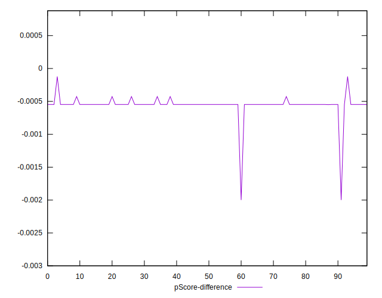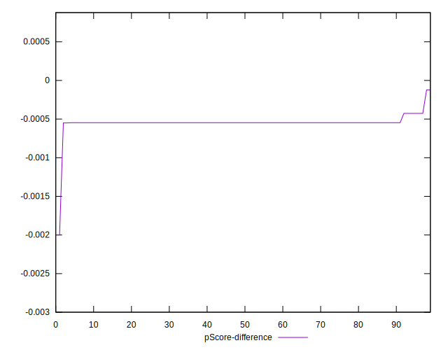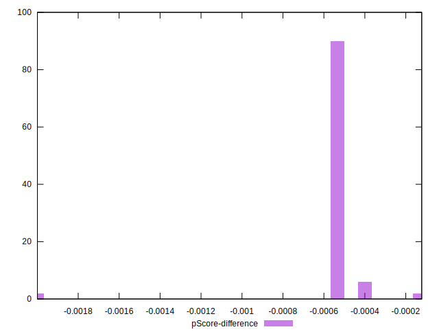