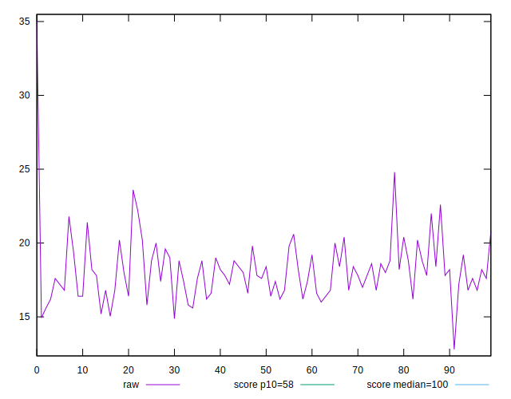
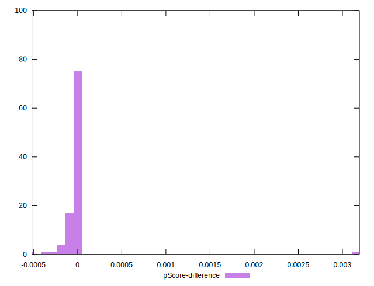

# //estimated-input-latency/samples/astro

[→ Parent](../..)


## Raw


```yaml
p90min: 15.040000000000001
p90max: 22.6
p90range: 7.5600000000000005
p90mean: 18.038723404255318
median: 17.8
p90stdev: 1.6193663286833904
mad: 1
stdevBySn: 1.6696400000001086
lfitCenter: 18.049227583808616
lfitStdev: 1.4117447455274643
mfitCenter: 18.049227583808616
mfitStdev: 1.7693596496308492
mfitConfidence: 0.17693596496308492
p90skewness: 0.6573364401801125
p90eccentricity: 1
p90discretization: 2.292682926829268
outlandishness: 1.019856197091925

```


## Score


```yaml
p90min: 1
p90max: 1
p90range: 0
p90mean: 1
median: 1
p90stdev: 0
mad: 0
stdevBySn: 0
lfitCenter: 0.9999534639864746
lfitStdev: 0.00011610565185013966
mfitCenter: 0.9999534639864746
mfitStdev: 0.00014551685503243686
mfitConfidence: 0.000014551685503243686
p90skewness: .nan
p90eccentricity: .nan
p90discretization: 94
outlandishness: 0.9998000100000003

```


## Raw Estimate


## Score Estimate


## P Score


```yaml
p90min: 0.999766370466181
p90max: 0.9999958404631456
p90range: 0.00022946999696460413
p90mean: 0.9999604381082748
median: 0.9999755145865248
p90stdev: 0.00004260046647507457
mad: 0.00001394744229055167
stdevBySn: 0.000020317582926603084
lfitCenter: 0.9999312039940697
lfitStdev: 0.00009794628766730847
mfitCenter: 0.9999312039940697
mfitStdev: 0.00012275746715453232
mfitConfidence: 0.000012275746715453232
p90skewness: -2.4953342685032283
p90eccentricity: 1.0000000000000002
p90discretization: 2.764705882352941
outlandishness: 0.9998512176046321

```


## Score Difference


```yaml
p90min: 0
p90max: 0
p90range: 0
p90mean: 0
median: 0
p90stdev: 0
mad: 0
stdevBySn: 0
lfitCenter: 0
lfitStdev: 0
mfitCenter: 0
mfitStdev: 0
mfitConfidence: 0
p90skewness: .nan
p90eccentricity: .nan
p90discretization: 94
outlandishness: .nan

```


## P Score Difference


```yaml
p90min: -0.00019940913804816773
p90max: -0.000003846661936313112
p90range: 0.00019556247611185462
p90mean: -0.00003711739308772335
median: -0.000024485413475217044
p90stdev: 0.000037705860476223077
mad: 0.00001394744229055167
stdevBySn: 0.000020317582926603084
lfitCenter: -0.000021683674793566455
lfitStdev: 0.000045223501298167084
mfitCenter: -0.000021683674793566455
mfitStdev: 0.00005667925357293176
mfitConfidence: 0.000005667925357293176
p90skewness: -2.333963089853674
p90eccentricity: 0.9999999999999994
p90discretization: 2.764705882352941
outlandishness: 0.1413106420230056

```

