# //estimated-input-latency/samples/music

[→ Parent](../..)


## Raw


```yaml
p90min: 20
p90max: 32.800000000000004
p90range: 12.800000000000004
p90mean: 28.09574468085106
median: 28.8
p90stdev: 2.7555155693654574
mad: 1.5999999999999996
stdevBySn: 2.623719999999999
lfitCenter: 28.275509083793196
lfitStdev: 2.1975342798702067
mfitCenter: 28.275509083793196
mfitStdev: 2.754200782968161
mfitConfidence: 0.2754200782968161
p90skewness: -0.9283092180700521
p90eccentricity: 1
p90discretization: 2.0434782608695654
outlandishness: 0.9998283552141525

```

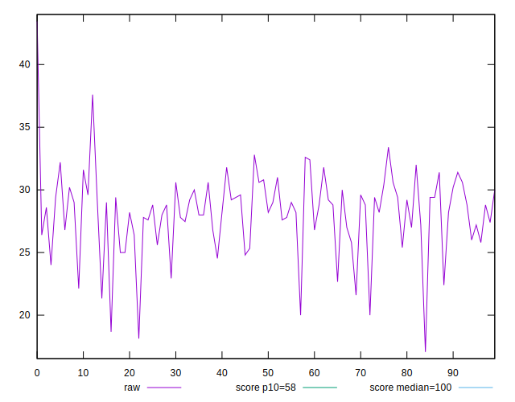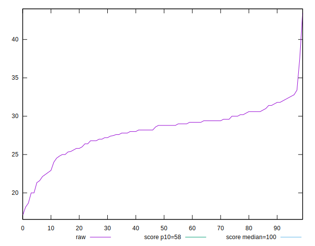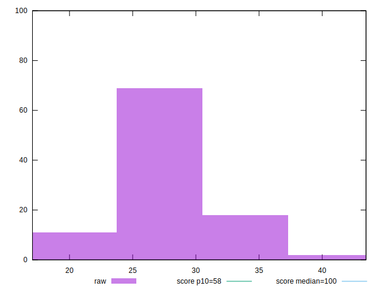
## Score


```yaml
p90min: 1
p90max: 1
p90range: 0
p90mean: 1
median: 1
p90stdev: 0
mad: 0
stdevBySn: 0
lfitCenter: 0.9998591531298257
lfitStdev: 0.0003497210956835414
mfitCenter: 0.9998591531298257
mfitStdev: 0.0004383103937786957
mfitConfidence: 0.00004383103937786957
p90skewness: .nan
p90eccentricity: .nan
p90discretization: 94
outlandishness: 0.9994000900000001

```

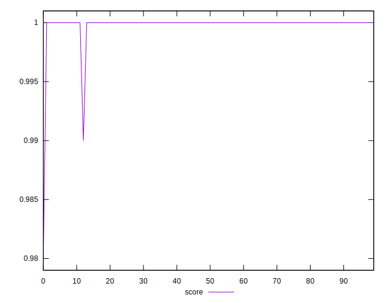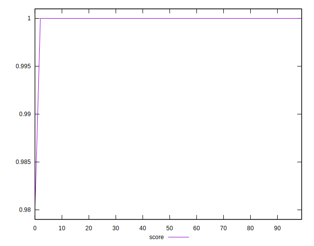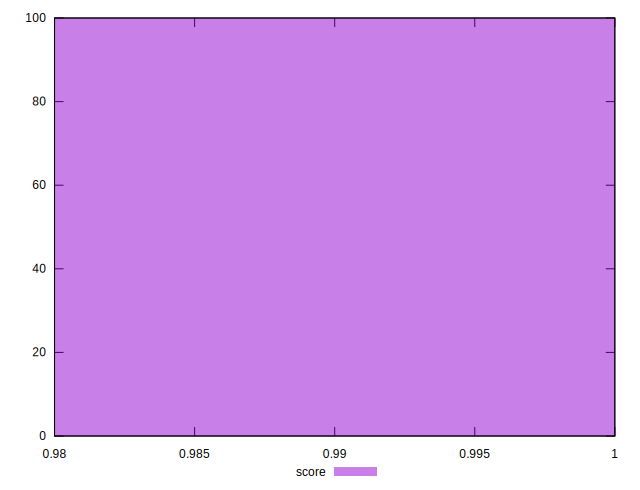
## Raw Estimate

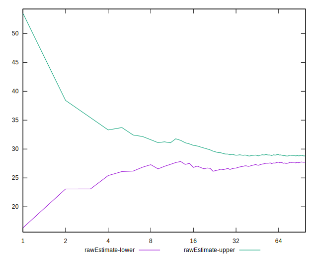
## Score Estimate

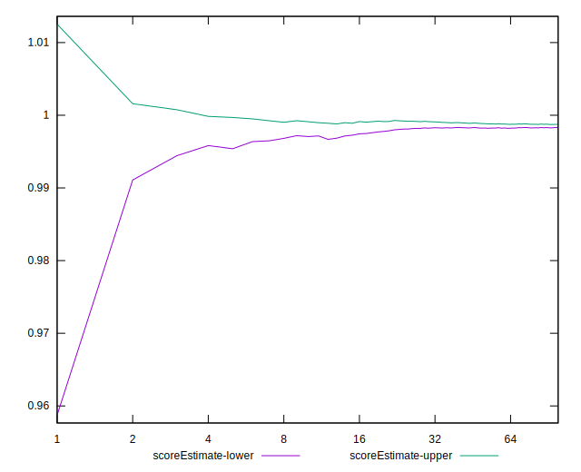
## P Score


```yaml
p90min: 0.9956368193216583
p90max: 0.9999235648616619
p90range: 0.004286745540003634
p90mean: 0.9983081874981216
median: 0.9982972767087045
p90stdev: 0.0009862937538850217
mad: 0.0006954603103650481
stdevBySn: 0.0009885376073727303
lfitCenter: 0.9981970841819378
lfitStdev: 0.0009478844298787526
mfitCenter: 0.9981970841819378
mfitStdev: 0.0011879969577036967
mfitConfidence: 0.00011879969577036968
p90skewness: -0.573820234007064
p90eccentricity: 0.9999999999999999
p90discretization: 2.0434782608695654
outlandishness: 0.9993880501464527

```

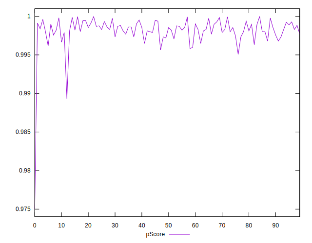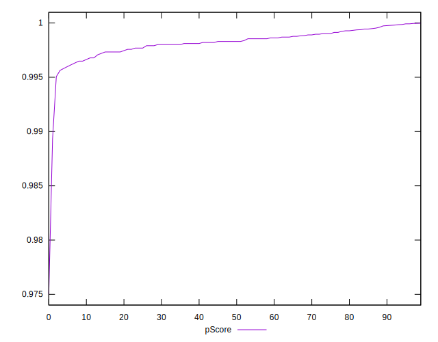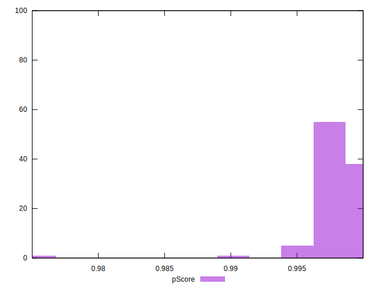
## Score Difference


```yaml
p90min: 0
p90max: 0
p90range: 0
p90mean: 0
median: 0
p90stdev: 0
mad: 0
stdevBySn: 0
lfitCenter: 0
lfitStdev: 0
mfitCenter: 0
mfitStdev: 0
mfitConfidence: 0
p90skewness: .nan
p90eccentricity: .nan
p90discretization: 94
outlandishness: .nan

```


## P Score Difference


```yaml
p90min: -0.00418237112747144
p90max: -0.00007643513833810456
p90range: 0.004105935989133336
p90mean: -0.0016527131965999723
median: -0.0017027232912955048
p90stdev: 0.0009518678305730397
mad: 0.0006954603103650481
stdevBySn: 0.000988303850142077
lfitCenter: -0.001646900437207447
lfitStdev: 0.0007636846120982035
mfitCenter: -0.001646900437207447
mfitStdev: 0.000957136721756094
mfitConfidence: 0.0000957136721756094
p90skewness: -0.5140255598747803
p90eccentricity: 1.0000000000000004
p90discretization: 2.0434782608695654
outlandishness: 1.0547042297706126

```

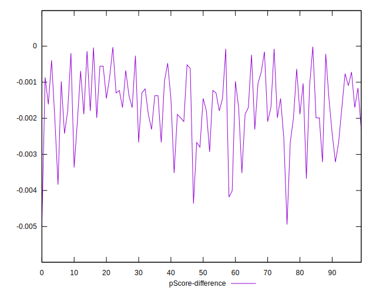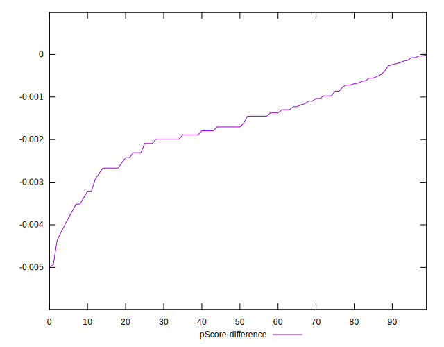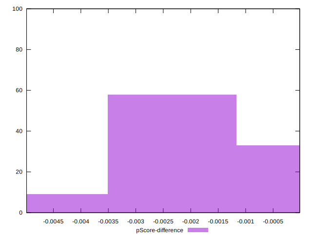