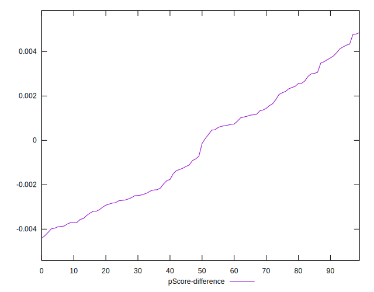

# //first-contentful-paint/samples/astro

[→ Parent](../..)


## Raw


```yaml
p90min: 2534.93
p90max: 2607.1849999999995
p90range: 72.25499999999965
p90mean: 2561.4639468085106
median: 2558.3395
p90stdev: 16.63701205487905
mad: 11.767499999999927
stdevBySn: 17.641535499999886
lfitCenter: 2571.839481467426
lfitStdev: 33.14905716396223
mfitCenter: 2571.839481467426
mfitStdev: 41.546182024079066
mfitConfidence: 4.154618202407907
p90skewness: 0.591377351710739
p90eccentricity: 1
p90discretization: 1
outlandishness: 1.0186016238583477

```


## Score


```yaml
p90min: 0.85
p90max: 0.86
p90range: 0.010000000000000009
p90mean: 0.8562765957446805
median: 0.86
p90stdev: 0.004834284156383737
mad: 0
stdevBySn: 0
lfitCenter: 0.8541032705135897
lfitStdev: 0.010180366292668353
mfitCenter: 0.8541032705135897
mfitStdev: 0.01275919701049028
mfitConfidence: 0.001275919701049028
p90skewness: -0.5281426177624559
p90eccentricity: 1.0000000000000007
p90discretization: 47
outlandishness: 0.9860892188223266

```


## Raw Estimate


## Score Estimate


## P Score


```yaml
p90min: 0.8461015830053193
p90max: 0.8614422606782479
p90range: 0.015340677672928571
p90mean: 0.855867278690489
median: 0.8565437515769414
p90stdev: 0.003522843070805606
mad: 0.002479411956969879
stdevBySn: 0.003741763502914531
lfitCenter: 0.8532943182293292
lfitStdev: 0.0078103251195106235
mfitCenter: 0.8532943182293292
mfitStdev: 0.009788790899162935
mfitConfidence: 0.0009788790899162936
p90skewness: -0.6156350418412428
p90eccentricity: 1.0000000000000002
p90discretization: 1
outlandishness: 0.9864184285347497

```


## Score Difference


```yaml
p90min: 0
p90max: 0
p90range: 0
p90mean: 0
median: 0
p90stdev: 0
mad: 0
stdevBySn: 0
lfitCenter: 0
lfitStdev: 0
mfitCenter: 0
mfitStdev: 0
mfitConfidence: 0
p90skewness: .nan
p90eccentricity: .nan
p90discretization: 94
outlandishness: .nan

```


## P Score Difference


```yaml
p90min: -0.0039882591843686255
p90max: 0.004337617840542651
p90range: 0.008325877024911277
p90mean: -0.0002980632200394946
median: -0.0004288256793828493
p90stdev: 0.0025618319391815096
mad: 0.0023374739163699587
stdevBySn: 0.003299327937500932
lfitCenter: -0.00033927361361313005
lfitStdev: 0.002479066339723283
mfitCenter: -0.00033927361361313005
mfitStdev: 0.0031070488940446264
mfitConfidence: 0.00031070488940446265
p90skewness: 0.1871363779911355
p90eccentricity: 0.9999999999999999
p90discretization: 1
outlandishness: 0.788077492671239

```

