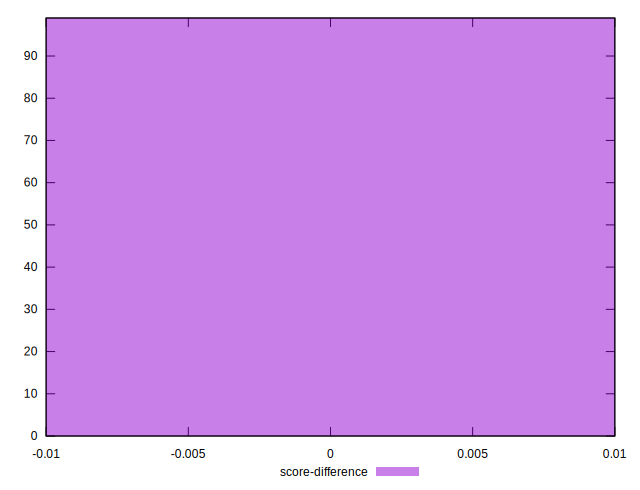

# //first-contentful-paint/samples/card

[→ Parent](../..)


## Raw


```yaml
p90min: 1589.4264
p90max: 1761.02
p90range: 171.59359999999992
p90mean: 1654.1890623655913
median: 1620.7644
p90stdev: 58.535506121840136
mad: 13.134600000000091
stdevBySn: 22.67001413999978
lfitCenter: 1646.1440634013297
lfitStdev: 51.93659850574031
mfitCenter: 1646.1440634013297
mfitStdev: 65.09287321682262
mfitConfidence: 6.542079908678029
p90skewness: 0.9293357635065422
p90eccentricity: 1.0000000000000004
p90discretization: 1
outlandishness: 1.0016241139179916

```


## Score


```yaml
p90min: 0.97
p90max: 0.99
p90range: 0.020000000000000018
p90mean: 0.9805376344086023
median: 0.98
p90stdev: 0.00339689655890996
mad: 0
stdevBySn: 0
lfitCenter: 0.9802924216239933
lfitStdev: 0.001446137155278728
mfitCenter: 0.9802924216239933
mfitStdev: 0.001812464143031829
mfitConfidence: 0.00018215950025483695
p90skewness: 0.8928583967930693
p90eccentricity: 1.0000000000000018
p90discretization: 31
outlandishness: 0.9999335398030306

```


## Raw Estimate


## Score Estimate


## P Score


```yaml
p90min: 0.9746955023547137
p90max: 0.9860630347090693
p90range: 0.011367532354355614
p90mean: 0.9820409002789565
median: 0.9843223591344568
p90stdev: 0.003932658035339813
mad: 0.0007723008251347974
stdevBySn: 0.0013135373885077943
lfitCenter: 0.9825974022009433
lfitStdev: 0.0034836224648169363
mfitCenter: 0.9825974022009433
mfitStdev: 0.004366073288618264
mfitConfidence: 0.0004388068759254503
p90skewness: -0.9732319790373732
p90eccentricity: 1.0000000000000002
p90discretization: 1
outlandishness: 0.9997778629769111

```


## Score Difference


```yaml
p90min: 0
p90max: 0
p90range: 0
p90mean: 0
median: 0
p90stdev: 0
mad: 0
stdevBySn: 0
lfitCenter: 0
lfitStdev: 0
mfitCenter: 0
mfitStdev: 0
mfitConfidence: 0
p90skewness: .nan
p90eccentricity: .nan
p90discretization: 93
outlandishness: .nan

```


## P Score Difference


```yaml
p90min: -0.004763380878016865
p90max: 0.004908479424840184
p90range: 0.00967186030285705
p90mean: 0.0015182490607699628
median: 0.004127822905241718
p90stdev: 0.0039499376881178385
mad: 0.0007056073324971379
stdevBySn: 0.0009474490434927458
lfitCenter: 0.002042726769125295
lfitStdev: 0.0038884924233500533
mfitCenter: 0.002042726769125295
mfitStdev: 0.0048735025319327566
mfitConfidence: 0.0004898054337353936
p90skewness: -0.7215822301794702
p90eccentricity: 0.9999999999999996
p90discretization: 1
outlandishness: 0.8831242936773055

```

