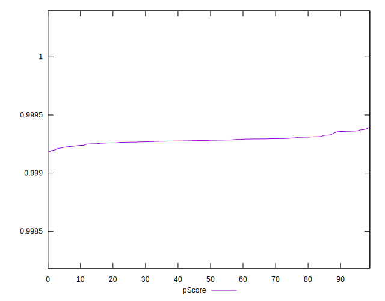
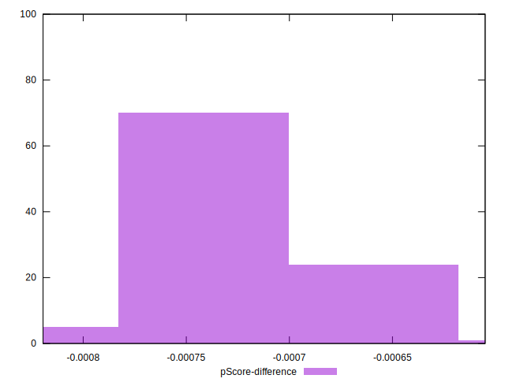

# //first-cpu-idle/samples/agenda

[→ Parent](../..)


## Raw


```yaml
p90min: 1440.6399000000001
p90max: 1485.1023
p90range: 44.46239999999989
p90mean: 1465.3804595744682
median: 1466.6541000000002
p90stdev: 9.383918729789913
mad: 4.533899999999903
stdevBySn: 8.544501960000146
lfitCenter: 1465.726755382862
lfitStdev: 6.974468677920174
mfitCenter: 1465.726755382862
mfitStdev: 8.741200203097268
mfitConfidence: 0.8741200203097268
p90skewness: -0.6403510248296895
p90eccentricity: 0.9999999999999999
p90discretization: 1
outlandishness: 0.9998600991456539

```


## Score


```yaml
p90min: 1
p90max: 1
p90range: 0
p90mean: 1
median: 1
p90stdev: 0
mad: 0
stdevBySn: 0
lfitCenter: 1
lfitStdev: 0
mfitCenter: 1
mfitStdev: 0
mfitConfidence: 0
p90skewness: .nan
p90eccentricity: .nan
p90discretization: 94
outlandishness: 1

```


## Raw Estimate


## Score Estimate


## P Score


```yaml
p90min: 0.9992118139699442
p90max: 0.999370811829964
p90range: 0.00015899786001982719
p90mean: 0.9992851956710419
median: 0.9992812159104749
p90stdev: 0.00003349061808368291
mad: 0.00001659254667324417
stdevBySn: 0.00003131460940346244
lfitCenter: 0.9992840603515292
lfitStdev: 0.000024968414916118853
mfitCenter: 0.9992840603515292
mfitStdev: 0.000031293267432219585
mfitConfidence: 0.0000031293267432219586
p90skewness: 0.5189397527237802
p90eccentricity: 0.9999999999999996
p90discretization: 1
outlandishness: 1.0000001938026721

```


## Score Difference


```yaml
p90min: 0
p90max: 0
p90range: 0
p90mean: 0
median: 0
p90stdev: 0
mad: 0
stdevBySn: 0
lfitCenter: 0
lfitStdev: 0
mfitCenter: 0
mfitStdev: 0
mfitConfidence: 0
p90skewness: .nan
p90eccentricity: .nan
p90discretization: 94
outlandishness: .nan

```


## P Score Difference


```yaml
p90min: -0.0007881860300558152
p90max: -0.000629188170035988
p90range: 0.00015899786001982719
p90mean: -0.0007148043289576286
median: -0.0007187840895250264
p90stdev: 0.00003349061808368291
mad: 0.00001659254667329968
stdevBySn: 0.00003131460940346244
lfitCenter: -0.0007159396484710328
lfitStdev: 0.000024968414916075658
mfitCenter: -0.0007159396484710328
mfitStdev: 0.00003129326743216545
mfitConfidence: 0.0000031293267432165448
p90skewness: 0.518939752721663
p90eccentricity: 0.9999999999999999
p90discretization: 1
outlandishness: 0.9997290852806795

```

